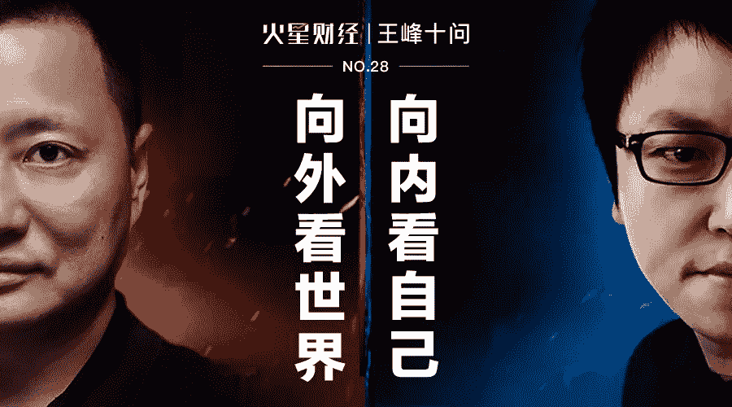
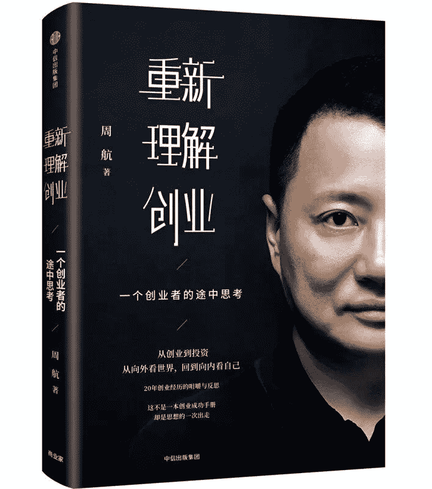
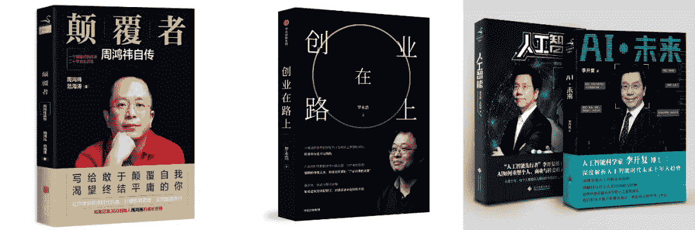
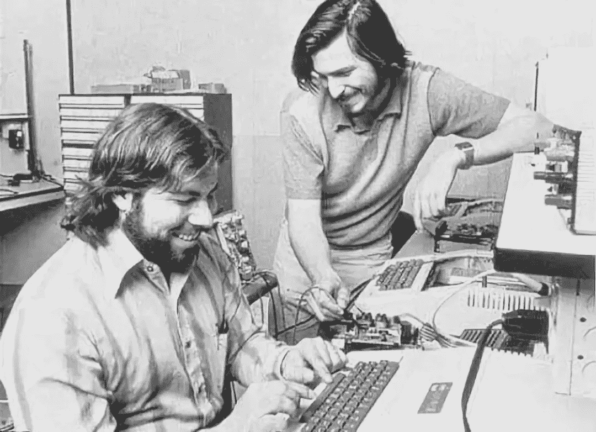
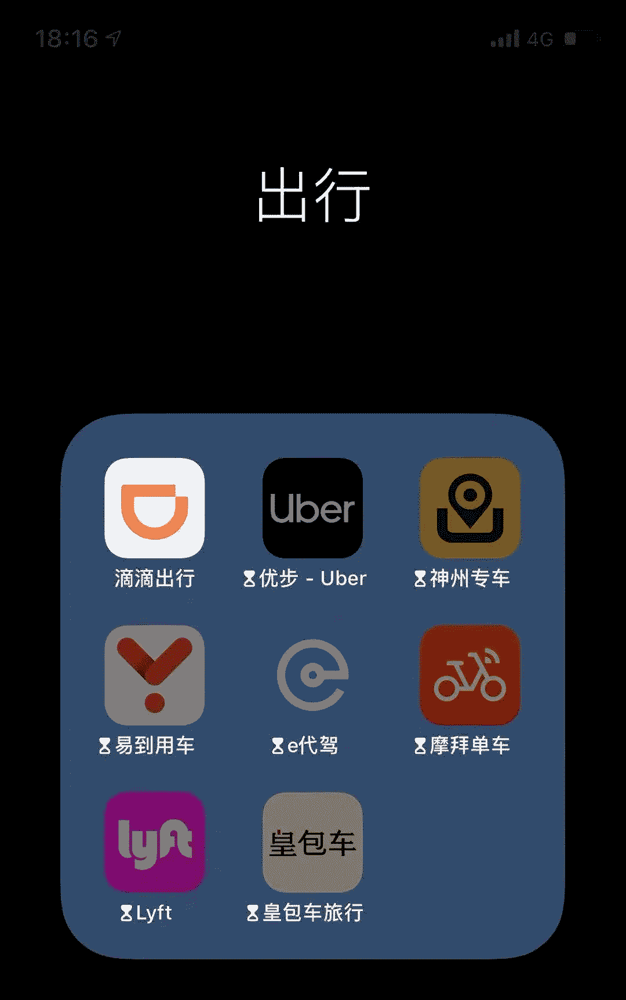
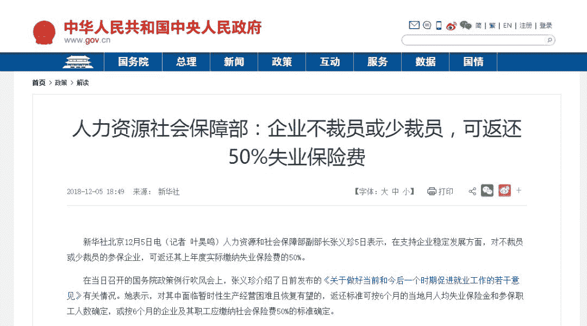
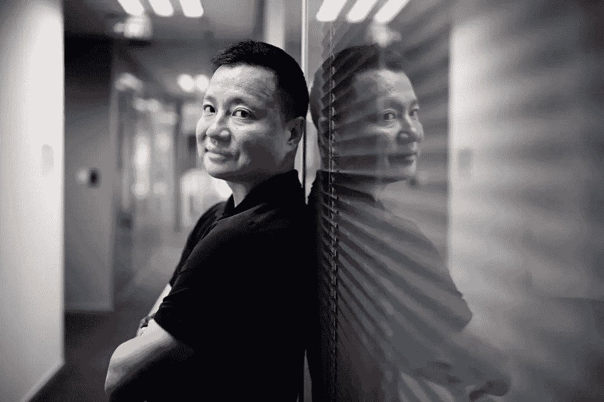
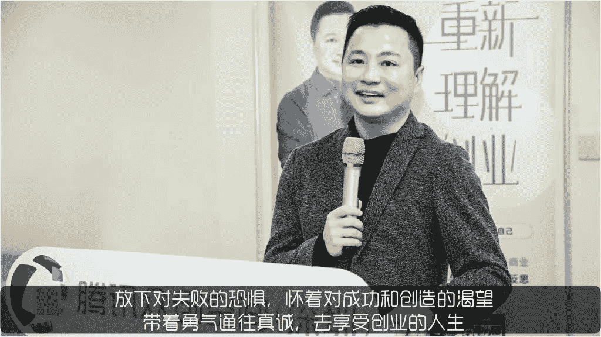

# 王峰十问第 28 期 | 周航做客王峰十问坦言：极其狼性的对抗性战争不适合我，我到今天也不喜欢（附音频）

> 原文：[`news.huoxing24.com/20181214223002189449.html`](https://news.huoxing24.com/20181214223002189449.html)

10 月，易到创始人周航出版《重新理解创业》一书，首度复盘自己 20 年创业经历，全方位坦陈创业之得与失。从 1994 年创立天创数码集团赚到第一桶金，到 2010 年成立易到进入出行领域，到 2016 年逐渐淡出易道加入顺为资本成为投资人。周航不仅仅是一名连续创者，在中国 20 年互联网创业的大潮中，他身兼亲历者和观察者双重身份。

“向外看世界，向内看自己”，一个创业者与投资者的“途中思考”究竟隐藏怎样的风景与风暴？

就此，周航来到「王峰十问」，与同为创业老兵的王峰，展开长达 3 小时坦诚且率真的对谈。

犀利观点如下——

> 1. 极其狼性的对抗性战争，不适合我，到今天我也不喜欢。
> 
> 2.给出行企业的建议：用户出行问题还远远没解决好，不要跑偏，也不要自己说故事忽悠自己。
> 
> 3\. 现在有创业者抱怨投资者给的估值低，有可能人家现在给你的估值才接近于真实价值。
> 
> 4\. 关于创业，泡沫时代已经结束了，接下会进入一个“老实时代”。
> 
> 5\. 学会度过低谷期是一个创业者的基本功，不要再指望通过骗傻钱来解决自身的问题。

**以下为对话全文：**

**王峰：**Hi，大家下午好，欢迎来到火星财经“王峰十问”第 28 期——“老友记”番外篇。欢迎。我在香港沙田，上午看看香港中文大学，刚回来在酒店大堂。今天邀请到的是我的一位老朋友，易到用车创始人，连续创业者，现为顺为资本投资合伙人。

先让我们看一看周航的经历：

> 1994 年，周航和哥哥创办了“天创数码集团”，发展成为国内最大的专业视听和服务集团之一。随后旅居海外。
> 
> 2010 年，回国再次创业，创立易到用车，首创国内互联网专车的行业模式。
> 
> 2014 年，成为湖畔大学第一期学员。
> 
> 2017 年，加入顺为资本，担任投资合伙人。

前不久，我在机场的书店，偶然看到了周航最近新出的《重新理解创业：一个创业者的途中思考》这本书，谈到了周航过往 20 年的创业经历和感悟。

如果读过彼得·蒂尔与布莱克·马斯特斯的《从 0 到 1》和本·霍洛维茨的《创业维艰》这两本书的朋友，我建议可以捧起周航的这本新书再翻一翻，里面有很多以上两本书没讲到的东西。我理解，书中有周航自己独到的创业思维和方法，把很多抽象理论具体化了，推荐大家阅读。

我想，周航的这本书名定义为“重新理解创业”，以一个创业者的思考和经历为主线，与其说是一本个人创业反思，不如说是试图在唤醒今天创业者们的集体思考。下面，就开始咱们今天的“王峰十问”吧。

### **创业 3 大收获 & 3 大建议**

**王峰：**第一问，最近一两年，我身边的许多朋友，尤其是那些非常成功的创业者们都出书了，比如周鸿祎的《颠覆者：周鸿祎自传》、罗永浩的《创业在路上》，好像他们都不是第一次出书。一向重视传道授业解惑的李开复老师也先后出了《人工智能》和《AI·未来》两本新书，我正在学习中。你的这本《重新理解创业：一个创业者的途中思考》，我到现在还没有读完，因为总是停下来思考，照镜子嘛。但我大致翻了一下，我觉得应该是有趣的一本书，最主要原因是它是周航写的，周航是有故事的人。

我认识周航大概有 3-4 年了，最初我们是在朋友的饭局上认识的，我印象里的周航，炯炯有神的大眼睛，嘴角一直保持微笑，而且每次饭桌上都能提出让大家深思的问题。在我眼里，周航始终是一个聪明人。我感觉周航和任何人吃饭，大家都会很开心。我数了一下周航的朋友圈，里面有企业家、学者、艺术家和各界名流，他都打成一片。

我想，周航的这本书名定义为“重新理解创业”，以一个创业者的思考和经历为主线，与其说是一本个人创业反思，不如说是试图在唤醒今天创业者们的集体思考。

在你看来，你创业以来最大的三个收获是什么？你给创业者们最大的三个建议是什么？对初出茅庐的新手来说，创业应该注意什么？对连续创业的老手来说，比如类似我这样的人，已经是第二次、第三次创业，你又会给出什么样的建议？

**周航：**首先谢谢王峰，能这么看待，我觉得你真的是很懂我的人，我特别喜欢你说的这句话：“与其是一本个人创业的反思，不如说是试图在唤醒今天创业者们的集体思考”，这让我感觉到你是特别懂我的一个人。

你问到了创业以来的三个收获，因为我始终都在创业，所以我说说最近的这次创业，自己有什么收获。**首先是让我的生命感觉更加开阔，**我进到了一个更大的大海里，去游了一次泳，知道海是怎么回事，浪是怎么回事，海水的咸味是怎么回事。应该说，**创业把我带到了一个世界级的视野**，我结识了很多全球科技创新业里的大佬，不管是创业界、投资界、技术等各个方面，都是世界级的视角，这让我提升了非常高的层次。

**第二**，**胆子更大了，**因为经历了非常大的一次、商业史上史无前例的一次竞争，也使得我见过大场面，花过大钱。**第三，****让我对自己的创新能力有一种更大的自信**，我会更加坚持地去做一些更原始思考的事情，更坚定地去走这条路，而不是说走跟随式的创新。

如果说给创业者们建议，不同阶段的创业者面对的问题是不一样的。**对初出茅庐的新公司来说，不要做 PR、不要做 BD，要谨慎地、少去做抛头露脸的事。**就埋头苦干去做真正正确的事情，**在我来看，****初创公司最正确的事情就是去做好你的产品，天天研究你的用户，去做真正有意义的创新**；**对连续创业的老手来说，要放下那种想赢怕输的心态。**

我们之所以还在创业，可能也想取得更大的一些成功，但同时，我们过去取得了一些成就，其实我们自己不自觉的会背上一些包袱，会怕输，害怕失败。我觉得，害怕失败会成为我们这样一些人的心魔，导致我们不敢去尝试真正新的一段征程，而且也不愿意真正的去放得下身架，就是去掉身上一些光环而去真正的吃苦。

**王峰：**2005 年，开复老师回到中国创立了谷歌中国，之后没过多久就出版了他的《做最好的自己》，引起巨大的轰动。在我看来，这本书是当时市面上第一本强调个人奋斗并引导年轻人实现自我的精神指南。不过，今天我想谈另外一个维度，就是向内看见自己，产业者如何真实地看待自己。有时候我们常常发现，在抱着自我奋斗、自我实现的梦想挣扎多年后，最大的反思，不是我们是否学会了去做更好自己的能力，而是开始学会自我反思，照见自己，去寻找什么是真正的自我，即“我从哪里来，我将行至哪里去”的哲学境界。或者，我们把它理解为是创业的一个阶段，当我们停下来那一刻，我们暂且忘记得失成败，去思考“我从哪里来，我将行至哪里。”

当你置身“那一刻”的时候，你会想些什么？当然，我相信周航你不止一次有过“那一刻”的思考。

**周航：****第一是会想过去，过去到底发生了什么，能从过去学习到什么。第二个是看现在，看现在就是说你现在到底是什么状态。**这点往往是蛮困难的，就是想现在，想现在能不能看见自己，看见真实的自己，不管你的需求、你现在的状态、你的恐惧、你的渴望，这些到底是什么，其实要看到，是蛮难的。**另一个是想未来，想未来也不容易，即要想到自己想要什么。**我想要的很多，通常想要的很多，但有一个很好的方法。

我这里分享一个方法，我曾经有一个很好的朋友，我跟他说我现在还很焦虑，他说你为什么焦虑？我说我想有一个更大的事业，我要更成功，我要有更多的钱。他问了我一个非常智慧的问题，他没有问我要多少钱，他说，如果你有了心中足够多的钱，你会做什么？我说要做这个，做那个，他说你看你所想象这些事情好像跟钱的关系不大。其实他当时给我这样回馈的时候，我感觉有点醍醐灌顶的，还是蛮棒的这种状态。然后我很清楚的知道了自己内心真正所想要的是哪些东西。

另外我还有一个很好的方法，当你难以抉择、难以放下的时候，问自己一个问题：人生以后如果只能做一件事情，你会做什么？这个时候内心真正想要的那个东西反而会立刻清晰起来。当有人问我的时候，我说，如果人生往后只能做一件事情，我非常想去做一个经济学家，我很清楚自己到底想要什么。

### **创业者的根从何处来？**

**王峰：**第二问，尽管周航的身份已经摇身一变，增加了“顺为资本投资合伙人”的标签，但在我眼中，周航的人生是创业人生，如果用一个词给周航定位，我还是愿意用“创业者”。我想谈的是，我们每个人的创业起点，你认为所谓创业者的根儿是从何处来的？

比如，考大学对很多人来说都是人生中重要的一步，但不同的人会有不同的倾向。有人从小喜欢航模，只要有航空航天等专业，他就去报考；也有人就要去读最高等的学府，为了能读北大清华，哪怕他去学食品专业他也愿意，哈哈。.每个人的价值取向不一样。这让我也反思，我觉得，创业也有类似的过程，尤其是创业者的第一步。创业的起点，有的来自于对一件事情偏执的热爱，也有的来自于要自我实现抱负的极致追求。

我常常说，创业是今天和平年代里一项最好的自我修炼。我认为，对一个背景平平的人来说，要做到自我实现，除了在专业领域去发现，去发明，去创新以外，我们中的许多人，最重要的自我实现就是去创业。你的创业起点是什么？什么是你的 motivation 动机？是兴趣使然，还是通过创业来实现个人自我实现的最终目标？

**周航：**我的第一段创业在上世纪 90s 中期，那个时候最重要的还是说要去做一段成功的商业，至于它是什么其实是第二位的。当时你的认知、你的资源背景、你的历史机会就是那样，我就是想怎么能去做一个成功的公司，至于这个公司是做什么的倒是在第二位的。第一段就是这样，第一段很不幸的是做到取得一定成就以后，你会发现可能你还是缺乏一些足够的动力，就是你并不爱那个东西，你不是一个发烧友。

尽管我当时做音响但我并不是一个发烧友，我对声音、电子器材也没有什么着迷的地方，我只是把它当作如何经营一个成功的公司来看待的，所以在这个过程中也走过很多小弯路，就是说别人有什么事你也去掺和一下。所以当时对公司是不是往产业链的更上下游、更宽泛的领域去走其实也没有什么顾虑，因为对你来说是如何扩展边界去做一个更大的公司反而是一种更大的追求。

**王峰：**如果我们暂且把喜欢和热爱做创业起点的称为 A，把希望自我实现有所成就的称为 B，以你之见，哪些人算是 A，哪些人算是 B？哪些人是 A∩B？你觉得。

**周航：**有一类人是 A、有一类人是 B，我在想，如果只是单纯的说我不追求成就，我只是喜欢创业，这称之为 A，我觉得这些人是不是内心中也会有一种恐惧？就是说，他不确信他会成功，意思是他不敢追求成功，那我想说，是不是在某种程度上，这是一种逃避。反之，如果另外一种，只是把创业当做一个工具，当做一种手段，来去追求成功感，称之为 B，这种是比较多的，但这也其实无可厚非。

补充一点，B 类最后变成了一个貌似体量在变大，但实际上变的越来越平庸的公司，我把这个比喻就像一个发福的中年人一样。

**比较好的是结合两点，既享受创业的过程，同时又积极去追求成功。**因为你有前者，所以当你在追求事业成功的过程中，就不容易迷失，就不容易变形。很多人为了成功很容易变形，也很容易放弃自己的原则，甚至很容易放弃自己出发的一些初心，走到后面往往就是数字驱动了，公司的估值、市值、规模、影响力，都被这些所带偏了。

**王峰：**这让我也想起了当年乔布斯和沃兹在车库创业的经历。乔布斯和沃兹在最开始合作的时候，做了一个数字版蓝盒子，沃兹买了二极管和晶体管，苦心设计出一个让他最自豪的电路，测试成功后，两个人都很兴奋。我认为乔布斯就是非常好的兴趣和自我实现结合型人物，他能做出一个让自己喜欢、市场规模又可以被放大、消费者又觉得很酷的东西。乔布斯能做出这样的产品，而沃兹则更多沉迷于自我兴趣中。

乔布斯和沃兹在车库创业

**周航：**我跟沃兹打过交道，没有乔布斯他就是个普通黑客。

**王峰：**这又不得不回到另一个话题，就是如何看待外部的世界。相对于沃兹来说，显然乔布斯就更懂外部世界。创业者如果一心向内，不太抬头看外部的世界，很难成功。**在我看来，创业者即使被工匠精神所武装，如果不看时机，所谓“天”；不看竞争环境，所谓“地”；不看团队和对手，所谓“人”，创业很难做大做强。**

我们当年学习做 SWOT 分析，S 和 W，谈的是自己的比较优势和劣势，Q 和 T，则是机会和威胁，来自于外部。你是如何看待外部的世界？世界变化的如此之快，多少企业的当家人必须面对，今天的盛宴之后，夜里瑟瑟发抖，明天的早餐在哪里？

**周航：**我觉得不同的历史时期每个人所面对的机遇是不一样的，其实有很大的局限性，不是每个人都可以浪漫到像硅谷的车库一样，就是只是从兴趣出发做一个产品。在我第二段创业的时候，因为有了一定积累，在考虑再次创业的时候可以更任性一些，你就可以从什么是我感兴趣的、想做的，当然你的理性会限制你，告诉你说，你要在想做、能做和可做之间找一个交集，这才是你该做的。

其实我当时有很多天马行空的想法，和第一段相比，更多的不是从有什么资源、有什么人脉去出发的，而是更多从想做什么来出发的。那么想做什么也比较简单了，因为像我们这样脑子里总是会出现无穷多想法的，是想很多事情的，但想完了以后我会回归理性，我想做这么多事情，我当时还想做过移动支付、电子阅读，想做过移动社交。这些产品很早都是基于原创的想法，去想过很多，但很多事情是我的能力做不了的，或者外部环境不是允许那么做的等等，导致我最后选择了一个更适合我做的，就是打车的这件事情。

当然往后其实是可以进入一个越来越自由的状态，可以说在这三者中想做、可做和能做，可能想做的成分会越来越大，套句不恰当的比喻，就是你可以越来越任性。我现在在思考我以后可以做什么的时候，可能可以更加任性一些，就是自己想的成分会更多一些。哪怕能力弱一点或者不够的时候，只要想也就会去做了。

### **“重新理解失败”**

**王峰：**说实话，你现在出门打车用什么 App？哈哈，截图为证。（这会为难你吗）

**周航：**不为难，谁快用谁的。

**王峰：**你还在惦记出行市场吗？出行市场今天可以做到这么大，也许出乎你最早创业的意料。如果今天给所有出行企业提一个建议或者提醒，你会说什么？

**周航：**早不惦记了，我的人生，这段翻篇了。世界那么大，何必纠结。**建议就是，用户出行问题还远远没解决好，不要跑偏了，不要自己说故事忽悠自己。**

**王峰：**败给了对手，又失去了公司，这就是易到的周航吗？其实失去公司也不可怕，很多人卖掉了公司，让投资人套现离场。大家都开心。我当时死活不想买蓝港互动去 IPO，其实多少有胜负心态。俗啊。哈哈。《潜伏》里的余则成说过一句话，有一种失败叫占领，有一种胜利叫撤退。你听说过吧？

**周航：**好像有这句话，怎么让你说的那么惨？为什么不说是：开创了一个行业，体验了一段创业，对所有投资人都有了能做到最好的交代，现在离开了，在潇洒的生活………我书里有详细写过“重新理解失败”，大家可以看。

**王峰：**我可不敢说你惨啊。1985 年，因为苹果公司新产品（Apple Ⅲ、Apple Lisa 和 Macintosh）接连在市场上遭遇惨败，加之那个时候的乔布斯心高气傲，乔布斯最终被苹果董事会赶走。到了 1997 年，在苹果危难之中，乔布斯选择重新回归，就此缔造了一个全新的属于苹果的时代，让苹果名声大噪。你可曾动过这样的念头？

**周航：**除非我对这个领域有新的创造性想法。乔布斯要是没回去呢？他就不伟大了吗？看你们一个个俗不可耐的样子。

### **“我从来不设做××事情的时间表”**

**王峰：**第四问，周航去雷总和许达来的顺为资本做投资合伙人的事情，值得一说。大家知道吗？投资合伙人（Venture Partner）这个 title 可能有的人不太了解。它是一线创业者或在某个领域非常有成就的公司高管，离开公司以后，通常会被很有名的 VC 邀请担任的职务。这个角色很微妙，以我的经验和观察，很多人把做投资合伙人当作是养精蓄锐，琢磨方向，再伺机行动再创业的预备动作。很多人这样走过。

比如 2005 年的周鸿祎，卖掉 3721 给雅虎后，再从雅虎离开后，去 IDG 做了投资合伙人，2006 年，周鸿祎继续做了奇虎 360；同样，2008 年，傅盛离开 360 以后，去了经纬，2009 年，他就离开经纬创建了可牛，再后来，可牛和金山安全合并，上市前更名为猎豹移动。现在周航同学又被邀去顺为做了投资合伙人。哈哈，实话实说，周航你有再出山的时间表吗？如果有机会再出山，你更看中什么领域？

**周航：**我很感谢雷总和许总给了我这样一个机会，让我有机会加入顺为做投资合伙人。一方面给了我很大的自由度和空间，同时又给了我机会，让我参与到去学习投资是怎么回事，同时让我通过投资这件事情对创业的一线、最前沿的创业更了解，给我足够多资讯和让我保持了对创新足够的敏感度，这些都是我在学习做投资的过程中一些收获。

至于时间表，我觉得千万不要有什么时间表。我从第 1 次到第 2 次创业之间的转化，从 04 年开始思考我以后我还可以做什么，当我真正找到第二件事情经历了长达 6 年的时间。而在这个过程中，我也曾经在 07 年，有半年时间在雅虎，当时在雅虎中国做顾问，有过各种各样丰富的经历，我觉得人生有一个丰富的经历是非常重要的。一个人不是简单的重复自己说我要做一个什么。**人生不是在既定轨道上，要顺其自然，顺着心走，顺势而为，可能你的未来其实早已经发生了，只不过我们自己不知道而已**。这么说起来有点宿命感，我认为就是这样的，不要焦虑，当你给自己设时间表的时候，假设一年两年三年你还没有想出来，你还没有做决定，你心里该多着急，我觉得那是一种很不好的状态。

**王峰：**和雷总一定可以学习到许多。从你 2017 年 4 月加入顺为资本，到目前为止，你见了多少创业者？能不能说说令你印象深刻的人和事。BTW，2007 年 yahoo 已经是阿里巴巴的资产了。难怪你和阿里这么熟。

**周航：**在顺为里面见过很多创业者，每天人来人往，谈项目、上会的、投后的……很多人做企业，这两年下来两三百个是有的，肯定是见过这么多的。我不能具体的评价哪一件事情，因为创业本身就是一段很有趣的事情，但很多创业公司和项目的创始人都给了我巨大的启发，坦率的说我有这样几点感受。

**一方面，我从他们身上学到了东西**，我从他们身上看到趋势，我就看到世界正在朝哪个方向去。**第二，看人**，我经常感慨，我觉得创始人们好棒，我在想如果退回十几年前去，我在他那个年龄我简直就跟个傻子一样，我觉得他们比我当年的同龄时候强太多了。**第三，我看到了很多创业者身上，既有人性的光辉、伟大和力量，也有人性的弱点**，特别是创业者有很多的妄念。就好像人性一样，创业像一面镜子能检验出人性。

**我还是看到太多的创业者给我比较大深刻的印象的问题是，做太多的事情**。他们总认为一切都是机会，好像机会就应该抓住，看到机会而主动放弃觉得非常不甘心，这个往往给我很大的一个印象。**另外，我觉得创业不知道是有意还是无意，身在局中容易忽视其中的影响，总是认为自己做的很好**，总是认为竞争对手不如自己，总是认为自己有机会而对手没机会，这些往往都是一些并不好的，非常影响大家创业的一种状态。

### **“创业泡沫时代结束，进入‘老实时代’”**

**王峰：**第五问，“2018 艰难”、“失业潮”、“被优化”等字眼最近屡屡被大众热议。智联招聘最近的报告指出，今年第三季度，IT/互联网行业的招聘职位数同比减少 51%，连续第二个季度出现需求负增长；金融行业的整体招聘职位需求同比也下降 46%；有调查者表示，“以前天天接到猎头电话，甚至一天好几个，都快成骚扰电话了，现在一个多月没接到猎头电话了。”12 月 5 日，国家拿出稳就业的大招，中国政府网发布了一则消息《国务院：企业不裁员或少裁员可返还 50%失业保险费》，政策固然利好，但看得人心有戚戚焉。

你怎么看未来一段时间的中国就业形势？我和徐小平老师的十问对话里，我看到的更多乐观，为了避免盲目性和片面性，请你谈谈看法。如果你给国家有关部门提建议，你会怎么讲？

**周航：**说到形势，接下来的形势，我知道小平老师一贯是天生的乐观派，我觉得他像一个老顽童一样，他那个年龄反而对一切新鲜的事物都如此的充满了好奇和热情，都是拥抱一切、拥抱未来，总是给人以希望和力量，我觉得非常的棒。因为小平老师也曾经是我的天使投资人，我在困难的时候也曾经找小平老师，寻求这种精神和心灵上巨大的支持，我觉得在一个人脆弱的时候，像小平老师这样给予人支持和力量是非常宝贵的。

但至于说到对未来形势的判断，我可能和小平老师的看法有所不一样，小平老师说黄金时代结束了，但白金时代来了。我认为过去的十年，过去十年踏着这几波大浪，特别是在移动互联网大的技术周期下，**其实我认为在很大程度上是泡沫时代结束了，我把过去时代称之为泡沫时代，因为主要在投融资上，包括创新创业。**如果现在站在投资角度来看，创业者公司的质量其实并不是很好，有大量的创业公司一来创新性不够，市场规模和成长性也不是很好，这样的项目蛮多的。

现在很多公司价值都是一个泡沫价值，坦率说也有创始人各方面的，跟我沟通的时候表示说现在我很沮丧，融资不好融，打很多的折扣等等的。我是这么表达的，我说你有什么好沮丧的，你以为你过去真的值这么多钱？那些只不过像啤酒一样，只不过是你的泡沫价值，有可能人家现在给你的估值才接近于你的真实的价值。

如果你这么去想，把过去你曾经触达过的高度，不管是公司的估值、GMV 等等，如果你意识到那是一种泡沫催生下的状态，不是一个真实的常态的话，第一你接受起现实来和面对未来的一些行为举措，我反而认为是不是会更加务实一些。再者，**面对未来我觉得当一个泡沫时代结束了，接下来可能转入一个“老实时代”**。就是说再也不要瞎花钱去做营销了，每个人开始更加务实，开始真正关注我们的产品，关注用户的需求，不断的做对用户需求有价值的事情，减少营销、减少 PR、减少创业者在各地的花蝴蝶一般的大大小小的论坛去曝光露面，我觉得反而是一件好事。

至于说接下来给政府有什么建议，减少就业的压力，坦率的说，我觉得政府对经济活动的干预越少越好，尤其对微观经济，最好不要有什么干预，政府对创新创业企业最大的支持就是不管，少管，然后定下规矩长期执行，保持政策的稳定性。我觉得这个是最重要的，不要让创业者处在政策多变的环境，政策的不确定性是整个创业者最无力的地方，他们可以坦然的面对竞争，面对技术周期的变化。现在大家都有预见，有判断有选择。但政策的多变性是我们每个人都无法预见的，到了年底我参加很多行业的会议，我发现行业中普遍谈到的都是说今年有很多的没想到，其实把所谓的没想到归因在一起，大的都是一些宏观经济形势的变化和行业产业政策的变化是他们所无法预测的，这是我的建议。

**王峰：**在我看来，对于创业者来说，无论市场形势晴雨都要面对。其实，过去哪一年不难啊，未来也是会一样难下去的，创业这事儿从来就没有简单过。我看过你写的一篇关于“创业低谷时期”的思考，你说低谷期的表现通常是“融资后高歌猛进，但结果却差强人意。这时候发现，钱也烧得差不多了。反反复复，由于总看不到乐观结果，投资人的信心也开始渐退，转而处于观望状态。”这种症状，在今天市场熊市的情况下更是非常普遍。很多公司也确实如你所言，开始冬眠、开始慢、开始利基。在这里，你愿意结合你自己的经验，结合当下的现状，就这个问题再谈一下，市场这么不好。创业者们应该做好怎样的心理准备和物理准备？

**周航：**这个我在书里专门有个章节谈到了，一个创业公司在低谷时期的正确姿势，其实就像王峰说的我很同意，企业经营不管是宏观的变化、技术的变化还是竞争环境的变化，其实总是起起伏伏。而对于一个创业公司来说其实大多数的时候都是低谷，宏观低谷也微观低谷，就是没有竞争对手搞你也有可能内部团队有问题，没有团队问题钱又紧了。反正总体而言创业公司就是处在问题之中，甚至长期都是各种各样的低谷。**如何学会有一个更好的低谷时期的准备，往往就是一个创业者的基本功，我觉得到了现在反而很好，你不要再指望着通过骗傻钱来解决你自身的问题了**。一个公司始终都要坚持去做对客户有价值的事情，我们之所以能够创业，之所以能够有一个公司，之所以有人愿意给我们钱支持我们去创业，就是因为我们有一个初心，就是为某一类人、为某一类客户去创造一种不可替代的独特的价值，而这个价值有可能是与日俱增的。比如打车，能不能够给大家提供更便捷、更快捷、更便宜、质量更好的车，这就是你一路精进的方向，一个创业公司不需要做太多的事情。

第二，把你有限的资源全力以赴的投入到几乎是唯一的那一件事情上去，就是如何去增强你最核心的竞争力。每个创业企业可能在一个时期只能有一项关键任务，你敢不敢舍弃掉绝大多数的事情只做一项，对你当下最重要的事情，是什么，然后你全力以赴的做。如果没有钱了，我觉得过去有过的投资者，其实大家都愿意你成功，都希望你成功，他们都在等待着被你说服，如果你拿出一个新的这段时期应对的方案和新的目标感，我觉得抛弃掉那些泡沫估值的想法，用一个新的条件一定会争取到你现有投资者对你的支持的，因为你们本来就已经在一条船上了。

### **形成可持续竞争力的 3 个关键点**

**王峰：**第六问，《重新理解创业》书中有个观点，你说对创业者来讲，核心的意义不是“看到”，而是“看穿”。我很喜欢“看穿”这个字眼，换言之，一个好的创业者，必须要对某个新趋势要有足够深刻的思考和洞见。据说，你对新消费领域也格外关注，接下来咱们聊聊如何“看穿”新消费的新趋势吧。就在本周三，瑞幸咖啡(luckin coffee)宣布完成 2 亿美元 B 轮融资。不到半年，瑞幸投后估值从 7 月份 A 轮融资后的 10 亿美元跃升至 22 亿美元，翻了一番还多。我同事告诉我它比之前红极一时的喜茶还要火。以瑞幸咖啡、喜茶为代表的新消费趋势，成为当下创业和投资市场最炙手可热的风口之一。

几天前，我见到好乐买创始人李树斌，他回顾互联网产业发展，总结为“应用靠诱导机制，电商靠补贴机制”，他断言如果区块链可以成功，比如链商，则是靠通证激励机制。话说回来，你觉得今天的补贴模式还会有效打法吗？已经有人担心，“小蓝杯”会不会成为下一个 ofo“小黄车”？

**周航：**我也注意到了瑞幸咖啡火箭般的融资速度，我不想直接去评价它到底会怎么样，首先要恭喜它，对一个创业公司能够有这样的成就也是非常了不起的事情。我觉得应该这么看，我是这么思考这个问题的，中国的咖啡市场肯定在快速增长的，因为咖啡作为一个比茶更容易被年轻人接受的饮品，我们平均的消费杯数和量，和全球比如欧美、日韩的平均水准还有几十倍的差距，咖啡肯定是有一个巨大成长空间的市场。在这个市场里，我们只知道有一个大巨头那就是星巴克，当然有类似于 Costa、太平洋，也有一些在小品类上，就这两类是同类的在跟星巴克竞争中当然还有很大的差距，我们也看到在一些市场有一些差异化的存在，比如说漫咖啡这类的。此前的一个思考，[《学习星巴克 好好活着》](https://mp.weixin.qq.com/s?__biz=MzIxMTQyNjA2Mg==&mid=2247483879&idx=1&sn=4ade273e16bec4582a0301de959ff9c1&scene=21#wechat_redirect)再分享出来。

**王峰：**理解。从其他国家的发展历程看，当人均 GDP 达到 8000 美金的时候，都会迎来一场深刻的消费革命，无论是日本，还是亚洲四小龙都是如此。中国人均 GDP 在 2016 年已经突破 8000 美金，这将是消费市场的一个重要分水岭。如今，无论是互联网巨头，还是老牌的传统企业，似乎都在新消费市场积极布局。你认为，所谓的“新消费”，到底新在哪里？新消费所催生的新市场体量会有多大？

**周航：**关于体量，在互联网大的潮流下，**如何借助互联网的力量，如何更好的进入一个有希望的产业，毫无疑问我觉得这是一个基本的立足点。****我们未来所有创业者都应该把互联网的做法、互联网的模式切入某一个新行业、切入某一个传统行业的一件重要的大的技术背景来思考。**你的所有产品，所有用户背景构建都是基于互联网来思考的，我觉得这是一个很好的切入点，我觉得做的非常的不错。

**第二，每个产业都有它内在的非常大的 know-how**，**对一个行业、对用户需求、对这个产品是怎么理解的，其实往往代表了你到底能够在这个产业中能够走多远，能够做多大的关键点。**刚才第一点谈的切入点的问题，我觉得从互联网切入很好，第二就是说你对产业到底有多大的理解，你能够对这个行业、对这个产品提出什么一些与众不同的全新的主张。这个主张是不是真正的成立，我觉得这是能做到大，进入市场、占领滩头阵地以后能够走多远的关键点，至少从目前我还没有看到有什么特别与众不同的新主张，我觉得拭目以待，也希望他们能够发展出来。这是第二点，对产业本身的洞见。

**第三关于付出什么样的代价，通过直接受惠于消费者，让消费者产生口碑，取得了更好的影响力。**这很显然从目前实现的情况来看比传统的广告投放、品牌投放可能取得了不错的效果，我觉得作为初期的品牌营销来说是无可厚非的，那能不能长期的低价？我觉得本质上是看企业运营的效率，我也希望它能够效率做的更好。但能不能够，就要看企业自身的思考了。从这几点来看，就是从互联网或者互联网思维来切入一个行业，形成对行业的洞见和新的主张。第三就是本质上如何去优化效率。**这三点来思考进入一个行业和在行业里能够形成可持续的竞争力的关键。**

我相信所有投资者和创业者，当然一方面既不傻，肯定是思考很多，要去投这么多钱，当然了人性都有弱点，就是说投资了不代表他们的判断就一定是正确的，我们拭目以待。当然我们对所有创业都有一个宽容的心，我们都希望他们有所成功，而我也相信中国的咖啡市场肯定不会只是长期永远处于一个星巴克一家独大，其他人都处在一个很小的市场空间的这么一个机会。所以我认为任何挑战最终的行为本身都是值得被关注的，至于他能不能够成功，我觉得本身创业就是一件试错的事情。

### **“几乎所有行业都要被重新数字化”**

**王峰：**第七问，我记得你曾经提出过“后 O2O 时代”这个说法，认为互联网人在第一波的线下攻击中，可能遇到了挫折，但马上又会带着新的智能化武器来了，未来会把原来线下服务业态彻底颠覆掉。我认为这是一个富有前瞻性的市场看法，其实我很认同。区块链是否颠覆互联网我不是那么确定，因为他们的关系比较复杂，不是一个维度的关系，难言替代或颠覆。但互联网以及新技术必将进一步改变传统领域，我则深信不疑。2018 年的科技风口被媒体概括为“HI，ABCD”，H（HealthTech 大健康科技）、I（IOT 物联网技术）、A(AI 人工智能)、B(Blockchain 区块链)、C(Cloud 云计算)和 D(Big Data 大数据)。

比如，这两天刷屏的《雷军写给 2029 年的信：这个技术将引爆时代》一文中，雷总说到，他相信属于 AIoT 万物智慧互联的时代已经到来了。AIoT 正是“A+I”的深度融合，代表着万物智慧互联。你所谓的互联网人新的所谓“智能化武器”是什么？做选择题给你，“HI，ABCD”中的哪一个或哪几个？单选和多选不限。

**周航：**这个概念实在太多了，难道我们不能通过简单化、抽象化的概念我们就无法理解这么一个复杂的世界吗？我自己认为，**所谓的新武器在我来看，其实所有商业都会经历的，在我脑子里都会经历都有这么几个关键词：**

**第一个，所有业务在线化、数据化，这类东西一在线了。**不管内部的业务运营流程和前端的面向用户服务的流程，全部在线以后，把 CM、EMP 传统的真正 SaaS 化或者 PaaS 化。这点是传统行业很难做到的，基本上都是由互联网公司来完成的，他们直接面向行业提供新的 SaaS 或者 PaaS，提供这套系统，因为特别是裹挟着在线支付、新的技术人脸识别、顾客管理，这个东西都来了。

**第二个，我觉得现在比较可靠的是在提效方面，我越来越感受到 AI 对效率提升巨大的影响。**如果你没有 AI 思维，传统行业人有个 AI 思维，你会知道行业中的什么事情、哪些事情，过去习以为常的那种流程和方式有可能会被 AI 解决，那个是更高效、用户体验更好，所以我现在认为应该出现一个 AI 思维。我认为这两点比较多。当然，未来是不是 IOT 化，我也看到雷总昨天提的，我认为肯定有大量的东西都 IOT 化，特别是像现在小米公司推动的，我看到他们最新发布的 wifi 的通用模块已经 9.9 块了。我认为他们有个巨大的梦想，就是要推动这个行业用这样一个成本建通用联网模块的方式，实际上在推动整个行业把传统的电子设备给 IOT 化。我看到了他们的整个的雄心和非常精妙的战略。

**王峰：**AI 思维，下一个热词。之前是互联网思维。还有区块链思维。更具体一点，在你看来，哪一个线下的细分领域，会被所谓的“智能武器”最早颠覆掉？

**周航：**我觉得，下一个细分的领域，坦率的说，我的观察和思考，我自己没有什么结论。**我觉得几乎所有行业都要被干掉，都要被重新数字化掉**，就是首先就像刚才我们谈论咖啡一样，那是很好的例子，那是一种很好的思维方式，就是如何从互联网快速的切入一个行业，切入到一个行业里面然后同时再完成整个在线的方式。现在街面上的每个小店，零售业都会被数字化掉，我觉得工厂也会被数字化掉，然后至少这么一层层往上推，产品的数字化、零售的数字化和生产的数字化，我觉得是一浪接一浪的在往前推进走的。

### **“对于区块链的到来，我措手不及”**

**王峰：**第八问，去年底至今年初，区块链大火，一度成就了一批又一批的造富神话，目前一些神话开始破灭。我记得你当时是唱反调的，给大家泼了不少冷水，说大家追的只是表面所谓的“趋势”，缺乏真正的思考。如今币市由牛转熊，很多区块链项目方和投资机构都在为如何撑过寒冬绞尽脑汁，你如何看待区块链行业的未来发展前景？在你眼中，区块链到底算不算是一个真正的趋势？比如，截止到现在，你有没有投资过区块链项目？你个人买过比特币或者其他加密数字资产吗？ 

**周航：**我觉得来到了今天对我来说最挑战的问题，有压力。关于区块链的话题，我也知道王峰十问是从区块链时代开始诞生的。我是一个行动很慢的人，因为我对一件事情是需要一个很深、很慢的思考，我自己得足够把它理解透彻了，我从心底里相信了它、接受了它我才会有所行动。**所以说当区块链这个事物在去年下半年到今年年初那么迅猛的来到我眼前的时候，说实话我是措手不及的。**

你说我有没有买过比特币，其实我是中国最早一波买过比特币的人，我应该在 2-3 年前那波比特币的小浪潮中，我在国外很赶时髦有体验的，我当时买过几百美金的比特币，在一个机器上买的，有点像 ATM 上买个比特币。只不过可惜我好像找不着了，如果现在三年下来应该是涨了多少了，你算算。但在这波浪潮中，我完全没有介入。

至于区块链的投资项目，我身边有很多朋友在这个领域创业、投资，然后我也很深度地跟他们学习和思考过。我不确信区块链是不是趋势，到今天也不确定，我经常打个比喻就是说，如果我们回到一百年前的欧洲，那个时候二十世纪初的时候，当资本主义社会的矛盾也不可调和的时候，全世界也有一大波共产主义的思潮游荡，就是共产主义的幽灵在全世界游荡，就像我们今天把去中心化当做信仰一样。这点可能有点深。

**但是我不认为去中心化能够代替中心化，我是这么理解的。**中心化有很多问题，大家都例数出来，像例数罪状似的，但是中心化的问题就必然需要一个去中心化来解决吗？这是我的问题。**去中心化就没有问题了吗？有可能去中心化带来更大的问题，在现实的世界中去中心化能取代中心化吗？**我觉得本质去中心化能不能够比中心化更高效，至少从目前来看我们全世界过往的商业经历来看，都经历了从分散的、碎片的方式逐渐的走到了中心化，因为中心化的效率更高，我现在还看不到在新的技术条件下去中心化如何做到比中心化效率更高。

**王峰：**区块链行业的兴趣已经不是中心化还是去中心化的问题了。你兴趣广泛、不可能不关注到变化。周航也是湖畔校友、快的创始人、泛城资本陈伟星有计划将打车业务链化的“VVshare”项目，作为共享出行市场的同路人，你可否注意到？

**周航：**打车链这个事情无数人都看到了，在过去的一年到今年，我觉得有不下 50 个人来忽悠过我，周航你该做个打车链，为什么不行？我很早就断然地拒绝了，因为我明确的说不行，这个根本就无法成立。 因为我们先姑且不说司机的成本中有多少是必须需要的现金的成本，就是他不可能接受一个币。先不论这些技术性的小问题，从道理上来说，我们非中心化的东西能不能做到比中心化的效率更高？

为什么不成立？就是帮助用户更快的打到车、车更快的来、打车的价格更低，可以做到吗？如果做不到，我觉得你就无法战胜中心化的平台。很多人说那好，反过来在那些中心化还没有成熟的市场有没有机会？应该这么想，在那个市场中，某一个小国家，比如非洲，过去没有打车应用，你现在去做了一个打车链，如果你解决的核心问题还是帮用户打到车，那只要存在这个需求，我就用一个中心化的方式帮你竞争，看谁的效率更高。所以说以这个为例，我认为可能没有什么胜算。

**王峰：**劳动者自己创造，自己获益，这是一个区块链理想化共识机制。很多人期待。我记得你曾表示，自己在考虑如何用区块链技术，来解决影像艺术作品被馆藏后无法得到更大范围传播的问题。如今有什么新进展吗？

**周航：**恩。当然创业，大的新的技术出现，在一个新的技术周期里面往往我们都会容易这么思考，就是说过去没有解决的问题，在新的技术条件下是不是可以能够得到解决或者更好的解决，比如影像什么的，只是一个思考点，也没有付诸实施，因为这个事情太小了，可能不值得我们深入的去思考和做，所以我没有去做这个事情。

### **“极其狼性的对抗性战争不适合我，我也不喜欢”**

**王峰：**第九问，我听说马云有句话，“湖畔大学里，只学失败，不谈成功；湖畔大学更多要研究失败案例，找出聪明人犯的错误。”去年初，你在湖畔大学一期班教室里的一次关于失败的分享，却被台下的老师和同学呛声：“不够痛。失败的过程、关键时刻都没有讲”，“这到底是失败的教训，还是成功的？”，“讲得太务虚了。”这些呛声，你有听到过吗？对不起，这个问题你要面对。我也觉得你反思，不够血腥。

**周航：**我不太在乎这个事情，因为我认为这个事情，我要讲的本身就是我的认知，我又不是给你讲故事，为什么我要给你讲故事呢？这不是我的责任，我没有这个义务要给你讲故事，再说我认为讲故事毫无意义。我说的所有的中心和使命都是说我通过这段经历我是怎么重新理解创业的，我谈的是我的认知问题，我不是要去讲我当年的、现在谁关心当年的具体事件，有什么重要的？所以我不认为要求有什么正当性。这是我的真心话：[周航：我与《重新理解创业》的二三事](https://mp.weixin.qq.com/s?__biz=MzIxMTQyNjA2Mg==&mid=2247484470&idx=1&sn=eab0f3a4a0de36ba0f7a9edd5cdae2de&scene=21#wechat_redirect)。

**王峰：**感谢你这样讲，我可以理解了。其实，周航是一个可以在知识类、文化类，甚至偏向于设计类创业更有感觉的人。也许你适合做小而美的事情，这个需要品味和格调，有本书推荐给大家《格调》，英文名是 Classic，里边将了很多如何认真装逼的事情。作者叫保罗·福塞尔，是一本对美国社会等级描述的书籍。书中对美国社会的诸多描述无不折射出当下中国的众生百态。中文版被无耻地翻译成了“格调”。我好奇你如何看待自己的格调？

**周航： **我之前听说过这么一句话，A translator is a traitor。这个书我好像有点点印象，我没有真的看过，我当然很不喜欢装逼的做法，我后来去过几次以后，当时因为工作和时尚界有过一些交道。我再也不去了，因为我觉得累死了，大家都装成一副那样一个状态，我觉得很不舒服，我觉得我生命中为什么要浪费在这样一个状态中？我就再也不去了。

我希望生活的是舒服的，我不希望是苦的，坦率的说，我希望可以生活舒适的。当然有很多自虐的时候，比如我们去徒步去穿越，我们可以住帐篷，可以吃很艰苦的食物，觉得会受伤，这个都不是问题。我很喜欢有这样很精彩和丰富的人生的经历和体验，这个不需要去装，相反对比装我个人觉得我最崇尚真实的，就是要真诚、真实，真正按照自己内心的驱动去生活、去工作、去选择，这是我最看重的。

**王峰：**依赖大平台作战和极其狼性化的市场攻势的高对抗竞争型的创业环境，好像你的性格并不适合。在中国，品味太高的人不适合做大生意？当然，腾讯张小龙除外啊。张的那句“善良比聪明更重要”，是我这几年听到的最有品味的一句话。今天已经是互联网终极之战了，战争不需要品味。

**周航：****极其狼性的对抗性战争，这个不适合我，我也不喜欢，我到今天也不喜欢。**但是我并不认同你说的品位太高的人不适合做大生意，关键你要放到多长的时间跨度来看这个问题，就是如果你看一两年、看当下几个月、当下的竞争你可能会得到前者的结论，狼性的人比较成功。但你放在足够长的时间跨度要做伟大公司的角度来看，我觉得太关注竞争对手、太关注狼性、太以打败别人为目标的，我觉得都做不出伟大的公司来，做出伟大公司的，是关注未来、关注用户的这样一群人，所以我并不是很认同。

如果你只是为了生存，你是我要竞争，泡沫时代结束以后真正再关注竞争对手还有意义吗？现在是不是中国出现那种所谓的强对抗式的那种傻 B 式的竞争的时代还会继续下去吗？我不这么认为。所以我相信，我同意你说我不适合做这种强对抗的、狼性的，但我依然认为在中国未来做大生意的人一定是有大格局的人，一定是那些善良比聪明更重要的人，一定是那些真正有品位的人。你看看我们微信的产品做的有没有品位？

### **一边嚼着碎玻璃，一边凝视深渊，也依然享受创业的快乐**

**王峰：**第十问，最后一个话题，现在咱们聊点轻松的，有一个定义叫斜杠青年，可能有朋友不太了解“斜杠青年”这个词，它最早来源于英文 Slash，出自《纽约时报》专栏作家麦瑞克·阿尔伯撰写的书籍《双重职业》，指的是一群不再满足“专一职业”的生活方式，而选择拥有多重职业和身份的多元生活。你算是这一类人吗？我看着有一点像。在多重角色切换的过程中，得到的最大收获是什么？如果只选一样，你最乐于享受其中角色？

**周航：**老实说，我是非常不喜欢被贴“斜杠青年”的标签。当然我觉得是很有收获，收获就在于你的人生宽度非常宽广，就是你结识各个领域非常有意思的人，做这些有意思的事情，你尝试别人都没有尝试过的，我觉得很好。你看我今天写本书也可以认识很多出版社的朋友，我今年年初拍了出话剧我又跟戏剧界有很多的朋友，我通过当代艺术我有很多艺术圈的朋友，我们不光只是朋友，我们会探讨很多深层的问题，这个深层的问题会让我们的视野、我们的见解就是会有所不同的。

所以我认为你没有足够的宽度、没有足够的跨界，我觉得没有足够吸取跨界的养分，你所有在某一个领域的高度，你都要来自于跨界吸取的养分，这些跨界的东西就像根一样在地底下到处蔓延，但最终这些养分滋养你成为一棵大树。如果你的根基很干涸什么也没有，懂的理也很少，你想长成一棵参天大树我觉得也是蛮难的。

当然我本人还是很喜欢经济学，我觉得我不可能做一个很好的话剧演员，也不可能做一个特别一流的收藏家，更不可能做一个艺术家，当然我觉得我去做一种新的某一种角色的经济学家是有可能的，在这方面梁建章是我很好的榜样、偶像，之前跟他的接触很多，我们有一些交流、合作、配合。对，我跟马斯克有一个交流。

**王峰：**一个新世界开始了。我们很多创业者都将埃隆马斯克视作新偶像。你曾当面问过马斯克，“你做这么多疯狂和不可思议的事，难道不担心失败吗？”马斯克回答，“不，恰恰相反，这些事情失败的可能性远远大于成功的可能性，我之所以去做，不是因为这些事可以成功，而仅仅因为我想去做，那是我对于未来世界的主张。”马斯克用自己的实践证明了，梦想可以疯狂些，再疯狂些……只要你是认认真真的。希望我们一起努力，认真下去，激流激流再激流，无悔青春，不负于时代。

**周航：**马斯克也说创业是一边嚼着碎玻璃，一边凝视深渊，即便这样，我依然享受创业时候的快乐。同时，也感谢时代，因为是时代造就了我们。

**王峰：**再次感谢周航能做客火星财经的“王峰十问”。谢谢各位。