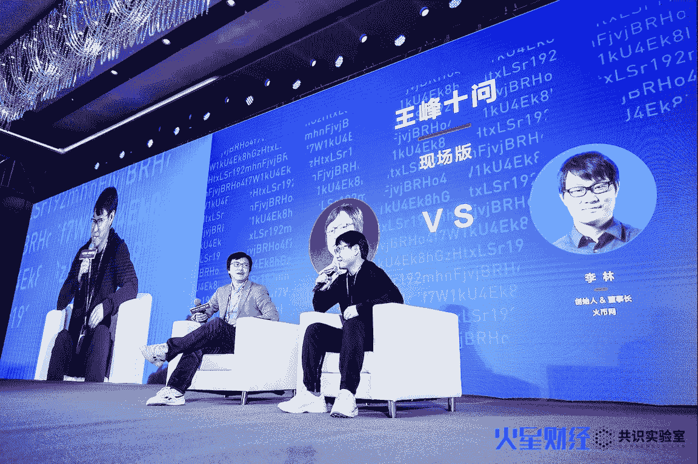
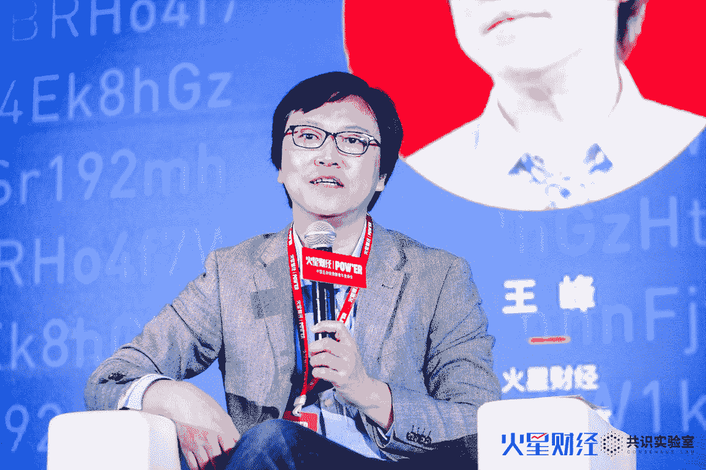
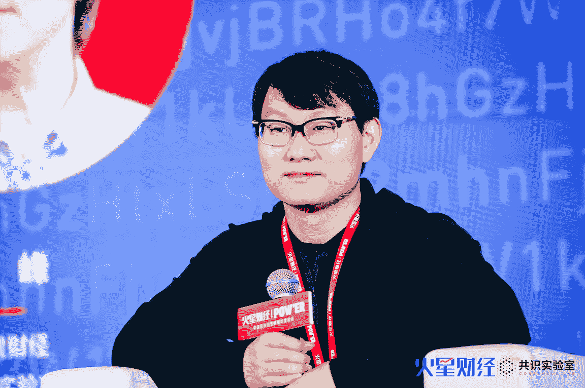

# 王峰十问第 29 期 | 王峰现场十问火币李林：交易所最核心的能力就是选择好的资产，没有之一（附音频）

> 原文：[`news.huoxing24.com/20190328185829327914.html`](https://news.huoxing24.com/20190328185829327914.html)

**火星财经（微信：hxcj24h）一线报道**，3 月 28 日，由火星财经主办、共识实验室与 VBLOCK 联合主办的“POW'ER 中国区块链贡献者年度峰会”在重庆举行，「王峰十问」也在峰会现场同步进行。王峰独家对话火币集团董事长、创始人兼 CEO 李林，热议火币国际化和生态化布局、如何筛选好项目、火币系创业者、三大交易所竞争、火币上市、交易所为项目背书等热议话题。此次对话不仅是 2019 年首场「王峰十问」，也是首次现场版「王峰十问」。 

**犀利观点如下：**

1\. 我的分工更多是给公司制定战略，选择人才，眼下主要就是为公司选择项目。

2\. 现在所谓的竞争，还是低维度的竞争，新的技术形态或者商业形态的变局，以及真正正规军的入场将是会极大的改变行业。

3.  在选择项目上，其实我们走了很多弯路，这里面有深刻的教训，交易所最核心的能力就是选择好的资产，没有之一。

4.  关于区块链经济的部分和传统经济的部分，我们更多地希望和传统金融体系有一个窗口，包括在海外的业务合规。

5.  公司覆盖的范围越来越广，涉及不同国家和地区、不同的业务线，坚持正确的文化、进取的文化、创新的文化，至关重要。

**以下为对话原文：（根据录音整理）**

王峰：很多人都蛮期待做“王峰十问”的线下版。说句真心话，去年 3 月份以后，我进入到区块链服务领域，做了火星财经以及投资机构共识实验室，我们陆续与产业中最头部的企业家、创业者和意见领袖进行了深入沟通，我大概用了一个月时间去理解区块链，去尝试认识区块链的牛人，后来发现很多人在关注“王峰十问”，自己开始有了压力，因为做不好会被别人嘲笑，而且如果瞎问就更不对，影响了产业的调子也不好。

“王峰十问”最大的特点之一，就是能够找到大家愿意听的、讲话有意思的、被广泛关注的人对话，所以今天和李林的对话很重要，王峰十问李林很重要。

**第一问  去年一年你忙的最主要的事是什么，现在忙什么？**

**王峰：**我感觉火币这家公司挺高调的，在网上可以看到很多关于火币的信息，而且火币做的事很多，每件事都在点上，甚至央视都报道过火币入驻海南的消息，所以在我眼里，火币是一个高调的公司。但是李林低调，低调得不知道他在干什么。所以想问李林，去年一年你忙的最主要的事是什么？现在忙什么？

**李林：**其实我自己也在思考去年到底在做什么，可能一直在想公司要往什么方向发展，这是干得最多的事情，所以我很少参加外面的聚会或者活动，把更多的时间留给自己去思考。至于为什么高调和低调，首先，高调做事、低调做人，没有毛病；其次是公司内部有分工，并不是所有的会议、官宣都需要我出面。我们火币中国有负责市场的，火币的 LOGO，也代表我们各个业务线，我的分工更多是给公司制定战略，选择人才，这是我做的两个主要事情。

**王峰：**眼下忙的什么事？

**李林：**眼下就是为公司选择项目。

**王峰：**李林给我的印象是他们做项目特别认真，不是什么项目都会上所。

**第二问  火币一方面做全球化布局，一方面做国内生态，是不是挑战很大？**

**王峰：**第二问，我自己观察，火币在区块链行业的影响力非常大，我关注到去年火币公司的业务发展主要有两个维度：第一个维度是火币在做国际化。这完全能理解，区块链尤其是加密货币以及从事交易的业务，确实在每个国家政策落地不是特别一样，有的地方特别热，有的地方特别凉，我感觉火币在拼命地做全局化布局，我直觉更像在交易上做全局化布局。第二个纬度，火币做很多生态性业务，在我眼里，这些业务是一个核心业务非常强大之后才能够做起来的，甚至是有了垄断型业务以后，要做的新的业务方向。我感觉，像腾讯、阿里他们在国内擅长的领域做得很大以后，才进行扩张并做了很多生态业务，再比如华为手机、苹果手机，他们在制造业领域做全球化，也不会太早做生态。火币一方面做全球化布局，一方面做国内生态，这两个维度同时做，是不是对火币的挑战很大？打比方，CZ 集中精力做全球化交易，你怎么看？

**李林：**包括我们公司内部的同事，我们的股东，当然也包括一部分非常关心我们的用户经常问这个问题。第一，每个创始人需要管理自己的欲望，尤其是在顺境中大家会过于的乐观，认为自己无所不能。有一部分火币的业务是在牛市的过程中，被胜利冲昏了头脑，觉得我们无所不能，疯狂的布局了很多。第二，火币布局会更多思考需求的问题。什么时间点、有没有这个需求，我们能力能否匹配。

所以刚才提到的两个方向，2017 年 9 月 4 日以前，火币在中国大陆市场取得非常领先的市场和优势，所以认为站在中国大陆市场领先位置，可以尝试在这个市场里面扩散；而全球化的问题，因为这个行业有特殊性，特殊性在于与传统行业不太一样，所以国际化还是在对核心业务进行深化。刚刚王峰提到的生态布局，确实有一部分被胜利冲昏了头脑，我们疯狂的布局，比如资讯，避免和火星直接竞争，所以后来我把资讯关了。但是更多来说，这个布局还是围绕用户的需求，用户是否有需求，尤其是火币的交易用户，是否能够为行业提供更好的服务，这是我们思考的问题。

总结一下，第一，看用户需求、市场需求、自身能力以及匹配程度；第二，交易所天然就是国际化的，我们确实在法律合规市场，包括美国、日本、香港进行布局；最后，确实有一部分属于牛市时的冲动，同行竞争非常多，我们也主动作了调整。

**王峰：**数字货币市场去年下半年进入了“寒冬”，步入了一个熊市，对你还是有影响，可否这样理解呢？

**李林：**火币广放的生态布局，本质上是给业务加了杠杆，但是整个行业寒冬对我们还是有一些冲击。对交易所来说，坊间传交易所是旱涝保收，不像挖矿，跟价格没有直接的资产损益，更多可能从这个时候用户少，收入会越低一点，对我们有冲击，但是冲击有限。我们做了一些业务和战略的调整，在去年下半年尤其是四季度开始做了很多管理上的优化。

火币从 2017 年 10 月份进入海外，一年的时间长期在大牛市里面，公司呈大跃进状态，没有像样的管理，甚至都没有对员工进行绩效考核等等，所以在去年年底，一是对业务进行了调整，缩减了一些和交易所业务关联比较差的业务，二是对管理进行了优化，并将会在 2019 年继续持续，需要把火币打造成行业里非常有竞争力的高效团队。

**第三问  未来交易所业务竞争会一家独大，三足鼎立，还是百花齐放？**

**王峰：**提到交易所，在中国会想到三个人，李林、长鹏、明星三人名气最大，给我们感觉在中国的交易所里面，他们的声音比较大，名声也比较大。第三个问题，在接下来的时间里，未来交易业的竞争真的会出现什么？一家独大、三足鼎立、百花齐放或者居中运行，你觉得接下来是什么情况？因为这是你的主战场。

**李林：**首先声明一下或者纠正一下，刚才说火币老板很低调，火币很高调，其实中币很低调，不能说国内是三大平台，有很多平台很难用表面的数据去看谁大。从不同的维度看到不同的公司的阳台，比如（员工）人数最多火币最多，但交易所收入、交易量、用户量、品牌影响力等等都不是很清楚。此外，这之间其实有分歧，不同的交易所有不同的特点，每个都有自己擅长的地方，而刚提到的三个交易所，可能是目前中国大陆地区品牌知名度比较大的三家。

关于交易所未来的发展，我个人认为，交易所未来的发展有两个非常大的变局，现在交易所的格局可能还只是上半场，还没有到中场，远没有到下半场。第一是新的技术形态或者商业形态的变局。无论现在大家讨论的去中心化交易所效率、节点数量、新形态出现，还是去年的交易挖矿，都属于新的交易模式，这些新的技术模式和商业模式，都会带来整个行业根本性的变化。也就是说未来这三个交易所可能不是前三大，能够打破现在格局的，99.9%不是在现在的模式产生的，就像打败柯达不是另外一个更好的胶卷厂商，而是数码相机。所以大家在积极布局自己的供应链，积极的布局自己的去中心化交易所等等。

第二，真正正规军的入场，将对行业改变最大。比如美国一个公司天使估值几亿美金，一出生就有各种牌照了；包括日本 SBI、雅虎、乐天这种巨型的企业，一旦市场合规，市场将会被巨型合规的企业争夺，所以留给我们的时间不多了。所以现在所谓的竞争，还是低维度的竞争。高纬度的竞争有两个：有传统市场的竞争巨头进来，二是有新的商业模式，这会带来巨大的挑战。现有的商业模式，能够出现新的更好专业机构的机会已经不多了，这是我的观点。

**王峰：**补一个问题，去年不知道是哪一个媒体报道，你在海南讲火币今天在这个领域好像就是一个大公司了，即使互联网业务巨头进来也没那么容易在这件事情上有类似的成绩。

**李林：**在区块链这个行业里面 BAT 现在不算大公司，这是事实。火币在区块链投入这么多，1 千多人在区块链行业里面深耕，腾讯或者阿里不能说一两百人就宣布进入区块链了。而且在体量上，随着行业的不断发展，去年火币的营收大概 5 亿美金级别，如果再成长 10 倍达到 50 亿美金级别，我们和几个大巨头又会拉近一点。

就像现在巨头可以用滴滴市场、美团市场或者别的市场，体量足够的时候，更多不是消灭你，而是跟你合作，或者别的合作模式。所以对我们来说需要迅速提升自己的量级，进入可以跟巨头 PK 的量级，为什么这么热衷于做生态？我认为做单一的业务很容易被击破。 

**第四问  把公司搬到海口，该怎么解决人才的问题？**

**王峰：**第四问，火币从去年下半年起，陆陆续续把公司总部往海南搬。我知道海南政府非常重视火币，我自己去过海南，也参加过火币在海南搬迁的正式发布会，当时搞得很隆重。火币花了很大的精力往海南搬，晓奇也说自己大部分时间在海口。我想谈的问题是，把公司搬到海口，该怎么解决人才的问题？新兴热门领域用的都是新兴人才，这些人才不好找，在管理上怎么解决这个问题？我看火币做得还是挺顺利的。

**李林：**回答第一个问题，为什么搬海南。其实火币整体的思路是业务合规，所以任何有合规的机会我们都不会放弃。不只是海南，其实我们也在努力争取香港合规。我们认为，如果从整个中国大区域的政策来看，香港最开放的，其次可能就是海南，再之后是大陆，包括重庆和其他地区。整个中国范围，香港和海南这两个区域是我们重点努力争取政策窗口的区域。

海南确实有很多问题，比如该如何解决人才的问题？其实很简单，只要给足了工资。这是开玩笑，但很重要，我们提供了比较好的薪酬和待遇，包括给海南的同事补贴，这是其中一点。再有比较重要的，就是需要给团队一个信心。我相信所有做区块链的从业人员都希望受到尊重，都希望受到认可，都希望自己出去参加的会不是一场政府不敢参加的会。马斯诺有需求分层理论，当一个人感觉他不再缺钱时，就需要受到尊重。在海南受到尊重，对我们的团队来说很重要。**如果对外说自己是火币的员工，你会很自豪，这比什么都重要。**

另外，我们在本地也招了一些人，在海南也成立了人才培训中心，现在跟海南几所大学在合作培训区块链专业人才，同时特别推出了一个区块链行业的培训证书，给海南培训本地的人才。

**第五问  创业做火币，当时有什么标杆吗？**

**王峰：**第五问，在我和李林对话之前，我花了一些时间研究李林原来做什么。火币是 2013 年成立的，做火币之前，李林做过一个互联网项目：友谊网，那时候大家都看到了 Facebook、饭否、开心网等社交浪潮，李林当时也朝那个方向走过一段时间，但是没有做大，后来火币却取得了巨大的成功。我的问题是，第一次创业尝试做社交没有做成，你有哪些反思？第二次创业做火币，当时有什么标杆吗？或者自己有一个目标竞争对手吗？

**李林：**第一个问题比较简单，我们公司内部经常说的一句话是选择的问题，首先就是“赛道”的问题，是不是有用户需求、市场需求？社交是高度集中化、一家独大的行业，当时已经有腾讯了，更不要说人人网了。

**王峰：**人人网的老大陈一舟曾经说，做不成功的根本原因是腾讯，在社交领域，有腾讯谁也做不成。

**李林：**所以我觉得还是“赛道”的问题，当然有更多的原因，比如经验不足，团队不足，第一个创业失败是选择方向的问题，没有选择一个合适的方向。

第二段创业当时有没有标杆，为什么选择做这个行业？务实一点说，2013 年尝试了非常多的项目，现在说的 O2O 项目都做过，甚至做过洗车，做了两个月就不做了，还有网上教育、婚纱摄影婚庆等。

**王峰：**火币不是第二个创业项目？

**李林：**那时候我们尝试了很多方向，火币只是其中之一。当时项目创业或者失败，或者不怎么成功，我们在寻找创业机会，只不过是无意中碰到，仅此而已。**你问有什么标杆，我们就想做一个事情能够养活团队，这就是标杆。**

**王峰：**所以从这点来看，今天给我一个启发，我们老讲创业，李林在创业期间找了好多篮子，直到找到一个有价值的篮子，才花大力气笃定去做。

**李林：**主要看对项目有没有信心，如果项目做出来，感觉不是很好，就尝试一下也不错。如果对自己的判断非常有信心，就一直做下去，比如火币做了 6 年，一直没有换过赛道。 

**第六问  在你眼中，什么是好的区块链项目？**

**王峰：**第六问，在你眼中，什么是好的区块链项目？你有主动去找好项目吗？

**李林：**准确来说，我最近这段时间每天都在积极主动找项目，确实如你所说，好项目很少、很难找。什么是好项目呢？不同人、不同的角度对好项目的评价是不一样的。从用户、投资人的角度来说，能涨的项目就是好项目，而且是短期能涨，今天买明天就能涨的是好项目，比较浮躁。从平台角度来讲，能给我们带来很大的交易量，给我们带来用户，给我们带来很大的收益和价值，这就是好项目。**但是我个人认为，从长远来看，能够创造价值的项目是好项目，只有创造价值才能把这些都统一起来，而且是可持续的。**

其实项目短期能涨非常容易，就是一块石头放到平台交易，只要有足够多的钱，就可以炒成黄金，但是它不能持续，本身还是一个博彩的游戏，因为这个项目不给社会、行业和用户带来新的价值。所以，我们会关注到底哪些项目能够创造新的价值。

具体来讲，我们会关注：第一，这个项目解决什么问题，是否让这个行业的成本更低了；第二，这个事情为什么要用区块链来做，不用区块链能不能做，区块链是不是最好的方案，用区块链技术是否真的能带来价值；第三，除了技术之外，有没有足够的能力保证项目落地，有没有机会能够创造新的价值。

最近谈的一个项目，我们在问同样的问题，特别关注技术和创新，但创新的技术一旦开源就不创新了，你究竟有没有能力让它落地，让别人用你？这是前置阶段的问题。

除了这个问题，假定这个项目能够给社会带来价值，有可能经过半年、一年的努力，回到二级市场要关心是否定价合理的问题。

我们会要求项目方给火币用户一个非常低的折扣，尽量降低火币用户的投资风险，因为我们知道 2018 年很多项目被高估，很多项目有 50%的流通，但并没有投入使用，没有给用户带来价值，支持不了 50%的流通。流通要和市值有关系，项目进展过程中不断有人用，用的人越多，价值越高。我们非常喜欢把它用做后期挖矿的项目，因为挖矿是产生价值的过程，而不是一开始把 80%卖出去，因为没有价值支撑，只能变成二级市场的一个游戏。

最后，关注风险的问题，比如这个项目有什么风险，是不是合规合法，法律机构是否清晰，创始团队是否有良好的信誉，是不是做前四个项目都没做成等等。

**王峰：**追问一个问题，我感觉火币今年的项目政策跟去年有变化。刚才在会议室跟你聊天时，感觉到你个人更关注项目，对项目的评价中，关于场景、用户量、可落地的问题大于纯粹说技术有多牛。关于火币在去年的项目政策，该怎么看？有没有人的因素？会不会太主观，还是有一套系统？去年其实有好多批评，包括你背后备书的投资机构、推荐方等等，也有很多的矛盾，你现在怎么看，有更好的解决方式吗？

**李林：**在选择项目上，其实我们走了很多弯路，这里面有深刻的教训，**交易所最核心的能力就是选择好的资产，没有之一。**

从运营角度来说，我们去年走了几个弯路：

一是认知的问题。2017 年底，整个行业没有谁能够判断什么样的项目是好项目，什么样的项目能够落地。有的时候觉得这个项目不错，但做了以后发现不行，所以在一段时间内认为，只要用户量足够大，我们就非常喜欢，后来发现很多项目其实跟链没法结合，这是认知的问题。

二是尝试解决个人主观的问题。当时的初衷本来是好的，希望通过一种社区化的方式解决问题，认为自己的判断太主观了，让这么多超级节点来推荐，让社区来投票等等，最后又变成了一种资本游戏，所以这是尝试，不叫失败。

现在来看，我们有两个改进：

第一，我们基于这一年多的经验已经升级迭代，虽然不能百分之百确保现在的认知就是最终正确的认知，或者接近真理的认知，但在实践过程中，至少以前犯过的错误不会再犯了。

第二，现在更多地希望把社群治理和公司产品把控结合起来，其实每个项目我们都选择了很多不同的机构，有投资经验、项目判断经验的合作伙伴，但是最终依然是我们来决策，因为我们发现去中心化的模式会导致很多人为火币的品牌负责，而我们只为自己的币负责。

**第七问  交易所为项目备书，主动营销项目，这个事好吗？**

**王峰：**第七问，我自己在旁边观察，现在做数字资产交易服务的企业有在为项目营销，这在传统证券交易市场是不存在的，港交所不可能帮我宣传公司。现在数字货币交易所为项目备书，主动营销项目，这个事好吗？你怎么看待这个问题？

**李林：**其实自有了项目开始，交易所就一直在做营销。简单来说，我们每上一个项目，甚至从 2017 年 5 月份第一次上项目，我们都会说火币上了某个项目。

交易所本来是一个中间平台，一个中介机构，从严格意义上来说，一个中介机构提供交易场所，让大家自行交易，就像新三板或者 A 股，有点像现在的去中心化交易所，你自己爱上就上、爱买就买。但在这个过程中，绝大部分用户没有判断能力，这是全球的现状。这个时候，交易所在选择项目的时候，已经脱离了交易所的功能，有点像证监会或者美国的一些投行。

用户选项目的过程，已经不由交易所决策了，因为在这个行业阶段，没有完善的机制能够让大家各司其职，各自分工。所以很多时候，对于最后要承载所有用户的交易所，只能做到这样。

对于营销，也是一样，好的项目非常少，我们每上一个项目都有例行推广。如果我们认为这个项目在未来落地广泛，会乐于提供更多的推广资源。

**王峰：**跟交易所相关，很多项目上了以后也流通了，不同于传统证券，比如上了 IPO 以后，要求按季按半年发财报，公布透明的数据，也有针对普通用户的服务，要求定期发布数据或者发布动态，而且是强制性的策略，但现在看到很多项目上了交易所以后，也没有动静，高兴的时候说，不高兴就不说。

**李林：**实际上是这样的，项目分不同的类别，比如像比特币这样社区化的项目，不能说两个星期要发一次动态，不然就把它下架。现在很多项目都是去中心化的，我们有管理规则，有包括多长时间不更新会怎么样等要求，但是这还远远不够。

我们主要有两类办法解决问题，一类是立法的问题，不同领域都有其法律约定，比如一些口头承诺不行，一定要通过系统合约来做；第二类是可以整合一些机制，就像创业板有保证金机制一样，这是最低的要求，可以降低风险。

**第八问  怎样看待区块链创业者中的火币系现象？**

**王峰：**第八问，最近几年火币好像出来了很多创业者，今天也遇到一些人找我投资或合作，事实上从火币出来的创业者很多。从同行来看，有好多人从火币出来做资讯和行情，似乎在区块链创业者中有一个火币系，这个现象你是否有感觉到？这些人从火币出来创业，是否得到你很大的支持？我听说李林对和自己工作好多年的同事都很好，你怎么看待这个问题？

**李林：**不管怎么讲，这是一个行业小和大的问题。其实早期的时候，我们做事情并没有那么专业，更多是说，有几个同事或者合伙人出去创业了，能支持一把就是一把，更多是基于朋友帮忙，后来发现行业人才流动率非常高，投的人多了，莫名其妙就会支持一把。

后来，因为行业的发展越来越大，我们负责投资所谓的生态企业，但早年不是那么一回事，就是因为朋友互相支持一把，因为那几年，大家都是互相支持，假设没做成也没关系。具体有没有帮助，说实话精力有限，真正有效的帮助并不大。

客观来说，我本人或者火币公司给生态企业或者投资企业的帮助并没有那么大。火星财经我们也投了一点，还推出过产品跟火星竞争。

**王峰：**去年火币一年投了多少企业？

**李林：**我们投了 60 多家股权企业。

**第九问  干区块链是不是一定要 IPO？区块链企业能不能不上市？**

**王峰：**第九问，有消息说火币要 IPO，不知道是你主动发声还是媒体曝出来的？对于火币收购桐城控股，舆论认为是火币迈向 IPO 的步伐。不过反过来，一边人家排队拿项目登陆你所开创的新市场，一边你还急着要去传统证券市场，干区块链是不是一定要 IPO？区块链企业能不能不上市？

**李林：**这取决于我们对于这个行业和市场的判断。在相当长的时间内，我个人不好说行业的潜力，但这个体系和传统的体系时间会更长，这是互相补充、互相促进的关系。

在这个过程中，关于区块链经济的部分和传统经济的部分，我们更多地希望和传统金融体系有一个窗口，包括在海外的业务合规，现在去海外收购一个公司可能连审计都很难过，这是很尴尬的事情。

未来竞争中，我们的底气越来越足，你们有的我们慢慢也会有，彼此更多的是补充。

**第十问  火币让你最不放心的是什么？**

**王峰：**最后一个问题，火币让你最不放心的是什么？有没有这个事？

**李林：**其实最不放心的是从 2017 年下半年到现在，这个过程很惨痛。**对于我来说，公司的文化越来越重要，现在公司覆盖的范围越来越广，涉及不同国家和地区、不同的业务线，是不是能够坚持正确的文化、进取的文化、创新的文化，至关重要。**

在这个市场中，我们以用户为中心，给用户提供最好的服务，踏踏实实按照这个方向去做，对自己的战略方向非常有信心。随着公司人员越来越多，用户越来越多，我们对于文化也越来越要加强管理。

**王峰：**谢谢。李林对于他所从事的事业和他所处的行业，都有冷静和务实的思考，学习了。谢谢大家！