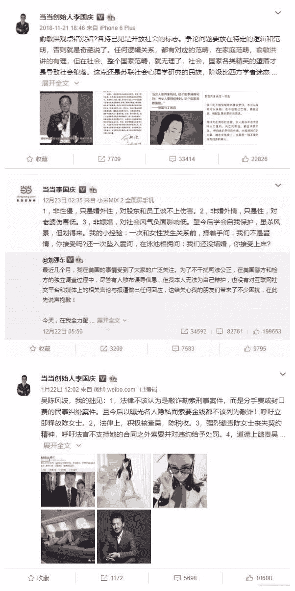
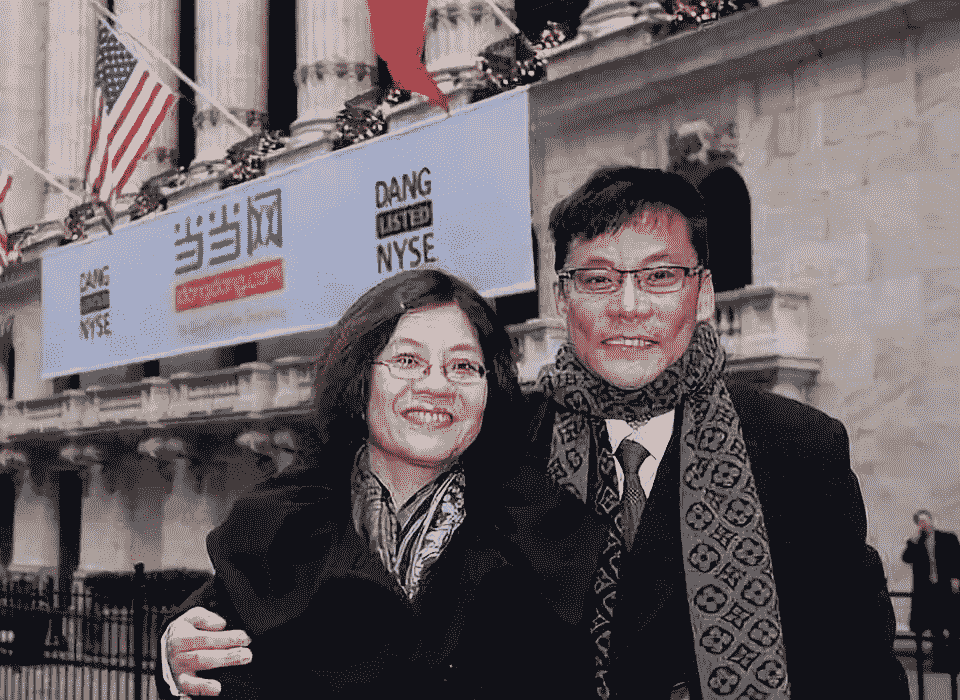
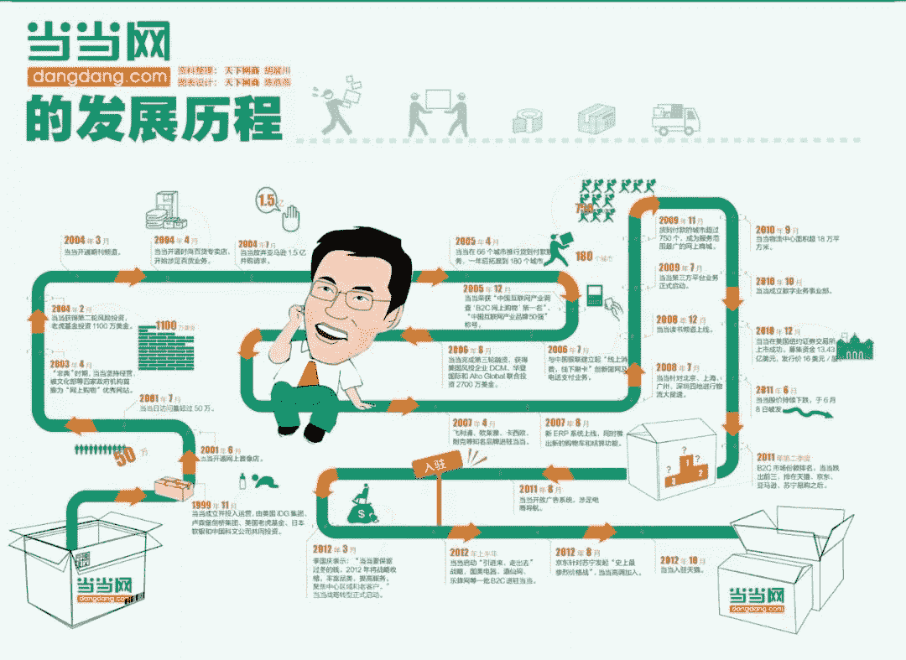
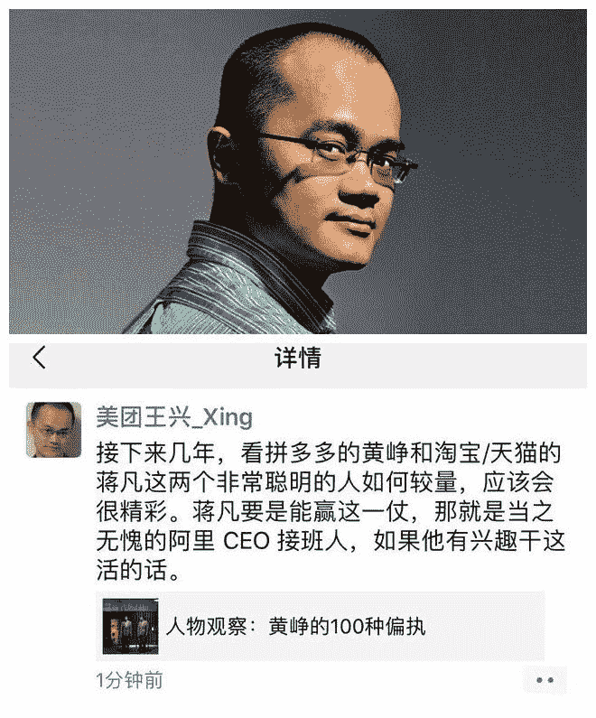
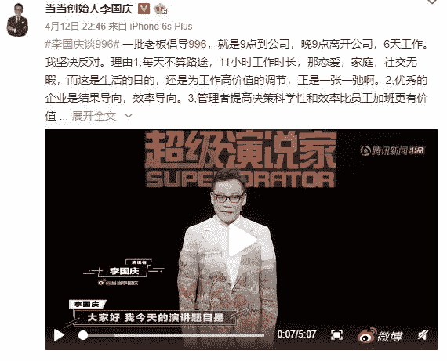
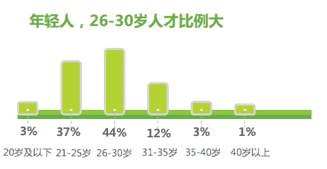
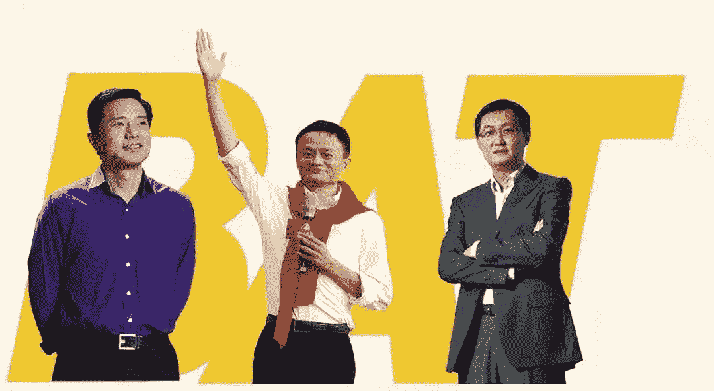

# 王峰十问第 30 期 | 李国庆做客王峰十问: 只要聊 10 分钟就能让 90 后 00 后在我怀中哭泣(全文)

> 原文：[`news.huoxing24.com/20190422223545114234.html`](https://news.huoxing24.com/20190422223545114234.html)

**文 | 王峰十问**

**出品 | 火星财经（ID：hxcj24h）**

从 1999 年 11 月与妻子俞渝共同创办当当网，到 2010 年 12 月 8 日带领当当网在纽约证券交易所正式挂牌上市，李国庆在中国 20 年互联网创业的大潮中，经历了从创业者到成功者的蜕变。如今他选择离开互联网投身区块链，开启自己的“二次创业”。作为兼具亲历者与领导者身份的“互联网老兵”，他将以怎样的视角看互联网行业的下一场浪潮——区块链？

此外，在当下 90 后、00 后等年轻群体主导的市场中，年逾 50 的李国庆能否把握年轻人心理与需求？对此，李国庆在对话中回答，自己 10 年前刻意与 80 后接触，现在刻意与 90 后、00 后接触，目的就是希望能保持自己的消费者觉察和对用户的洞察力。李国庆表示，“我现在跟 90 后、00 后可以无障碍沟通，如果一对一聊天，不需要喝酒，聊 10 分钟就可以让 90 后、00 后在我怀里哭泣。”

**4 月 22 日 15:00，“王峰十问”第 30 期，火星财经发起人王峰独家对话当当网创始人、早晚读书创办人李国庆，****就创业经历、电商竞争局势演变、996、京东与刘强东近期争议、他眼里的 BAT 大佬、区块链未来趋势等话题展开深度对话。**

****核心观点如下——****

> **1. 对于 996，李国庆表示明确反对，但也认为大佬们突然呼唤 996，一方面是因为竞争激烈，另一方面是人口红利下降，企业人力成本攀升。年轻一代越来越不接受 996。企业更需要顺应潮流，在效率和创新上下功夫。**
> 
> **2.对于当当过去 20 多年的发展，李国庆认为犯了 2 个大错：1）资本战略失策。电商要尽快达到一个规模值需要强大资本支持。这是一种竞争策略，而在这方面当当出现了战略失误；2）没能争取 BAT 支持。在特别需要资金支持的阶段，当当没有“抱 BAT 大腿”，而是选择了独立发展。**

> **3\. 对于外界评论当当“成也夫妻店，败也夫妻店”，李国庆首度回应称当当有机会与阿里、京东形成并驾齐驱的市场局势，但最后失去了这个机会，这其中“夫妻治理结构导致的谨慎和保守占了 3 成因素”。**
> 
> **4\. 对于最新的创业项目“早晚读书”，李国庆表示不会 ICO，也不会发币。他认为，“早晚读书”所在的知识付费领域不会出现百亿美元公司，但市场规模远不止于此。**

****以下为对话全文：****

****王峰：****Hi，大家下午好，欢迎来到火星财经“王峰十问”的第三十期——“老友记”。****

****约上老朋友们，一起聊聊当下热门的话题，好不惬意，对我而言也是学习。今天请到的这位老朋友，是当当网创始人、早晚读书创办人李国庆。****

****先让我们看一看李国庆的经历：****

> ****1964 年 10 月 1 日，出生于北京。****
> 
> ****1987 年，取得北京大学社会学学士学位。毕业后，先后在国务院发展研究中心、中共中央书记处农村政策研究室工作。****
> 
> ****1993 年，联合北京大学、中国社会科学院、农业部等创办“北京科文经贸总公司”，从事图书经营。****
> 
> ****1995 年到 1996 年，在美国和香港分别创办“科文实业集团”“科文（香港）出版有限公司”，从事国际版权贸易、合作出版等业务。****
> 
> ****1999 年 11 月，与妻子俞渝共同创办当当网。****
> 
> ****2010 年 12 月 8 日，带领当当网在纽约证券交易所正式挂牌上市。****
> 
> ****2019 年 2 月 20 日，李国庆发表公开信，宣布离开当当网，未来将投身“内容产业+区块链”项目，进行二次创业。****

****国庆兄是土生土长的北京人。北京人能侃会说，是出了名的。我记得高晓松曾经问同是北京人的冯小刚：“你说北京人到底是更会骂人呢？还是更会夸人？”冯小刚回答说：“反正北京人就是靠嘴走天下！”国庆兄的嘴也是了得，这是圈中人的共识吧。但过于耿直的国庆兄，经常因为开口炮轰别人，反落得自己遭受到更猛烈的炮轰。****

****最近，他关于刘强东、娱乐圈、996 工作制的几番言论，接连引发社会热议，再加上离开当当、做书友会、投身区块链，更让国庆兄一次次卷入是非旋涡。****

****谢谢国庆兄做客王峰十问智库群。能和国庆兄聊天，应该蛮有趣和有料。不久前一次饭局上，我记得是三里屯一家很好吃的火锅店，我和国庆兄相约合适时间，做一次十问的对话，爱书成迷且还在图书行业打拼的国庆兄提议，时间就定在世界图书日（4 月 23 日）前后。****

****希望国庆兄不见外，继续坦荡直言。国庆兄，咱们就正式开始吧。****

******1、接受“电商界鲁智深”人设，敢说话对事不对人****** 

********王峰：**第一问，大哥，我常常见到你在微博和其他社交媒体上的言论，但大多数都不是关于当当网的，而是别人家的事情。比如，今天支持一下俞敏洪言论，明天评论一下刘强东事件，后天抨击一下吴秀波丑闻，以及最近的 996 话题，都有你非常犀利的观点。******

********

****特别是你对很多敏感事件的看法引起了很大的争议，当当官方发文对你进行指责，引来一大波朋友圈刷屏，最后以你的公开道歉收场。**薛蛮子曾经评价你，说你是电商业界鲁智深，说话大胆、豪气直肠。你接受这个人设吗？******

******李国庆：**在进一步回答这个问题之前，我先更正一下。如果大家仔细看我的微博内容，可以发现，名为道歉，实为辩解。****我接受这个人设，我在企业家里面算是敢说话，我不仅批评社会弊端，也对企业家群体和自我提出批评。********

******王峰：**不过，这可能导致了公众对你的关注，大过对当当的关注，不知道你有没有意识到？俞渝评价“李国庆就是一个性情中人，比较二的一个人。”性情中人，我想你肯定认，我也看得出来，关于“二”这个特点，你自己认吗？哈哈。****

******李国庆：**二不二的，用中国传统文化看，我肯定是个二的人，因为我已经财务自由了，我也在企业有自己应有的地位了，那就不该去点评别人了是吧，经常批评别人会得罪人呀，那么我这么做当然是二了，但是我觉得这是我给我自己的一个责任感吧。****

******王峰：**我的直觉是，大部分没有近距离接触过你的人，他们所理解的那个李国庆，和你本人实际的性格或处事风格出入很大。比如一次饭局，你曾提到当年腾讯和当当谈合作时，马化腾说第一次见到你后，他惊讶于你原来是那么好说话的人，根本不像业界所说的那么拽。我身边很多人，尤其是这个产业中的人，对你的印象至今还停留在 2010 年当当上市晚宴提前离席、和大摩女在微博隔空互骂的李国庆的形象，你是一个喜欢公开批评人家而私底下又是一个做事比较圆满的老好人吗？****

******李国庆：**嗯，接受你给我的这个帽子，我是公开的批评，私底下老好人似的。因为我与人为善，我从不为了企业去攻击另一个竞争对手或中伤哪个人个人的私德。****

******我批评友商或别的企业或者行业现象，也都是出于对事不对人，所以真正私下接触的时候跟大家都还能处的不错。**也谢谢大家，现在这个社会这么多企业家对我的包容，能够接受我，虽然他们不一定喜欢我。****

******2、首度回应“当当成也夫妻店，败也夫妻店”******

******王峰：**第二问，咱们中国有相当一批男人是怕老婆的，过去他们被称作“妻管严”，准确的理解是，无论一个人在外面如何能干，回家只怕老婆，而我听说你是办公室里怕老婆。有人说，其实俞渝比李国庆能干。听说你虽然在外名气很大，但当当网内部俞渝说了算。**难道这么多年里，俞渝在当当才是实际的当权派？******

********

******李国庆：**嗯，这个问题提得很敏感，为夫妻治理结构呢，真的谁说了算，其实是谁也说不清的事儿，那么俞渝过去一直说呢，我有商业洞察力啊，**所以在这个这个商机的捕捉判断上，这些事儿都说让我决策。******

****但是俞渝一直管着财务和人力，中间也管过几年技术也管过其他的部门，但是人力和财务都归他管，这就是要害了，而在用人上我们俩观念完全相左，分歧大于共识。****

****所以从这个角度看呢，我想用的人她不同意就进不来，我满意的人她不满意就要把人挤兑走，不用她挤兑，恐怕人家那些人也受不了吧，就是所谓的两个老板嘛。****

******王峰：**余渝公开说过，再来一次的话绝对不和你一起创业，你后来也强调过反对夫妻创业。其实夫妻创业是有很多好处的，比如 SOHO 的潘石屹和张欣，也有今天百度的李彦宏和马东敏，很多夫妻创业合作多年，也是“都挺好”。为什么你们两口子在当当合作了大半辈子，却这么公开地彼此反对夫妻创业？****

******李国庆：**我们很早就发现了我们俩的夫妻治理结构是问题，但是各种竞争啊，导致我们还一时半会还分不开，他全交给我也不放心，我交给他，我也不放心。至于你说，百度的李彦宏，马东敏啊，搜狐的张欣和潘石屹呀，他们这个夫妻治理结构是不是都挺好？我也不认为。我相信问题也多得很。****

******王峰：**说道夫妻创业，我有一个观察和推测，凡是夫妻店创业，通常是女方忽悠男方干的，即最初的创业动念不来自于两性中的男方。你们最早的创业也是俞渝的主意？**** 

******李国庆：**那这个要倒历史，那这个当时做网上书店，那肯定是我的主意啊。是吧，俞渝 96 年嫁回来的，现在大家认为是 99 年创业高潮，海归女性创业代表，其实 96 年是嫁回来的。我这不是自夸，当年中国还在出国热的情况下，那人家俞渝在华尔街已经有了成就，肯嫁回北京是一件很不容易的事儿，这也是我引以自豪的，谢谢俞渝的。**** 

******王峰：**我在网易上读过一篇文章，说“当当成也夫妻店，败也夫妻店”。其实，在我看来，当当业务稳健，在众多电商巨头林立的时代，反而是独特的小而美，但是你听到网易上的那篇文章的观点，心里有没有一点不是滋味？**** 

******李国庆：**那网易这个文章，我没细看，标题看了。这样的文章很多了，有道理啊，那么当当的作为第一代电商，现在仍在图书有着遥遥领先的地位，作为一个垂直品类电商一个独角兽啊，这是我们给自己的人生，给读者给投资人一个完美的交代。**** 

******但是当当是有机会跟阿里、京东等，三驾马车、五驾马车并驾齐驱的，那么我们失去了这个机会，这里边夫妻治理结构导致的谨慎和保守，是占了三成因素的。****** 

******至于心里是不是滋味，当当 19 年，那么我觉得，可能这就是命运吧，有人认为俞渝该抱怨我，有人认为我该抱怨俞渝，我觉得不是。**如果没有俞渝，我可能有别来自别的投资人的掣肘，如果没有俞渝，我也可能有合伙团队的另一个合伙人，会产生了重大的分歧，导致公司决策缓慢或放弃一些重大的，有高风险的商机，所以我觉得这是命运，一点也没有心里不是滋味儿的感觉。********

******3、复盘当当：过去 20 年犯了 2 个大错******

******王峰：**第三问，当当有 20 年了吧，弹指一挥间。其实在早期，B2C 的方向并不被人看好，众做周知，最初的 8848 选择从 B2C 业务转型到他们并不擅长的 B2B 业务，最终弹尽粮绝，虽然王俊涛那时候一度风光占尽媒体头条；雷军将卓越网早早出售给了亚马逊；做 B2B 起家的马云当初并不看好 B2C，很显然，后来的淘宝和支付宝才是绝佳的好生意；陈年从卓越到凡客继续征战，依然陷入泥沼。刘强东确实是真牛逼，京东是 2007 年才拿到今日资本第一笔投资的。而当当是 1999 年成立的，虽然一直坚持到现在，令人佩服。但是有几点可以这里讨论一下吗？**** 

************

******你可曾想过中国 B2C 市场能容下今天这样体量？比如说，你曾经认为当当可以做到最高的营收规模是多少？当当最早上市，你也曾想过和京东对打过的。******

********李国庆：**我当然想过中国 B to C 会有今天的体量啊，现在当当马上 20 年了，在第 1 个 10 年，我是中国电商的预言帝啊，我现在仍然认为预言都很准确呀。**比如我最早说，淘宝一定会有一天，分出一个淘宝商城的，那么两年后三年后他们独立于淘宝商城。********

********王峰：**有人根据各电商平台 APP 的最新 MAU（每月活跃用户数）得出结论：**手机淘宝处于第一梯队，拼多多和京东处在第二梯队，第三梯队则包括了唯品会、天猫、小红书和当当等一众平台。在一轮一轮的电商大战和行业洗牌中，除了比胆大，你认为还错过了什么？******** 

********李国庆：**在京东突飞猛进的时候，好多投资人问我，那时候大概是他们正在融资，虽然有了今日资本融资，但是马上钱要烧断了，供应商的货款都在推迟发，那么这个时候那个 DST 就是俄罗斯的基金还没到啊，遇到了巨大风险我在网上喊话说，老刘啊，库房别干了，赶紧租吧，赶紧成立突击融资小组，否则过三年就没京东了。******

****在京东那场危机中，现在刘强东承认，当时他说你怎么知道我们的财务状况啊。我说我真没了解你财务，我就推算你的销售额、你的亏损额、亏损率，就能推算出来。那么当时有一个投资人说，幸亏你早就提醒我们，否则我们现在投京东得亏多少啊。****

****我说等等，我当时跟 RUBY，DCF RUBY 和策源资本的冯波说，京东现在的困难，他现在一年亏 80 亿，他只需要再来十几亿美金，他就挺过去了。果然，半年后 DST 来了，十亿美金到账。****

******整个电商行业过去十五年、二十年的竞争，可不是光比胆大哟。**比当当胆大的、比刘强东胆大的、比马云胆大的还有哦。那是尸横遍野呀，每家烧掉两千万美金而倒掉的公司，那页能数出七八十家咯。****

******那真正比的，也是当当错失的是什么，是资本战略。**这个亏损发展，尽快达到一个规模值，这种竞争策略，需要强大的资本，就要这个资金的蓄水池，那这方面，当当有过战略失误。这是第一个失误。****

****我们在上市前可是有更好的估值，融更多的资金，然后继续亏损着发展。但一上市就为了盈利，而收缩了手脚，失去了百货的战机。****

******那么第二个当当的失误，我觉得也是资本战略，傍 BAT 粗腿，当当选择自主发展。******

**** **王峰：**据你透露，原本你和俞渝打算 2018 年当当被海航收购后，就离开当当网。**后由于一些不可抗因素，这笔交易并没有成功。你们还会为当当寻找新买家吗？实话实说，这 20 年当当的创业史中，几曾想过出售？******

********李国庆：**我当然是希望当当独立发展喽，而不是被出售啊。**虽然这 10 年，就是当当上市后老有被出售，那说明资本市场看好我们或者有些巨头看好我们，但是我希望独立发展。因为图书是非常独特的品类，当当在图书啊，横向、纵向扩张都还有很大的机会，我过去几年管当当新业务时候，做了很多布局和尝试，我是非常满意的。********

******4、**由社群、社区的裂变，打造出人与人之间的强链接，会带来电商新格局******** 

******王峰：**第四问，美团 CEO 王兴前不久在朋友圈发表观点，认为淘宝、天猫未来主要对手是黄铮的拼多多，若蒋凡能够带领淘宝打赢拼多多，则“无愧”成为阿里 CEO 接班人。朋友圈有人打趣“美团王兴隔空替阿里定太子”，王兴的话很值得玩味。你读到王兴话中有话吗？****

********

******李国庆：**拼多多的事情呢，我分析有研究有观察，但是我这次别那么二，我现在不想发表更多的观点。****

******王峰：**其实很长一段时间，电商市场是沉寂的，只有京东和凡客折腾。但是移动社交软件和算法资讯平台大爆发后，市场正在发生重大变化，一个明显确实就是用户快速下沉到二三线乃至四五线地区，拼多多仿佛成为搅动市场大水的那条鲶鱼。****

****但这仅仅可能只是一个开始，**我注意到，同期崛起的抖音，已经开始由单一的娱乐快速渗透到电商、点评、旅行等多个领域，是否意味着接下来的市场还有大变局？**我觉得，未来几年互联网市场上最大的变数，大概率不会是社交和游戏，而很可能还是电商，洗牌可能已经开始了。**** 

******李国庆：**啊，我记得三年前亚布力企业家论坛呀，在这个黑龙江亚布力，什么互联网下半场。当时我跟几个人，我说怎么就上半场下半场了。竞争是无止境的，尤其一个零售业，全世界都如此，没什么竞争门槛，经常是死一个又上了一批。我现在每年去纽约，又冒出一个连锁店，不同的细分市场。**** 

******那么今后电商竞争的格局呢，确实要发生很大的变化，传统的电商都是弱链接，而现在通过社群、社区的裂变，打造出人与人之间的强链接关系，这种强链接会带来电商新格局，对现有传统电商造成巨大的冲击。******

******5、为何大佬们突然呼唤 996？****** 

******王峰：**第五问，最近“996.ICU”的事情也是炒得沸沸扬扬，996.ICU 即“早上 9 点到岗，晚上 9 点下班，每周工作 6 天，生病 ICU”，最早起源于中国码农在程序员论坛 Github 上发起的“996.ICU”项目，以此来控诉国内互联网公司加班严重的现象。媒体公布的“996 公司名单”中，华为、阿里巴巴、蚂蚁金服、京东等大企业先后上榜。关于是否认可并接受 996，每个人自有判断。很多老板出来讲 996，仿佛不谈 996 的就不是好公司。你认为这是“上司自欺和欺骗上级”，主张“实干，巧干，苦干”。你是明确反对 996 工作制的，为什么？****

********

******李国庆：****反对 996，第一个理由是工作时间太长。**大家知道，如果扣除吃饭时间一天 11 小时乘以六天，那么这个 66 小时周工作制时间太长了，不利于休息，学习进步。****

******第二个理由就是企业的效率很成问题，**包括倡导 996 在内的阿里巴巴和京东，这些公司在效率上应该有大幅度的提高。如何提高效率？第一，解决降低各部门间的沟通成本；第二，中高层要勇于担责任，勇于做决策。****

******王峰：**我的角度看，目前大家对 996 工作制基本上都可能走偏了。比如很多观点都在围绕道德层面争论，比如那些说“不加班就不是我兄弟”、“优秀的人心甘情愿加班”，甚至有人说“996 是前世修来的福报”，这些多少有点道德绑架的意思啊。我们先不谈道德上的争论，当前 996 更多与今天互联网产业日趋恶劣的竞争环境有关系，当老板确实也不容易啊。你认为，996 工作制在互联网行业普遍存在并保持很长时间的土壤是什么？****

******李国庆：****互联网公司所以长期的长时间的工作，就是因为这个互联网公司呢，都是一个新业态。**他必然效率低，因为还没找着这个边界，部门之间怎么分工，这个是一个大问题。****

****互联网公司长期长时间的加班，**第二个原因是，企业管理者忒 LOW，像我们都是创业出身，没经过科班的 MBA 训练。**创业，不需要 MBA 的训练，但是企业一旦变大，一定需要有 MBA 这些课程的训练。而无论阿里巴巴还是京东、当当都曾经尝试过，从跨国公司引进高管，空降高管团队，甚至罗兰贝格的，但是水土又不符，两个团队融不到一块去。结果往往这个空降的，有过管理训练的，在这个企业又没法活下去。其实百度也如此哦，腾讯我没注意到。**** 

******王峰：**拿开发应用类企业说，任务繁重的程序员往往会抱怨，自己所获得的价值与 996 的付出欠缺平衡。**在我来看，996 工作制是在公司制下，个体利益与公司利益冲突的一种体现。**一些人认为，这是目前公司本位出现的必然结果，有开始拿理想化的中心化组织来比较。比如，基于区块链的去中心化自治组织(DAO)或者分布式协作组织（DCO）等等新型组织形式，以社区共识机制生成的通证（Token）为激励，让包括员工、管理层、合作伙伴在内的所有人共享企业的收益，有助于实现所有利益相关者的利益统一，有可能会从根本上破解 996 工作制的困局。对此，你有了解过这样的说法吗？****

******李国庆：**你的提问里包含两个问题：**第一，怎么提高效率，是不是需要用区块链解决。**其实，我的“早晚读书会”正在做一些尝试。如果我不想把自己的公司变成大公司，而是选择用许多工作室将其变小，甚至接受自由职业者、soho 一族等人群，这对内容创作来说是有效的。但如果不是内容创作，那么这对其他的生产传播过程是无效的，这与产业有关。****

******第二个问题涉及到利益分配。****最近有些舆论风向是我所不赞成的，比如人们称“996 是另一种剥削”，将其上升到剥削层面我是不赞同的。**我的观点是：****

> ******1.不用上升到剥削的道德批判。劳资双方是谈判和双向选择出来的。互联网时代信息高度透明，个人选择企业前已经充分了解了，而企业面试时经常询问员工可否加班。******
> 
>  ******2.996 也很难构成违法。企业完全可以把个人收入结构化为工资和加班费或奖金来刺激长时间工作。
> 
> 3.996 的企业也不一定比其他企业效率更低。但大陆企业效率普遍低下是事实。******

> ******4.996 的个人效率和生活的平衡，只有少数人可以做到。比如我，每天坚持睡觉 8 小时，儿子高中前，每周四个晚饭陪儿子，21：15 他睡觉，我再工作 3 小时。****** 
> 
> ******5.为何大佬们突然呼唤 996?一是竞争激烈，再是人口红利下降，企业人力成本攀升，更重要是 90 后一代越来越多人不接受了。而企业就该顺应时代潮流，在企业效率和创新上下功夫。******
> 
> ******6.我上次谈坚决反对 996 的 6 条，最后一条被忽视：我也反对周 5x8=40 小时工作。我主张 50 到 54 小时工作，但弹性，且结果导向。******

********6、“996 把 70 后 80 后都给熬死了”******** 

******王峰：**第六问，今年 3 月份以来，京东的三大 CXO，包括首席技术官（CTO）、首席法务官（CLO）和首席公共事务官(CPO)相继离职，京东内部邮件又被曝光，要求坚决淘汰“不能拼、绩效差、性价比低”三类人。最近，京东下调快递员公积金，裁员 1.2 万人的传言又接踵而至。****

****除了京东外，从去年底以来，腾讯、阿里、百度、小米等纷纷调整组织，很明显是在加速推进管理层的“年轻化”，是公司人力资源生态的自然迭代。有数据统计，在互联网公司，35 岁就可以算作是“老人”了，在美国，2018 年苹果员工的平均年龄是 31 岁，Google 是 30 岁，Facebook、领英是 29 岁；而在国内，腾讯、华为的员工平均年龄都在 28 岁左右。****

****互联网科技公司中的员工，80 后逐渐步入 40 岁的行列，他们多年的行业经验并不足以成为企业的稀缺资源，而且个人还面临着体力和自驱力下降，**互联网科技从业者的中年就业难，可能会成为越来越严重的问题，你对他们有什么建议？******

********

****互联网行业就业年龄分布****

******李国庆：**很多创始公司早期都用 family culture，来吸引凝聚员工，形成了企业文化。所以今天还能看到刘强东经常用这个兄弟们兄弟们相称，这不是坏事，而挑战是公司变大了，还怎么能延续这个 family culture，这是个大挑战。****

******王峰：**中国成功企业都不是什么家庭文化，而是军队文化，或者类似的文化。**** 

******李国庆：**我们的骨干还不说员工，骨干的主力是 93 后，我跟他们交流在一起非常开心，为什么？****

******王峰：**先战友，再兄弟。****

******李国庆：**互联网公司啊，也需要年轻化，确实，主要问题是互联网行业面对的变化太快，这种激烈的变化，为什么要靠代际更替来解决呢？**这不就是 996 闹的吗？把 70 后 80 后都给熬死了，没有时间自我提升，驾驭不住新的市场变化，甚至丧失了对 90 后 00 后的消费者洞察。******

********7、李国庆再谈刘强东：****不应该用道德楷模绑架企业家******** 

******王峰：**第七问，我们今天很难回避刘强东和他的京东，听说你对他最了解。据说在很长一段时间里，你们俩经常约在北大西门一起喝大酒吹牛。刘强东自己也说，“国庆在微博说我坏话最多了，但我对李国庆从来没有讨厌过，我喜欢跟他喝酒，跟他聊天”。你和刘强东最近一次喝酒聊天是在什么时候？我看过一些段子，私下评价刘强东，说是你写的。你很了解刘?他现在可是一个备受争议的人物。****

********

******李国庆：****我跟刘强东早年没在北大西门吹牛喝酒啊，那个演艺的文章以我的口气写的啊，好多事件是不准确的。******

******我跟老刘我记得应该是我上市后的第 4 年我们才坐在一起，那就是说我们 2000 年上市，而 2014 年、15 年才坐在一起。******

******大家可以看我确实微博上就有一次接受王利芬的访谈，我说到她你怎么看三年后的京东，我说三年后还不一定有京东，所以我微博才喊话说，我说赶紧别盖库房了，租吧，成立突击融资小组，大家看现在可以查那个微博，充满善意，我真怕京东倒了，让马云的阿里巴巴一家独大，我当然希望市场三驾马车、五驾马车了******

******所以跟刘强东有英雄惜英雄的感觉。在百货的竞争中至今还在亏损，我甘拜下风，而刘强东能够呼风唤雨，要钱有钱，打下今天的天下，那我是佩服的******

******可以说至少过去的老刘是有赌徒的心态或者叫雄心啊，这个敢冒风险这些都是值得我学习的。******

********老刘的备受争议，我觉得是他的私德这次受到了巨大的挑战，这个是他的不幸啊，但是我不认为我们该用道德楷模来绑架企业家。********

********王峰：**那么，你认为，京东应该怎样处理刘强东个人名誉危机给企业带来的麻烦？这件事情今天还在发酵。那个受害女生的起诉，进一步放大了事件，显然媒体有更大推动意愿，有媒体甚至认为之前是被他们官方的宣传引导给误导了。媒体开始不断批评和指责刘强东，你是否有进一步的表态？******

******李国庆：**我们现在只看到单方面的起诉书，我也期待看到答辩状。到时候应该有分晓吧。单凭一方的起诉书就给刘强东定错，这个不合适。**如果只是婚外情不涉及到性侵，我觉得我们该原谅作为企业家的刘强东。****如果就是偶尔的外遇，我觉得又不是政治家，不需要道歉吧，不论是京东的股东，京东的员工还是我们从业者，我们有这么脆弱吗，他有外遇，我们都受伤害了，那我们该去治疗呀。******

****老刘已经发过道歉信了，在微博上。另外，当初这个刑事起诉被撤销，还被裁定撤销。这个他就知道，京东都知道一定会有民事的起诉啊，那么既然这事儿已经撕开了，那当然他们就等着民事起诉了。**** 

******王峰：**即使不涉足的严重的法律问题，有的时候道德站的比法律更高。多大的事情，总要面对啊。****

******8、“我”眼中的 BAT 掌门人****** 

******王峰：**第八问，在你 20 多年的创业历程中，经历过的“眼看他起朱楼，眼看他宴宾客，眼看他楼塌了”的匆匆过客，一定不在少数，你也和很多互联网行业的风云人物都有过交集。请你来评价一下 BAT 如何？我找了一些你和他们交集的地方，发现你和他们也打嘴仗。****

********

****先说说马云。有人告诉我说，2014 年时，你前脚深夜和马云就 O2O 促膝长谈，一个月后就能号召大众革马云的命：“马云是垄断暴利，私底下估计他都得乐疯了，但是在大众面前还得拿出革命者的形象。其实最该革的是他的命。”不知道事后马云是否生你的气？**** 

******李国庆：**这个反垄断企业竞争我觉得这是必然的，无论我说不说这个话，阿里永远是电商后起者和现在的电商一致认为的竞争目标。我不认为马云总会生气吧，我觉得这个我批评垄断的时候，他能听到批评的声音更激发他内部的改进呀，避免飘飘然呀。****

****我在领导当当的时候，就怕亚马逊中国一下退出图书市场。因为十年前，他们在西雅图认真研究过图书市场，并发现他们的图书不仅现在不赚钱，今后也赚不着钱，然后开始决定是否裁掉图书业务。最后，他们认为，亚马逊就是靠图书起家的，且中国市场这么大，他们不能认怂，所以选择继续从事这项业务。当时，我跟“当当人”说，我特别怕亚马逊中国的图书业务死掉。因为这样一来，“当当人”就会飘飘然，就会失去进步的动力。****

******马云独占鳌头，独领风骚，进入了很多政策禁区，让他被人羡慕的同时，也承担了别人难以想像的压力。******

******比如最近美团的王兴批评他这个，蚂蚁金服支付宝这个拆除 VIE 结构，有损企业家在国际上的信用。**我就不同意王兴的观点，**那当时金融是高度被监管的，不仅在中国，那么你没有各种执照进入这个领域，还被外商外资控制。**那你想，政府一定要下手的呀。********

******支付宝火的时候，马云跟我说，每天啊，他要接待十几波中央部委省市等，关于金融监管的调查呀，所以他果断的拆除 VIE 结构，否则支付宝就没了，这是需要惊人的勇气和智慧的。******

********王峰：**你和马化腾打过交道。听说，腾讯投资京东之前，马化腾也找到你，提议要入股当当网，并且许诺可以给予免费的流量。入股的条件是，只要让腾讯占当当网 25%以上的股份，腾讯自己的流量就可以免费使用。但是你却说这是趁火打劫，最终合作没有谈成。******

******李国庆：**我的观点和思想从来不结盟，就是对事，论事讲我的观点。那么针对亚马逊中国的图书竞争，李国庆都有这个心胸，何况马云总呼。****

******王峰：**事后多年，你公开说自己为此后悔了。如果现在马化腾继续开出当时的合作条件，你还希望当当能够联姻腾讯吗？****

******李国庆：**是的，在腾讯自做电商易迅呀，好乐买啊，出现困难的时候，想来参股当当占 1/4、1/3 的股份，然后让我们把易迅网好乐买都收了。****

****当时还没有微信，只有 QQ，我们在 QQ 里投放过很多广告，觉得引流一般，所以第 2 个呢，我和俞渝对百货长期亏损发展，这个模式不看好，所以在这个当当如果他们入股后的战略实际上是不一致的。****

****那现在看呢，错失了腾讯的投资是个问题，这是我个人觉得，我不知道俞渝怎么想啊，也不知道当当其他的股东怎么想。****

****那么就是今天我觉得仍然有很多机会呀，比如当当的图书纵向发展进入大文域，那么对整个腾讯的文化还是有很多的互补性，不一定非要在百货上纠缠。****

******王峰：**你也 DISS 过百度的李彦宏。2014 年时，当当是中国 CD 音像销量最大的公司，但百度 MP3 频道提供的在线音乐给当当带来不小影响。你曾对李彦宏说：你弄一个 MP3 频道，不就把音乐毁了吗！你甚至把“10 年音像产业被毁掉”的帽子扣在了李彦宏头上。李彦宏当时怎么回应你？****

******李国庆：**李彦宏是我的校友，是北大的同学，确实当时这个避风港原则和是否盗版，我站在了声讨百度的这个战队上，跟高晓松、小柯等一批音乐人了，包括韩寒也加入了，来声讨 MP3。****

****但是我这个人呢，是阳谋，不是阴谋，因为我站出来发声，所以我专门跟李彦宏在一次音乐会上，王菲的音乐会上，我们俩坐在一起，我跟他说，我说老弟这回呢，我要炮轰 MP3 这个滥用避风港原则了啊。这就是李彦宏，我很佩服啊，不恼不怒也不劝我别做，只是微微一笑不予回应。**** 

******王峰：**这三人当中，你最喜欢谁？****

******李国庆：**这些人里边呢，我当然最喜欢 Pony 马，马化腾。****

****虽然就是面对面聊就这么两次三次，但是从他的投资和从他的管理风格，我觉得他给被投资对象有足够的授权。****

****能摆正自己作为投资人的角度，这是我最喜欢的。****

******9、知识付费不会出现百亿美金企业，但市场规模不止百亿****** 

******王峰：**第九问，今年元宵节刚过，你宣布离开当当网，官宣称你将投资 CRYSTO 公链，并创办了早晚读书。这个方向不算是新鲜事情，目前的知识付费领域，罗辑思维的得到、樊登读书会等，都已经做得如火如荼。以得到 APP 为例，据说 2018 年用户数超过 2000 万；樊登读书会的会员也有 400 万之众。****

****我估计，当当现在已经有 20、30 亿美元的估值吧，为什么要离开当当做早晚读书，没有考虑直接放到当当业务的一部分？你对投身这个新领域的创业有多大的期待？****

******李国庆：**离开当当网创办早晚读书，而不是放在当当网有两个考虑，**第一个考虑跟当当做的不是一回事，当当就是纸书和电子书听书版的零售商，而早晚读书做的事，内容再创作是要改变上游哦。******

******第二个原因，我用全新的经济激励，全新的经济制度，区块链的经济制度思想来打造早晚读书，这在当当是做不到的，心理学有句话改造比塑造难。******

******还有第三个原因，我想就不用说了吧，在当当还是夫妻治理结构有意思吗？******

****这个我创业早晚读书是知识付费的领域啊，用音视频讲书，但是谁讲谁来选书？那我们请了豪华的顾问团，首批是 40 位。那么这 40 位人呢，我们明天会发布名单吧，**你会发现一定是读万卷书，行万里路，经了万件事，抒了万丈情。**我们提出跟对的人读对的书，因为书太多了，良莠不齐，鱼龙混杂，第二，我们说现在书过于臃肿，不适合屏读，我们希望在二次创作，每年把 50 本书讲薄，这样你每次听 40 分钟就基本覆盖这本书的知识结构。****

******王峰：**创业难，再创业难上加难。这是我的心得。这次再创业是兴趣趋势导向，还是风口思维导向？你本人也是书迷？****

******李国庆：****我做早晚读书会是兼顾了风口和兴趣。**知识付费是一个新的内容创作是个风口，传统出版社的改进太慢了，但是他得符合我身上的优势啊。追风口多数都失败，因为你不具备竞争优势，而显然在这场知识付费风口让我有足够的优势。****

******王峰：**追问一句，你认为知识付费领域会出现市值百亿美金的公司吗？如何看近几年知识付费市场的增长空间？****

******李国庆：****我不认为会出现一家企业百亿美金，但市场就不止百亿美金了。******

****因为这个知识付费啊，它是个内容产业或者文化产业的特征，不适合一家独大。你看阿里，腾讯都在这儿做了不断的努力，烧了巨大的钱，但只是做了点快餐文化还在巨额亏损。****

******王峰：**有人说罗振宇的知识付费模式实质上是“贩卖焦虑”，不是我说的啊。你同意吗？那么，“早晚读书”贩卖的是什么？****

******李国庆：****我觉得罗振宇不是在贩卖焦虑，现代人的焦虑，尤其在中国是非常重要的一个事情，人们渴望解决呀，这是用户痛点。******

******而贩卖焦虑是我们的解决的一个痛点啊，早晚读书也要解决它，因为读书的功能之一就是安顿心灵嘛。****** 

******我曾经发过一句话，每天与其在别人的领空荡来荡去，不如自己读半小时书，何必每天去刷微博刷朋友圈呢。******

******那么早晚读书另一个功能，还是要解惑，要提升人们的技能职场的、两性的，亲子的和管理的。******

********王峰：**你认为这是解决痛点的手段，这个要看对谁说。我身边就有不少人对这种从“一手知识”中提炼出来“二手知识”的做法非常看不起，甚至有反对者认为，认为读二手书就如同被别人的想法给洗了脑。将一本 20、30 万字的书浓缩成 30 分钟的音频，浓缩的一定是精华吗？你怎样看待你未来的受众，他们应该是怎样的一群人？******

******李国庆：**好问题，对于非虚构就是小说之外的东西，小说，散文之外的东西，浓缩肯定是精华，我跟美国的作家们跟日本的作家们，韩国的作家们发现跟中国一样，看是谁在浓缩，也要看当下图书粗制滥造。**** 

****有一次我和易中天先生吃饭，我就说你这个中华文明史十六七本呢，我还没读完呢，每本 8 万字你 8000 字能说清楚吗？易中天老师跟我说，我 5000 字就能说清楚，我那你干嘛要写 8 万字一本，说他们出版商让我写的。****

****有一次和张维迎老师聊天儿，我说你这博弈论与社会写得那么好，32 万字是不是多了点？5 万字能说清吗？他说我当然能说清啊，我说那你干嘛写 30 多万字，他说是出版社让我写的。****

****感情在非互联网时代传统出版是按纸张定价，不是按知识的价值定价，全世界如此，这是我们早晚读书的使命，就要浓缩。****

******王峰：**我自己有读书习惯。平时忙，但飞机上是最好的读书时刻，尤其是长途飞机，我可以读完两本书。但是要我拿起音频软件听人家给我念书，除非是像高晓松那样的口才和表现力，否则一定对我有强大的催眠作用。（失眠的朋友注意了，大家可以试试看什么十点或者深夜读书，可能也包括早晚读书，一定比吃安眠药管用。）听人读书会不会是很乏味的事情？哈哈****

******李国庆：**说的好问题，我们不是纸书的听书版，我们是讲解书，那么讲解书大概用 45 分钟讲一本书，更多的用户一定是分几次听完，每次听了 10 分钟 15 分钟，把大家的碎片化时间用起来。****

****另外我还主张听人讲解书，为什么我赞成音频为主，视频为辅，是因为把读书要降成伴随音，你听我们早晚读书的节目，你可以同时刷刷朋友圈、发发呆，闭目养养神，这个符合认知科学。****

******王峰：**听说，你的早晚读书每年计划有 52 期节目，希望人们将来能多听早晚读书的图书解读，使得在人均图书阅读量的数据上，中国（约 5 本）能赶超美国（约 50 本）、以色列（约 64 本）等国家。我的问题是，你在网上卖书多年，你的判断，国人的读书热情是高涨了还是减弱了，乃至于要用听书的方式获取知识？此外，用我们读的二手知识和人家读的一手知识去比较，这样做有意义吗？****

****好问题，国人的阅读当然是比过去高了，只是我们统计阅读口径错了，10 年前我在中移动全球开发者论坛上的讲演，我讲到，我坚决赞成碎片化阅读，把屏读加进去我们的阅读量大大提升。但是没有达到很多人的预期，如今大学毕业生比 20 年前 10 倍的增长，可是我们的阅读量没有跟上 10 倍，跟发达国家比差距更大，所以这是我们努力的目标，为碎片化阅读正面名。****

****在没有互联网时代，听书和听讲解书是人们获得知识的重要方式，我十几年 20 年前去美国 audio，video，这个 video 还占这么大的比例呢，大概占 20%呢，什么人在听书啊？****

****10 年前 20 年前，美国的人告诉我，上下班途中，单程经常开车 50 分钟，他们还告诉我，就是金领两口子也不请保姆啊，在家一边炒菜一边听书，这两个场景都是当今中国的现实，可是我们没跟上大家这个需要，这就是商机。****

****我刚才已经讲了，我们要适合屏读，因为我在当当啊做纸书的电子文字版和听书版，其实我发现的这个不适合屏读时代，我们的内容创作出了大问题，凯文凯利在他的发现这本书里专门有一章讲这个事儿。****

****以色列国民阅读数量第一。没有一手和二手，只有精华和非精华之分，我们的二手可是二次创作哟，去粗取精。****

******10、“早晚读书”不会 ICO，也不会发币****** 

******王峰：**第十问，谈谈区块链和你的关系了。你最近参与了很多和区块链领域的交流，我听说你对公链、通证以及 DAPP 早早做了部署。早晚读书和区块链有什么关系？****

******李国庆：早晚读书，就是知识内容的产生，传播和消费，这个是当然是知识内容的一部分了，是一种形态，那这种形态我要尝试用区块链来改造他。******

******王峰：**有人这样评价你，和互联网行业的人说早晚读书是下一个当当网，和区块链行业的人说早晚读书是一场区块链实验。你之前集中做了一次媒体披露后，我看到有这样一篇文章，大体是说“李国庆用陈旧的互联网思维做区块链，一开始就错了”。你看到这些声音了吗？****

******李国庆：**这是不同的理解了，我听过区块链呢，大家关心的是这个分布式存储，而这对现在的视频网站，我觉得有巨大的价值，因为这个存储成本很高吗？需要的带宽巨大，但对我说好像不是最重要的，那么我对早晚读书跟区块链的结合，我认为这是一个重要的武器。什么时候该中心化？什么该去中心化？那么我对区块链理解，**我更赞赏区块链带来的一种新的经济制度，而现行的区块链技术还不如互联网能解决得更有效率。******

******王峰：**听说你从 2017 年就开始研究区块链，但一直不敢进场。在 2017 年币价狂欢的高潮时，你说“一帮 95 后心潮澎湃、满脸通红的跟我们讲区块链，尤其希望找我这样的大佬站台，我都是拒绝的态度。**”那么，是什么原因让你最终下定决心入场区块链？******

******李国庆：****促使我下决心进入区块链，是因为我找到了应用**，比如在我这个早晚读书，现在是一个高度中心化的，但是一阵子后你就会发现他不但全上链，而且是完全去中心化的，谁都可以发起书友会，谁都可以组织专家学者奖，所以我提出是一个知识生产、知识过滤和知识消费合作社，真正做到从定价学上，从利益分配上、从治理结构上做到共商、共建、共享。****

******王峰：**我觉得对你来说，是确权、信用和激励。****

******王峰：**去年年初，三点钟群最热的时候，很多传统行业包括互联网行业的精英、投资者们都跃跃欲试，但大部分都只是看热闹，围观的多，动手的少。很多做区块链的人告诉我，他们希望巨头们继续误解下去，以给他们更长的窗口期，让他们积蓄力量成长。但是我却看到区块链行业确实很多人只关心币价不做事情，所以我很欣赏你说“说服传统企业利用区块链技术和思想实在太难，我先带头”的这句话。问题是，你真的看懂了区块链吗？****

********李国庆：**我觉得在利用区块链带来的经济制度上，我可能看的是最深的，因为我不仅对经济学货币学有素养，我在办当当俞渝经常批评我的就是左派知识分子办当当，他用的左派就是充满了人文关怀，那么当当有暴利的机会坚决不做，你看当当网每 5 年平均销售折扣下降 5 个扣，随着垄断地位提高，舞台降价，这背后是一种东西。******

****传统的知识产生过滤和消费第一是大量的侵权盗版，包括出版商对作者蒙版税，这都是侵权盗版行为哟，而区块链由于上链了，不仅能确权，还能对盗版进行溯源，并确认盗版带来的损失量可衡量了，单从资产上链那么这就对确权对创作者的激励是巨大的，何况分配体系大家讲过传统企业的合伙制，想过传统企业，想过平台化，由大化小，想过传统企业的股份制，现在用什么社群社区裂变的这个叫准传销制，都是解决分配机制问题。那区块链大家都参与挖矿，在分配机制上将是一场巨大的颠覆，当然应用落地是一个漫长的 5 年 8 年的事儿。****

****100 年前欧文就做了空想社会主义的实验，60 年代欧洲尝试了工人合作组织， 50 年代中国做了农产品的供销合作社，这些尝试都失败了，因为没有网络手段，没有公开透明的机制。****

******王峰：**内容产业是区块链技术最有希望率先商业落地的几个重点领域之一，被很多业内人士看好，然而，实践者众多，但成功者寥寥。你的信心来自哪里？担心呢？****

******李国庆：**信心呢，因为我在内容产业全流程我都做过，从出版到中间环节的批发，到书友会，到零售，到传统零售和网上零售，那么这些问题我看到的最多。同时呢，历经在过去的 20 多年，我觉得我在内容产业是有一定号召力的，那么区块链不仅仅确权，不仅仅分配机制，大家知道内容产业的第 3 个痛点是什么？****

******是跟金融脱节，我说的内容产业包括游戏，包括软件，包括这个电影电视剧，如何把内容产业跟金融嫁接，这一直是传统模式下探讨着，经常走入死循环，而区块链不管叫 IP 众筹还是叫版权众筹，那么可以有效的解决这一点。******

******我担心的当然就是这个落地慢，而这个币价炒得高，结果导致割韭菜，这当然是我的担心了。****** 

********王峰：**听说高晓松也在整和音乐版权相关的事情，他也在思考区块链作用。毕竟，早在 2017 年，链克、流量币、暴风 BFC 积分等就因为“代替了对参与者所贡献服务的法币付款义务”，被中国互联网金融协会定义为一种本质上是变相 ICO 的融资行为。你们如何规避政策和法规风险？团队要想想办法，我很期待。******

******李国庆：**合规性是我非常关注的，我相信现行的法规会有突破的，那么早晚读书有我们的积分，我们的积分你叫 token 没错，就是 token。只要这个积分用户足够大，用量足够大，不用我上交易所，有人就会到那儿去交易，就像现在的 QQ 币似的。**我的早晚读书不会去做 ICO，不会做公开募资。****目前我们早晚读书也不会做发币，我们会跟 CRYSTO 垂直内容公链签订战略合作协议。******

******王峰：****PLUS，最后聊聊你自己吧。听说，罗曼·罗兰的《约翰·克利斯朵夫》是对你影响最大的书。全十卷，120 余万字的内容，你读过不下 5 遍。书中的主人公约翰·克利斯朵夫有一个致命的性格：迫切地渴望被主流社会接受，而一旦被接受，他就要反叛这个主流。你觉得自己和克利斯朵夫的性格很像吗？给你一个文艺的问题。社会学系学生。******

************

********李国庆：**我相信有一批人被罗曼.罗兰的《约翰.克里斯朵夫》影响了。是的，我觉得我跟他很像，不断的奋斗努力，但是初心不改，每当努力被主流接受了，然后就要批判，但我跟他不像的事，我生性乐观。不会因为批判而产生焦虑，乃至精神疾病，我每天都睡 8 小时，如果哪一天睡了 6 小时，我中午还得补俩小时觉，或者周末睡一觉******

******王峰：**已经有了很不错的当当，为什么 55 岁还想创业？创业难，成功后再创业更难，这个年纪出来再干，难难难。此外，我在 KTV 看到你和一群 20 多岁的小伙伴一起唱歌喝酒，除了点的歌有很大差异，投入感完全无缝连接。你是怎么保持激情的？****

******李国庆：**10 年前我刻意跟 80 后接触，包括业余时间，我现在刻意跟 90 后 00 后接触，我希望能保持我的消费者觉察，保持对读者的洞察力。吹个小牛吧，我现在这个把门关一下，我现在跟这个 90 后，00 后确实可以无障碍的沟通啊，如果一对一的聊天儿不需要喝酒，聊十分钟就可以让 90 后或 00 后在我怀里哭泣。接触时间长了，你自然就会用他们的语汇语境，接触时间长了，果然你看我发的自媒体里那些文字也充满了二次元。我这个激情是从来如此的，我记得在当当的时候就是几年前我能从美国飞回来，直接开例会，一开三小时会。保持激情的最好的方法是拥有远大的目标，这句话斯大林说的啊。****

****每天都被远大的目标鼓舞着，我觉得人就是要改变社会，给社会做一个有贡献者，而不是索取者，而且是大目标，那你就发现你永远激情，确实这个时候 996 就不算事儿了。**** 

******王峰：**我服了你啊。如果有一天，充满激情与斗争的生活遥远了，你会去做什么？****

******李国庆：**那会不会随着时间随着年龄的增加，激情就会消减了，因人而异，我还期待着 2035 年谷歌能兑现他的预言，2035 年能够实现年龄满 80 减 40 啊。当然，这个创业是无止境的，我希望把早晚读书会带到 10 亿， 20 亿， 30 亿美金，用三、五年时间，然后再去孵化新的东西，我觉得我这个状态能够一直干到 80 多，也就是说对我来说还有小 30 年的奋斗哦。谷歌基因编辑技术是可以解决这个。**** 

****而我年过半百还创业，我觉得这是我的优势啊，因为第 1 个创业已经达到财务自由了，不是失败了再创业，当然失败了，再创业也有很多呀，但是年过半百就来不及了，可我没有嘛，所以财务上没压力。我还在朋友圈自媒体发过，我说我现在呀，是最自由的，是创业的黄金年龄，你看儿子大了，老婆还小，又没有包养小三儿。****

******王峰：**当当刚刚上市时，国庆兄曾意气风发地鼓励好友：“骑着瘦马也要战斗，没有方向也要冲杀。”如今的国庆兄，又重新站到了创业赛道的起点。相信，他当年这句鼓励别人的话，也是他自己此刻内心的真实写照吧。加油，年轻人。****

******李国庆：**请大家这个支持我的第二次创业，我认为我是第二个青春期啊，希望大家都成为我们早晚读书的会员，谢谢。****

******王峰：**继续加油，国庆兄，希望在未来的创业之路上一帆风顺，祝愿早晚读书做得越来越好！再次感谢国庆兄，谢谢你能做客火星财经的“王峰十问”。****