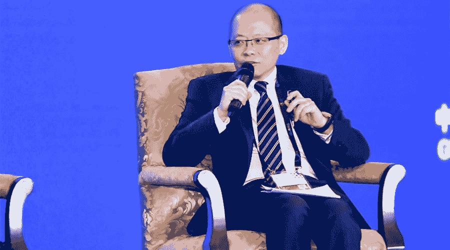

# 王峰十问第 31 期 |“王峰十问”走进 2019 数博会，与凯文·凯利等人激辩区块链

> 原文：[`news.huoxing24.com/20190528075315702674.html`](https://news.huoxing24.com/20190528075315702674.html)

> 凯文·凯利：“我们现在才刚刚开始理解区块链会带来什么样的变化，它会是一个非常强大和有力的工具。未来区块链将会是去中心化网络图景中的超链接基础机构。”

5 月 26 日-29 日，以“创新发展 数说未来”为主题的 2019 年中国国际大数据产业博览会(以下简称“2019 数博会”)在贵阳举行。**应数博会承办方邀请，「王峰十问」走进数博会。**在区块链高端对话论坛，火星财经创始人王峰以“区块链：数字文明的基石”为题，作为客串主持人，与《失控》作者凯文•凯利、香港理工大学电子计算学系系主任曹建农、 安永中国区块链负责人王靖、北京市互联网法院院长张雯以及中国信息通信研究院总工程师胡坚波畅聊区块链。

随着泡沫退去，价值回归，区块链技术也进入关键发展阶段，大机构排队入场，各国纷纷布局。区块链技术最大的价值究竟是什么？区块链技术大规模应用将在哪个领域率先落地？区块链在金融等领域的优势和挑战有哪些？企业又该利用区块链技术向真正有创造价值的方向前进？**围绕这些问题，这场高端对话从以下三个方面展开：一、“去伪存真，脱虚向实”；二、“区块链推动数字化转型，赋能数字产业生态建设”；三、“创新引领未来”。**

**犀利观点如下：**

> 1\. 凯文·凯利：正如工厂中有一千多种不同尺寸和参数的齿轮，区块链也有一千多种不同的形式，其中的某些元素是未来去中心化全球网络所需要的，会让数字社会保证其可靠性和信任。这就好像我们现在所使用的超链接一样，把两者链接起来。未来区块链会是去中心化网络图景中的超链接基础机构。
> 
> 2\. 凯文·凯利：做 AI 不做区块链是可以的，但是做 AI 没有大数据是不可以的。区块链可以帮助大数据变得更加的实用和具有价值。最重要的关系是在大数据和人工智能之间的关系。而不是大数据和区块链之间的关系。
> 
> 3\. 胡坚波：区块链在金融领域、医疗领域、版权保护领域、数字内容领域的商业模式会建立起来……但这这涉及到怎么推广区块链。有时候光讲区块链，行业领导者令人难以理解，你要从帮助他解决问题这一角度出发。
> 
> 4\. 罗玫：未来实现爆发式增长的领域一定是分布式系统和共识机制都结合得非常好的领域。
> 
> 5\. 王靖：区块链对中国的意义尤其重大，可以不用走欧美耗时数百年建立社会信任的过程，应该在目前技术大放异彩的阶段抓住发展机遇。但中国在区块链领域一定要扩大开放的态度，开放的心态和技术有利于区块链的发展。
> 
> 6\. 张雯：市场正在从区块链概念炒作逐步转移到应用场景落地探索的过程，未来区块链场景应用需要非常长的时间才能逐步落地，展现出一种有价值和有实际应用需求的场景落地过程，这是一个扩散的过程。
> 
> 7\. 曹建农：现在很多应用跑不起来，原因之一就是每个部门都有自己的数字系统和平台，互不兼容、互不相通，底层架构缺乏信任。如何把自己的数据贡献出来给别人用，这是一个生态系统的问题，区块链在适应方面、可信方面能被使用，更多的是打破数字孤岛，建立一个数字的生态和价值链。

《失控》作者凯文•凯利

**以下为对话原文（根据录音整理，未经本人审阅）：**

**第一问：区块链技术如何体现重构信任基础设施的价值**

**王峰：第一问，**各位先生女士们上午好，刚才听了前几位嘉宾的介绍，非常激动。我们看到了不只是有区块链产业，包括互联网方面的预言家、思想家，也看到相关部门领导的介绍和展望。刚才每一位嘉宾其实在他自己专业方面的介绍都非常的有见地，尤其是香港理工大学的教授介绍，远远比我想象的要专注还有看得更远。

今天的内容总体来讲包括十个问题，我们先来聊聊第一个话题，大家知道区块链有非常重要一个词，叫信任，这个标签不同于互联网，互联网讲信息服务、讲信息传递，但是区块链把信任这个词放在首位，2015 年 10 月英国《经济学人》周刊以“The Trust Machine”作为封面主题，认为区块链是建立信任的机器，它让彼此之间没有建立信任关系的人们达成合作，无需通过中心化的权威机构。我身边有非常多从事区块链行业的人，一般提到区块链有一个词就是无需信任，信任这个词在区块链显得如此重要，我想现场跟几位嘉宾探讨一下，**您如何理解区块链作为一种建立信任的技术的价值？**

**凯文·凯利：**区块链的数学基础是很容易信任的，但是对于那些进行区块链服务的企业还有组织，或者是控制网络的人——这些人和这些机构也需要被信任，这种信任就是另外一种层面了。我们从区块链当中所获得的信任其实只是数学式的信任的一部分，在更大的程度上我们也需要去信任那些运营区块链服务的机构。所以信任并不是我们自然生成的，而是需要去建立与机构之间的信任，也需要建立与其他人之间的信任，其实和我们人与人之间建立信任的过程是一样的。

**胡坚波：**为了达到信任的效果，相关机构会建立比较权威的体系。但是在谈到未来的数字空间虚拟的空间的时候，信任问题一直没有得到很好的解决，反而变得更加突出。当区块链技术出现以后，我们看到了未来在虚拟空间里面，它的一些特征可以在数字身份这个领域发挥巨大的作用。这为我们将来整体的数字平行的空间的发展提供了非常好的工具。

**曹建农：**区块链提供了免信任的平台，比如大家在转账交易时，由于缺乏信任，谁都不愿意先转账，但区块链提供了智能和约，相当于强行自动化的执行双方的交易。再比如食品安全问题，供应商说牛肉来自新西兰，普通消费者无法真辨认假。但如果供应商使用了用区块链的技术，使得牛肉生产地制造到运输过程当中记录不被篡改，我们就相信牛肉的来源是新西兰。共识以及不可篡改两大特点，保证了区块链可以重构信任体系。

**张雯：**实际上，互联网法院就是一个被大家选择信任的地方。由于我们通过互联网方式进行审判，所以在审理案件时，电子证据、信息化的证据是否真实是非常重要的审判环节，但它们很容易被篡改，正因为这样，我们引用了区块链技术，通过建立区块链联盟链“天平链”，解决了电子证据中间可信的问题。此外，“天平链”也是去年年底工信部第一批 197 个备案单位的唯一一家法院的区块链。值得注意的是，今年年初工信部又对这 197 家备案的区块链单位进行可信审查合规审查，所以是不是所有区块链单位都是可信任的，这也是一个问题。

**王靖：**区块链是一种在没有信任或者缺乏信任关系的情况下建立的基础机器，所以区块链对于发展中国家，特别是信任度比较低的国家意义非常大。区块链技术可以帮助中国等发展中国家避免或者不用再走欧美国家近一百年构建信任社会的道路，通过区块链技术加快进入信任社会，加快提升中国营商环境，所以对于发展中国家意义特别大。对于行业而言，区块链技术对于信任程度比较低，或者存在信任关系但信任关系不连续、信任成本比较高的行业都具有颠覆性效果，这是我对于信任的理解。

**第二问：区块链技术当前所处的发展阶段**

**王峰：第二问，**业界普遍把今天的区块链技术发展时期，当成是 1994 年 Netscape 刚刚推出网络浏览器 Navigator 时互联网兴起的第一阶段，我想请问一下在座的各位嘉宾，你们认为区块链技术发展当前处于什么阶段呢？

**张雯：**现在区块链的应用还处于初始的发展阶段。实际上，市场正在从区块链概念炒作逐步转移到应用场景落地探索的过程，未来区块链场景应用是一个需要非常长的时间逐步落地，然后会展现出一种有价值和有实际应用需求的场景落地过程，我感觉这是一个扩散的过程，这也是我第一个感受。第二，一些行业之间的场景落地大家比较感兴趣，未来行业和行业之间的区块链会不会有一种链接、未来的区块链会不会取代云的概念形成区块链云的对接。这中间规则和标准显得非常重要，但是应该会产生这样的迭代。  

**王靖：**刚刚听了 Kevin  kelly 先生的一句话，二十年后没有人讨论区块链了，区块链是比较无聊的事情。有人照了一张照片，在纽约马路上全部是马车，另一张是全部是轿车，他们经历了多少年，历史惊人的相似。第一个时间和第二个时间跨越的时间都是 3 年。比尔盖茨说，人类总是高估技术对当前的挑战，低估技术对长远的挑战。 如果把 2018 年作为区块链的产业元年，结合 Kevin  kelly 先生讲的，我估计到 2038 年左右，这一段时间将是区块链应用的高潮期。  

**王峰：**再问一下 Kevin  kelly 先生。您刚才谈到在 1994 年就有数字货币、电子货币的概念，这些词一直在迭代。包括用加密算法、各种共识机制，历史上都产生过，但确实只有比特币是在 10 年前被中本聪提出来，走进了现实。很多人觉得区块链不成熟，也有部分人认为是比特币带动了大众对区块链的认知，比特币是区块链第一个比较成功的场景。您怎么理解现在的比特币？又如何看待区块链？

**凯文·凯利：**理论上来讲，比特币是非常有意思的，而且从应用上讲是具有可用的潜力的，也许可以去做一些微支付的应用。有一种观点认为它会成为一种财富存储的机制，就好像黄金一样，因为本身总量有限的特质，加上别的设计，可以成为数字黄金，但我认为由于它的波动性，价值不会特别特别高，现在来看更像是一种投机工具。

总体上来看，比特币在解决一些具体的问题上没有别的数字货币那么好。但是要让数字货币更好、更有用，还需要各方面的验证和创新以及大量的发展。现在，还没有到让这些技术更好地适用于人们生活的程度。目前看到的创新也还没有告诉我明确的方向，哪一种数字货币更有可能胜出？但至少我的理解是，这在比特币的价格停止波动以前都是不可能的——毕竟，要成为货币，价格价值不能有大幅度波动，否则实在是太糟糕了。

也许以后比特币的挖矿的成本将最终让它的价格稳定下来，这是很可能发生的事情。但在这之前，比特币很难发生大的作用。我希望更好的方法是，人们能够找到一些更棒的解决方案，把比特币真正的用起来，而不是把它作为一个投机工具。但目前为止，比特币除了投机别无他用。

**第三问：区块链技术与数字化转型的结合**

**王峰：第三问，**建设数字化国家，以数字化、信息化推进治理现代化，已经成全球共识。IDC 报告显示，全球范围内支持业务实践、产品和组织的数字化转型的技术和服务支出，预计在 2018 年超过 1.1 万亿美元，比 2017 年的 9580 亿美元增长 16.8％，大家认为区块链技术与数字化转型会有什么结合点？                                   

**凯文·凯利：**我想强调一点，在区块链方面，我真的不能说是一位专家，对于最近的发展，还要问身边的几位专家。我觉得区块链在数字文明中的角色，应当是提供一个非常去中心化的网络和基础架构，大家可以在其中获取自己有权获取的那部分数据，不需要经过额外的审核。尽管过去的一些平台也会进行区块链改进，但还是会诞生一些新的平台。

就目前来看，已经有一些平台变得越来越去中心化，而且成为一个全球化网络。要让这个网络正常工作起来，需要上百万人做出自己的贡献，这是非常重要的。当然，我们也需要一些机制来避免欺诈行为、黑客攻击等。

在我看来，区块链是更大的图景当中的一个工具，可以帮助我们建立全球性的去中心化网络，当然也需要其他技术的帮助。正如工厂中有一千多种不同尺寸和参数的齿轮，区块链也有一千多种不同的形式，其中的某些元素是未来去中心化全球网络所需要的，会让数字社会保证其可靠性和信任。这就好像我们现在所使用的超链接一样，把两者链接起来，未来区块链会搭建整个图景中超链接的基础机构。

我们现在才刚刚开始理解区块链会带来什么样的变化，所以它会是一个非常强大和有力的工具。

**王靖：**区块链跟数字经济的关系可以从三个方面说。

首先，区块链技术是数字经济的重要组成部分，也是数字经济的重要推动力。KK 先生和胡教授说过，当人类社会进入数字驱动社会时，数据在每个人的手中没有价值，数据只有通过共享才有价值。传统的数据共享与数据保护形成了天然矛盾，这个时候区块链技术应运而生，通过分布式账本技术在实现数据共享的同时实现数据隐私保护。**区块链的经济学意义就是集中式共享数据的边际成本已经高于边际效应。**

第二，千百年来人的组织都是通过中心化实现，做生意也是通过中心化组织实现，未来区块链技术可以使人类社会从需要无数个中心化组织提供背书到实现信用社会。以前的经济形式都是中心化组织，未来经济形式都是点对点交易，这无限扩张了人类的信任空间。假如现在的 GDP 是 100，进入区块链经济社会将变成 N 倍。

第三，人类进入数字经济、平台经济和共享经济，区块链技术是平台经济和共享经济的底层基础。

举个例子：我们当时去调研，北京市一百万人口，汽车使用率是 4%，后来我们跟雄安同事沟通，如果雄安能让汽车使用效率达到 30%，这时候雄安需要的车在同等人口量级情况下只需要三分之一或者五分之一。

这个时候，在北京一个人用一辆车或者两辆车，但到新的城市，你可以拥有千分之一宝马，万分之一的奥迪，或者十万分之一的雷克萨斯，这就形成了平台经济，平台的底层基础就是区块链。在人类相当长的历史时期，区块链技术都是人类社会赖以生存发展的底层基础之一。这是区块链技术和数字经济的关系。    

**胡坚波：**数字经济转型是一个很大的话题，是大势所趋。互联网经济经过这么多年的发展，大家可以看到互联网对我们生活的变化。在这样大的背景下，大家意识到互联网的影响会向其他领域延伸，包括产业互联网等等。今天大家谈数字化浪潮，同样会对我们生活的方方面面产生影响。

在这样大背景下，我们需要选择各种各样的技术，解决垂直行业中的各种问题。不过，每个垂直行业有不同的问题，区块链要想发挥更大的作用，需要在各个垂直行业开展试点。这条道路需要时间，因为垂直行业本身在接受区块链等技术的同时也会有顾虑。

现在很多领域对区块链接受较快，比如食品溯源领域等，这是一个动态推动的过程。在推动过程中，区块链本身也在成长，它如果能成长为一种类似于底层工具型的模式，可以很好的支撑上层应用，大家采用拿来主义方式方便地推动某个垂直行业融合，区块链会更好地融入到数字化进程中。

**曹建农：**区块链在数字化转型当中的作用牵扯到几个方面，一个是基础设施，比如数字采集、数字处理、数字治理等，数字治理包含可信度、安全、私隐，再就是打破数字孤岛，建立一个生态系统。

现在很多应用跑不起来，原因之一就是每个部门都有自己的数字系统和平台，互不兼容、互不相通，底层架构缺乏信任。如何把自己的数据贡献出来给别人用，这是一个生态系统的问题，区块链在适应方面、可信方面能被使用，更多的是打破数字孤岛，建立一个数字的生态和价值链。

中国信息通信研究院总工程师胡坚波

**第四问：区块链技术如何助力数字化转型**

**王峰：第四问，**刚才几位嘉宾特别提到数字经济，据《数字中国建设发展报告（2018 年）》统计，2018 年我国数字经济规模达到 31.3 万亿元，占 GDP 比重达 34.8%。我想问几位嘉宾的问题是：区块链技术应用在数字化转型的过程中还面临哪些挑战？

**凯文·凯利：**其实我也是想听听各位专家的意见。如果说我给大家一个魔杖，把魔杖一挥就可以解决掉区块链当前的问题，大家最想解决的问题是什么？

**胡坚波：**现在谈区块链的时候，要结合当前的实际。如果谈问题导向，当前想通过区块链解决什么最核心的问题，我觉得有一点在政府领域谈得特别多，就是数据共享或数据治理。

这两年，全国六百多个城市搞智慧城市建设，取得的成效当然有很多，但还是有很多不尽如人意的地方，核心的要素就是政府部门之间的数据基本不通。这里面有各种主观的因素，原来归置于一种机制，因为政府之间的机制是条块切割的，需要层层的级别才能够实现真正意义上的共享，更多的是靠高层的压制，这里面没有从技术上进行更多的探讨。现在我看到很多领域也在这方面做了探索，这是非常重点要突破的方向。只有确确实实解决一些问题，才会让大家看到区块链未来的潜力。

**曹建农：**实际上，真正想要去推动区块链应用的时候，是很难把理念和原理说给大家听懂的。举个例子，比如说香港政府讨论电子选举，如果用区块链去做会有更好的效果，真正做到灵敏性，但从概念上来说，如何用区块链去做电子选举，政府部门没有办法向老百姓说清楚。所以，当前最大的办法就是用简单的方式让普通老百姓或用户接受区块链技术。

**张雯：**从司法的应用场景看，在让区块链发挥作用的前提下，实现什么样的规则边界，并让大家共同遵守，这关系到区块链能否成为这方面的治理工具。

**王靖：**如果我们现在用区块链去解决问题，可能面临多方协作的共识问题。目前区块链的难点包括以下几点：

第一，多方共识，多方协作。建立生态区块链需要第一推动力，人民银行是第一推动力，法院是第一推动力，这是目前做区块链项目面临的第一个难点。

第二，一般的用户和客户如何知道区块链的价值，并理解区块链的本质和规律。区块链有自己的本质和发展规律，很多用户和客户不太理解区块链的技术标准、场景，测链、跨链等都需要知识积累。

第三，很多客户在做区块链项目时把它想成 ERP 项目，想成技术平台迭代的项目。对我们而言，每做一个区块链项目都像一个治理游戏，每次对政府而言都是流程再造，它改变了流程，改变了数据，所以大家对区块链的共识需要得到更多的提升。

香港理工大学电子计算学系系主任曹建农

**第五问：区块链技术的应用前景**

**王峰：第五问，**下面谈谈区块链已经落地的应用领域。刚才几位嘉宾谈的时候已经提到，例如金融领域、数据治理、数据政务，跨界医疗。在对区块链的探索过程中，究竟哪些领域可以步入到实际的部署阶段？或者说，已经到了从理论到实验阶段？几位嘉宾觉得在哪些领域会尽快的把区块链应用起来或者形成产业。身边很多人看到消费领域比较乐观，看到区块链游戏比较有可能，请几位嘉宾谈谈自己的看法。  

**Kevin  kelly：**区块链对数字集中产业比较有用。例如以数字为导向的信息技术企业、金融机构、零售以及医疗企业，这些是区块链能最早进行落地的领域，因为它们掌握着大量数据，以及本身就具备大数据的基础。

金融企业或者金融科技企业可以使用区块链进行深度的连接。因为他们既有大量的数据，同时也有足够的资金保障。所以我相信在金融科技领域，还有医疗和零售是最早可以实现区块链落地的领域。    

**胡坚波：**区块链在金融领域、医疗领域、版权保护领域、数字内容领域的商业模式会建立起来，其能很好的解决当前我们在这些领域遇到的痛点。这涉及到怎么推广区块链的问题。要把区块链推广到一个行业，有时候光讲区块链行业领导者令人难以理解，你要从帮助他解决问题这一角度出发。这样能找到比较合理的商业模式，且又适合区块链领域。

**曹建农：**医疗一个非常明显的例子，医疗过去一直没有用到很多大数据，主要是数据被不同的医疗机构、医院单独保存。虽然政府也在推动，但一旦碰到困难，病人的隐私问题就很难解决。

第二，供应链的数据管理可能是区块链的下一个落地应用，因为它本身就是生态系统，且需要一种不可篡改、充分信任的机制，所以有很多与供应链相关的区块链用例。

第三个，可是物联网的应用。物联网里面有很多数据，现在大家谈到物联网区别中心化，就是云计算越来越被边缘计算所取代。边缘计算所收集的数据怎么共享，不就是上载到云上，然后共享。如果区块链建立到边缘计算平台里面用更好。

第四，身份管理认证。刚刚大家提到对大学证书进行管理，这可能也会成为区块链的应用场景之一。

**王峰：**在普通大众对区块链理解方面，如果不谈 B2C，不谈 B 的话，他们很难理解，你觉得跟普通人相关的消费领域有哪些？

**曹建农：**跟老百姓密切相关的就是食品安全，大家无法确保食品从哪里来。沃尔玛跟 IBM、京东利用区块链进行产品溯源，让老百姓知道我吃的东西就是你所说的，这非常重要。

**张雯：**我们在学习和调研的过程中实际上也遇到到一些应用场景。比方说，我去市场监管总局的时候，在谈到食品安全以及溯源的问题时，也希望区块链能够提供解决治理问题的能力，包括我们法院接触到人们对解决版权领域的保护，数字化的问题非常期待。

从司法领域出发，相关部门的公正力如果可以通过区块链进行赋能的话，对司法的效率提升有巨大的帮助。

**王靖：**第一，区块链在政府公共服务行业的作用巨大。因为政府行业跟公共服务行业没有区别，都要提供办贷款、结婚证、社保、医保等服务，它们是一个行业。

第二，金融行业目前仍是区块链行业的主战场，但是相对的重要性正在下降。安永最近对全球二百个公开信息的案例进行调研，金融业在区块链的用例从 70%~80%左右降至 40%，是重要性正在下降。

第三，区块链在供应链领域有非常大的发展空间天平，因为中国整个供应链效应在全球都是最高的。

**王峰：**我注意到，自今年春节之后，美国华尔街大型金融机构发出的声音越来越多，你怎么看？

**王靖：**因为安永的整个技术平台是基于零知识证明和以太坊，与摩根大通做结算。

目前，全球金融机构主要在三个领域采用区块链。第一，贸易融资领域。第二，清算。区块链有一个特别重要的特点，就是交易及结算，交易及清算。所以，目前该领域的区块链应用将来会得到特别好发展。由于这些应用必须跟实体经济相结合，因此促进了实体经济在供应链方面的发展，导致实体经济的区块链应用场景非常多。生态还在发展，但是重要性的比例在下降。

**王峰：**台下也参与一下。清华大学金融系的罗玫教授来了，您谈谈目前在哪个领域先落地？   

**罗玫：**大家好，我是清华大学经济管理学院的罗玫，也是数字管理中心的主任。今天作为非技术背景的人，就想跟大家分享一下，从我近几年研究区块链相关的领域的一些感悟。

刚刚几位嘉宾提到区块链在金融领域用例比较多。对于非技术背景来说，区块链就是一句话，分布式的网络下的共识机制。其实它已经隐含未来区块链应用的三个方面。

第一，分布式。你怎么建立这个分布式，谁来参与，谁的网络，谁能在网络里得到信用成本减少。所谓的联盟链就是分布式的一个很大的应用。联盟怎么建立具体的应用那是具体的场景，但是都是分布式的设计。

第二，共识机制。什么样的应用场景要参与方各自设立自己的治理机制，然后使大家得到协同，大家同意怎么共同维护账本。

第三，把这两者结合在一起，怎么建立分布式系统得到大家认可的激励机制。现在看到的溯源就是分布式的应用，并没有任何治理机制的应用。供应链的金融也是分布式的，它根本没有治理机制的设计。

供应链金融，最近研究中心做了面对银行董事长的高端培训，我们也在帮助银行赋能数字经济产业。我们发现一个现象，在供应链金融方面，虽然采用了区块链技术，但不是所有银行都能获益。

传统的金融机构如何用区块链获益。比如，上游厂商没有钱，那么他利用主要的厂家的信用去借钱。银行参与的时候觉得很危险不愿意借钱给上游厂家，这样厂家就要想办法使它的信用成本更加低，让银行愿意给他贷款。通过区块链，上游厂商不需要找场外高利贷资金，而银行也多了这一块业务，且利率很高，风险很低。在供应链场景下，银行有各种各样的激励机制，区块链帮助他们建立信用。

甘肃银行有扶贫的动力。他们需要对农户进行贷款，且利率不能特别高，所以既使区块链技术能够帮助大家建立银行和农户之间的信任，让信任成本降低一点。但是降低之后，它能够从农户那里获得的贷款利率，不足以支撑它弥补风险所带来的利率损失。对于他们来说，区块链技术到底能节约多少，这是需要探讨的地方。不是任何供应链金融场景都可以用区块链得到最大的利益化。

我觉得未来实现爆发式增长的领域一定是分布式系统和共识机制都结合得非常好的领域。但是这是非常难的，要分布式做得好，共识机制做得好，非常难。

对于非技术背景的人来说，他要花大量的时间学习区块链，知道区块链的痛点。区块链的人知道区块链的技术，不知道产业痛点，要把两方面结合起来非常难。我在清华大学教课，所有的人到我的课上都是“一穷二白”，到我这里学习完全不知道的知识。

如果产业得到大规模的增长，一定是在很多产业化专家和技术化专家融合在一起之后，得到爆发性、零售性的产品，让普通大众受用，而不是让普通大众了解区块链是什么。谢谢大家！

   安永中国区块链负责人王靖

**第六问：区块链技术在数据治理中发挥的作用**

**王峰：第六问，**我注意到，2019 年 4 月 9 日，北京互联网法院首个采用“天平链”证据的判决出炉。截至 4 月 11 日，北京互联网法院已有 58 例涉天平链证据的案件，由于“天平链”强大的“威力”，相关案件的电子证据争议很小，已经有 40 余件成功调解或撤诉了。2018 年 9 月，最高人民法院公布的《关于互联网法院审理案件若干问题的规定》指出，经过区块链认证的证据，在法律争议案件具有法律效力与约束力。您是互联网法律业界的权威专家，基于数据治理的角度，能否谈谈未来数字社会的规则和法律如何构建并被执行？区块链能起到什么作用？  

**张雯：**我们的“天平链”是一个联盟链，通过跨链互信的方式进行。为什么能够吸引这些链或者相关部门的链链入“天平链”，是因为我们有这类案件，最终对他们的纠纷或者链上上传的有效性进行司法判断。我认为，国家审判权利的力量是我们一直推动链的建设很重要的原因，这是我的第一个感受。

第二个感受是建设的过程中要注重规则。当时做这个链的时候，四家单位进行共同研发，除了互联网法院之外，还有信任度科技，另外从技术角度请了百度链的架构师进行技术指导，还请了工信部的信息发展研究中心对链的接入规范进行规范和合规的政策保障。这四家单位在一起形成现在的“天平链”，大家进入时都要遵循这样的规范，互相背书。

第三个，我们接入这个链以后，对外叫“宽进严出”，对跨链持开放和欢迎的态度，因为链的使用对于我们来讲，互相背书越多，价值更高。最重要的是进行检验，就是接入标准，因为按照最高法院的司法解释规定，只审 11 类案件，包括刑事案件不审。

围绕这 11 类案件，比如金融类案件及公司都会跟我们进行一些对接，包括阿里、京东也都进行过对接。当然，一定要符合我们的接入标准，希望接入的单位能够在工信部备案，我们也会进行判断。

在应用上，目前我们有两个场景应用，一个跨链，接入平台的信息可以互相背书、互相调用，法院可以调用他们的信息，另外就是验证，一旦有纠纷以后，上传的证据和当时所传的证据是否一致需要验证。对于法官来讲，其实就是看之前存入链的数据与当事人提供值是否一致。事实上法官一旦解释清楚以后，当事人基本上自行和解了，目前大概审结了 42 个案件，和解率高达 98%。

下一步，我们在想一个问题：上链是不是一定是真的？我觉得这个问题也很重要，所以最好要合规上链。

**王峰：**这个挑战蛮大的，因为区块链在公共服务方面，北京的法院已经开始做了，而且有成功的案例，如果往更大的公共服务案走，多方协作需要太多的确权，任何一个点出现问题，涉及到公信力的问题，而不是加密货币在某一个领域的机制计算，可以忽略掉不好的东西，只要 51%就可以确认。但是，如果公共服务，我觉得这里面还有非常多的挑战，不管怎么说，北京法院已经开始了，这非常了不起。如果按照现在的趋势看，你认为证据的确认会有多少的量来自于区块链技术？你们可能有一个大致的预判？

**张雯：**我们现在有将近 2 万件这类案件进入我们法院，通过 25 家应用单位接入的跨链的信息应该是 370 多万条，跟案件相关联的，其他的这种延展信息已经达到了上千万条。但是我们希望进来的信息都是对我们审判有用的信息，我们不一定追求数据上的海量。我们追求有效有用的数据，这是我们的想法。这个比例我们们也想逐步扩大，还是基于互联网的受案范围，实际有多少就做多少，这在区块链里面不需要太虚华，需要踏踏实实把自己的事情做好，把所有的链结合在一块，这样大家的可信度更高。

北京市互联网法院院长张雯

**第七问：区块链技术在个人隐私保护和网络安全方面发挥的作用**

**王峰：第七问，**去年一年我们发现很多跟隐私相关的，炸裂的消息被陆续爆出来。比如有个大的酒店集团，它的客户开房记录被黑客盗取出来，导致很多人遇到很多麻烦。一个快递巨头去年也了类似的数据泄露的问题，数亿条数据疑似流出。而 Facebook 的数据泄露问题也给扎克伯克带来很大的危机——我们赖以生存的社交网络，原来这些数据是裸的。这不由让我想到十五、十六年前有一句话，“在网上上网没有人知道你是一条狗”。今天互联网发展越来越成熟，甚至到了规模化、大数据、AI 为驱动的时代。在这个背景下，区块链技术在隐私保护方面有没有带给我们希望的东西？

**Kevin  kelly：**您刚才说到的数据隐私泄露的问题，其实在美国也存在。即使是加密的机制没有被打破，数据依然有可能会被泄露。某种程度上并不是说加密程序出了问题，是人为组织方面出现了问题。在这个流程当中，有些人就打破这样的规则，窃取到了数据。

在算法方面或者数学的方面，区块链整个是可信的，但是在整个区块链上链的过程当中我们并不能完全的信任它。既使是使用区块链，我们依然有可能出现数据泄露的问题。并不是说它的加密算法出了问题，而是在这个流程当中，出现了一些人为的不合规的做法。

对于隐私保护来说，可以从技术层面上推出很多创新来保证隐私的保护。尤其在我们的大数据时代。最近谷歌推出一项创新“差异化隐私或者联盟化的学习”。这个数据会由你自己来掌握。如果要进行分享，它会与其他的数据进行组合，然后你就可以获得经过组合之后的数据。这只是一个保护隐私的创新技术。

区块链也是一个创新技术之一，在大数据时代，我们确实有很多技术手段可以让人们感到数据的安全，让他们能够掌握这个数据分享的控制权。要进行隐私保护，我们需要做的不是减少数据流通或者减少技术使用。我们需要再去增加技术的创新，然后进行进一步的隐私保护。

**曹建农：**我觉得区块链在三个方面会有所作为，主要是技术层面。第一，数据的存储方式。通过分布式存储，所有的隐私信息不一定存在某一个方面，可能是在不同的节点上面。举个例子，以后你的身份、数据信息不是全部集中在一起，比如银行的信息是户口，其他政府的是你身份证号码，这些信息没有必要放在一起，隐私泄露就增加了一点困难。第二，透明性。透明就是我的数据谁来用的，谁拿走我的，在区块链上可以看见的，所以谁拿到我的数据可以知道。第三，透明化——不需要公布我的身份，我也可以把这件事情做完。这三方面是区块链可以对隐私保护有作为的地方。

**王峰：**一个哈佛教授讲，个人隐私已死。区块链技术在解决隐私保护问题方面给我们带来了哪些新的希望？

**曹建农：**社会已经处在全方面监控的环境下，你走在哪里，每一个上网每一个按键，在大街上所有的去向都可以追踪到，从这个方面来讲隐私已死，没有可能藏身的地方。但是一旦这些信息变成了一个数字化放在网上的时候，我们再来谈怎么保护隐私，我觉得是另外一个层面的意思。

**王靖：**我有几个想法。第一，要正确理解隐私跟共享的关系。只要共享，数据泄露、隐私泄露就会提升。要做到数据共享同时又有特别好的隐私保护，这是没法实现的。第二，正确理解区块链和隐私的关系。我们说人工智能需要大数据，但实际上区块链就是需要人类智能就行了，根本用不到人工智能——因为区块链是小数据单位。举个例子，现在中国汇一笔款到香港，最快是三天，要填很多东西，每一个中介机构需要填十项信息，而实际上并不需要十项。区块链能实现什么？数据共享同时隐私保护，每一个中介组织只需要再要两三项数据就 OK 了，所以区块链对隐私保护是革命性的。

**第八问：区块链技术与其他新型技术的相互影响**

**王峰：第八问，**互联网这么多年的发展，现在越来越重视大数据，重视云计算。再往下走，有几个非常重要的技术方向，比如人工智能 AI、物联网。在我看来，各种新型技术之间绝非割裂独立发展，而是有很多交集且彼此融合。比如，人工智能和区块链这两股技术力量，不是左右关系，而是经线和纬线关系，冲突着，缝合着，最终必然构筑一个我们今天还看不明白的新社会。大家能不能谈一谈你们如何看待区块链和人工智能之间的关系？

**Kevin  kelly：**目前的技术都是基于神经网络，而神经网络需要非常大的数据极来进行神经网络训练，进行上百万次的训练。对于未来的十年来说，人工智能会非常需要大数据。没有大数据就没有人工智能。同时，大数据也离不开人工智能。大数据太大了，所以如果没有又便宜、又好用，又无处不在的 AI 没有办法处理。大数据跟 AI 之间是一种共生关系，互相需求。

做 AI 不做区块链是可以的，但是做 AI 没有大数据是不可以的。区块链可以帮助大数据变得更加的实用和具有价值。最重要的关系是在大数据和人工智能之间的关系。而不是大数据和区块链之间的关系。

**胡坚波：**谈 AI 这肯定是未来一个大趋势，从整体的发展角度看，AI 肯定需要大数据。区块链在这里面扮演什么样的角色？我个人觉得不要过于夸大它的角色。但区块链对于数据的积累，数据的有效性，有用性上是有助益的——更多从这个角度定位，AI、区块链才能够在未来的整体发展中扮演好各自的角色。

说到其他的技术，比如云计算、大数据。我个人觉得，云计算像一种商业模式的变化，它更多谈的是服务模式的变化区块链很大程度上可以借鉴这种东西。

现在很多把区块链作为服务直接向上提供，但我认为，要尽量把复杂的东西包装起来，让它看起来非常简单，非常方便各个垂直行业和应用调用。从这个角度理解，我觉得不宜说区块链代替云计算，而是说，区块链要把自己融合到云计算的商业模式中，为各行各业所提供服务。

**曹建农：**区块链和 AI 两个都是基础的技术。至于它们两个怎么互动，我现在看到的是单方面的，区块链怎么用 AI 我不知道，但 AI 要用到区块链，因为区块链里面有数据，有很多使用数据的方式。AI 可以从里面挖掘有效的模式，通过这个模式设置区块链的机制使得它更有效。

现在很多人用 AI 从区块链的交易历史推导什么样的人经常用什么样的交易，但通过推导就有可能破坏了隐私，现在需要防止用 AI 来做类似的破坏性的事情。

区块链跟大数据、物联网一样，是一种使用共具。如果说到跨云合作，做到透明性，把这个建立在多云结合的上面，做数据共享机制，服务共享机制，我觉得这是很好的方法。以后，区块链很可能变成物联网底下的技术支持，实现共享数据，管理数据。

**王靖：**第一，大数据发展需要大量的数据，大量的数据如果是真实的相关的有用的，就太幸福了。所以可以用区块链来实现数据接入技术，通过大数据做数据分析技术和 AI 技术。第二，我们所谓的云计算更多是对企业内部而言的，区块链是什么概念？区块链的意义对于企业就像 ERP，ERP 是对自己的，如果将来企业的生态网络都改用区块链服务——这不是替代关系而是迭代的关系。第三，物联网技术、边缘计算技术这些技术将来基础性平台还是要基于区块链平台来做，这是一个趋势。

所以说，区块链技术是一个融合性技术，它可以同时促进各个技术得到更好的发展，每个技术都相得益彰。

**第九问：区块链技术与其他新型技术的融合，为数字化转型提供的支持**

**王峰：第九问，**刚才几位嘉宾谈到了区块链、大数据、AI、物联网之间的关系，尤其是有嘉宾谈到了区块链也是数据产生的来源。我的一个知觉是，未来的数据越来越来自于从事区块链的企业在它的区块链的场景上去获得新的数据，而不是我们过去中心化的老一代的互联网公司在社交网络电子商务抓取的数据。那么，以大数据为基础的数字化转型会不会因此越来越不一样？区块链会不会成为更有力量的数据驱动力？

**曹建农：**凯文·凯利说，以后区块链会变成在系统中环境当中看不见，但随处可用的设施。过去我在计算领域多年的经验也是，一个技术要真正能够被广泛推动应用，一定是上面人不需要知道太多，但是用起来很好用，就像汽车里的引擎一样，设计非常复杂，但开车的人不需要理解。区块链今后怎样性能更好、用户体验更好，这方面的改进可能会使它变成一个嵌入到我们工作生活当中的一个有利的、普遍合适的环境和工具。

**胡坚波：**我谈一下个人观点，不一定对。人工智能肯定要基于大数据，我们有各种各样的数据来源，区块链本身是数据库技术，通过区块链改进的数据库如果能够更好为人工智能服务的话，大家就会倾向于用区块链方式组织自己的数据。那么，用区块链组织的数据往往就成为一种优质数据或者更高质量数据的代表。逐渐地，当连锁反应发生，人们会默认，通过区块链组织的数据才是有价值的数据。

**张雯：**随着物联网时代的到来，信息的采集不限于人类，也包括人类关系，万物都进入了信息可读取阶段，这样的情形下，人工智能阶段曾经走过的一些弯路，比如说数据是否真实有效，或者数据的高保真性，都可能通过区块链的赋能，实现技术上的保障或者清洗——这才能在真正意义上推动人工智能产业，在这个意义上，区块链的价值或者前景是非常令人期待的。

**第十问：区块链技术发展与经济全球化的关系**

**王峰：第十问，**2000 年以后，中国的互联网公司在美国上市，美国的互联网的商业模式、技术迭代一直在影响中国同行，中国公司早期非常重视向美国学习，基本可以理解为是美国互联网的学生。但近几年出现了有意思的变化，在商业模式、用户体验、技术创新上，中国公司甚至有时候走在了前面，中美两个市场开始相互融合借鉴。那么，在新兴的区块链领域，接下来这五年，各位对于中美的竞争、融合有着什么样的展望呢？区块链技术能否进一步推动世界经济的全球化进程？

**凯文·凯利：**美国现在特朗普还是总统，特朗普是很难预料的一个人，我实在是没有办法预测未来会出现什么情况。但我希望区块链可以进一步的实现中美两国之间的互联互通和合作。

**胡坚波：**在区块链领域，相比较而言，中国行业应用的推广上更加活跃，包括商业模式创新。但是，如果归结到底层的技术、底层的标准，中国一直是比较薄弱的。当前环境复杂，很难预测，我觉得中美各方很可能会更加均衡地来发展自己在这个产业的定位。但如果有全球的产业链支持，大家会共同在全球的产业链中推动未来数字化浪潮的进程。

曹建农：中美两国互相合作，在平台上技术上来说，可能壁垒不是那么大。但是如果把算法也作为尖端的技术的话，出于对基础技术研究的保护（比如加密技术、共性算法），中美就有可能完全要开发各自的技术。这个技术出来以后可信不可信，能否跟对方对接，就变成另外一个问题了。此外，区块链也是价值链，会不会出现像物联网上的互相攻击，也是未来的挑战。

**王靖：**中美贸易摩擦和特朗普的不确定性，对区块链的发展只是短期影响，长期看没有什么太大影响。因为区块链技术会遵循技术的本质和规律改变人类社会。互联网进入下半场，价值互联网后，区块链技术更加紧密的构建了中美和中欧包括东南亚国家的网络。在这里，我有一个小小的建议，中国在区块链领域一定要扩大开放的态度，不太希望听到说这个只有中国有。开放的心态和技术有利于区块链的发展，更有利于中美经济上的合作。

**王峰：**感谢各位嘉宾在论坛上做的阐述，坦诚而且专业。本次论坛到此结束，谢谢大家参与。