# 第二章 【EOS 钱包开发 二】EOS 开发环境搭建

本课程是 EOS 钱包开发，可以选择以下三种网络进行开发：

*   主网
*   Jungle 测试网络
*   本地网络

咱们在开发阶段一般选择测试网络和本地网络皆可，测试完成后在部署到主网。这里我们先选择在本地网络上进行开发，因为在 Jungle 测试网络中不支持 wallet 的 RPC 接口，因为它作为一个公共的服务节点，是不可能帮助大家管理私钥的，那样会非常不安全，大家都会共用相同的钱包和私钥。最后我们将使用本地搭建的 keosd 服务管理钱包，并连接到 Jungle 测试网络中。

EOS 支持的操作系统

> *   Amazon 2017.09 and higher
> *   Centos 7
> *   Fedora 25 and higher (Fedora 27 recommended)
> *   Mint 18
> *   Ubuntu 16.04 (Ubuntu 16.10 recommended)
> *   MacOS Darwin 10.12 and higher (MacOS 10.13.x recommended)

**本教程的开发环境选择为：Ubuntu 16.04、本地网络、RPC+eosjs、eosV1.2.2。**接下来开始搭建 EOS 本地环境将它部署在单个主机。

## 一、下载和编译 EOS

获取 EOS 指定版本源码及其所有子模块，若不加入--recursive 参数，则不能下载 EOS 关联的子项目。指定版本源码使用`-b`指定版本号。

```js
git clone https://github.com/EOSIO/eos -b v1.2.2 --recursive
```

编译源码生成可执行文件

```js
cd eos
./eosio_build.sh
```

编译时间比较长，需一两个小时不等，若编译顺利成功后，则会看到如下显示

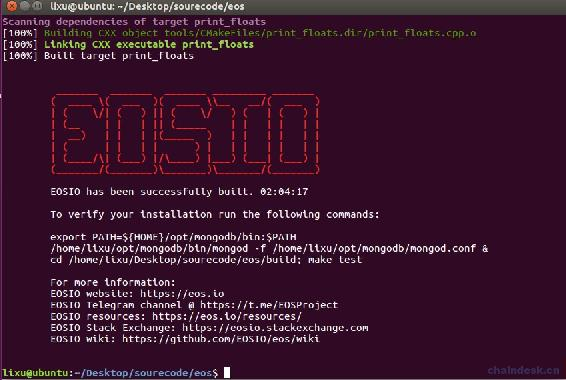 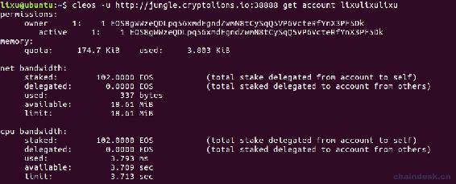

在编译的过程中很有可能会出现各种错误，由于系统、EOS 版本的差异出现的错误也会不一样，下面列出了常见的多种错误的解决办法。

## 二、编译时报错的解决办法

### 1\. 物理内存 RAM 不足

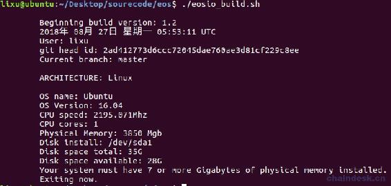

**解决办法：**

修改文件源码`eos/scripts/eosio_build_ubuntu.sh`中的`if [ "${MEM_MEG}" -lt 7000 ]; then`，将 7000 改为自己系统的内存大小，如 4000，如还报错，那么继续减小。

### 2\. 可用内存不足

```js
You must have at least 20GB of available storage to install EOSIO.
Exiting now.
```

**解决办法：**

在文件源码`eos/scripts/eosio_build_ubuntu.sh`中增加如下一行代码代码前面。

```js
DISK_MIN=1
```

### 3\. 无法下载（MongoDB 等）

无法下载 MongoDB 等是由于翻墙配置的问题。

**解决办法：**

Mac 的 Shadowsocks 使用“PAC 自动模式”，另外偏好设置配置如下

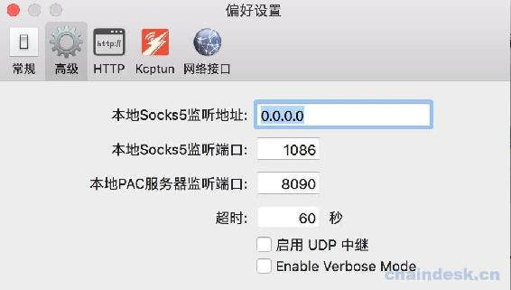

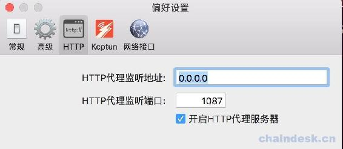

Ubuntu 的配置如下，其中的 192.168.1.116 是 Mac 的局域网地址。

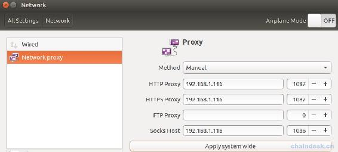

### 4\. 不能创建/tmp/llvm-compiler 文件夹

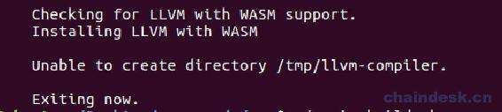

**解决办法：**

进入`/tmp`目录，删除`llvm-compiler`文件夹即可。

## 三、安装 EOSIO

安装所有依赖库并构建 EOSIO，使用如下命令

```js
sudo ./eosio_install.sh
```

> 若出现如下错误`file INSTALL cannot make directory "/usr/local/eosio/etc/eosio"`，加上 sudo 即可。
> 
> 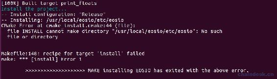

安装成功后的效果如下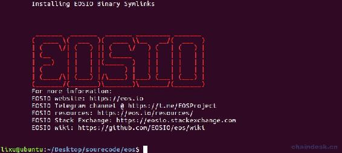

安装完在根目录新增了 build 文件夹，最后 EOS 的目录结构如下。

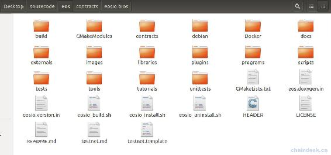

## 四、配置 Nodeos 与 Keosd

### 1\. 配置 Nodeos

`Nodeos`是用来运行节点的 EOSIO 程序。执行一下步骤进行配置：

*   找到如下 config.ini 文件的位置，然后打开 config.ini 文件

    *   Mac OS: `~/Library/Application\ Support/eosio/nodeos/config/config.ini`
    *   Linux: `~/.local/share/eosio/nodeos/config/config.ini`
*   将文中`enable-stale-production`所在行用`#`注释，`producer-name`所在行也用`#`注释

*   再最后面添加如下内容

```js
# Enable production on a stale chain, since a single-node test chain is pretty much always stale
enable-stale-production = true
# Enable block production with the testnet producers
producer-name = eosio
# Load the block producer plugin, so you can produce blocks
plugin = eosio::producer_plugin
# As well as API and HTTP plugins
plugin = eosio::chain_api_plugin
plugin = eosio::http_plugin
# This will be used by the validation step below, to view history
plugin = eosio::history_api_plugin
```

若是 v1.2 之前的版本需添加`plugin = eosio::wallet_api_plugin`插件。

### 2\. 配置 Keosd

`keosd` 是一个轻客户端钱包，负责管理钱包，以便在广播到网络之前保护密钥和签署交易，在本地计算机上运行并在本地存储您的私钥。

*   找到路径`~/eosio-wallet/config.ini`，然后打开 config.ini 文件
*   将第一行的服务地址设置为：`http-server-address = 127.0.0.1:8889`

## 五、启动节点

### 1\. 启动 nodeos

使用以下命令启动自己的单节点区块链：

```js
nodeos -e -p eosio --plugin eosio::chain_api_plugin --plugin eosio::history_api_plugin
```

使用了`plugin`加载一些可选插件，在 V1.2 之前版本需要添加`--plugin eosio::wallet_api_plugin`插件。启动后应该每 0.5 秒生成一个块并有日志输出到终端，如下


如果报如下错误，则添加参数`--delete-all-blocks`

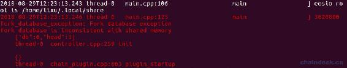

### 2\. 启动 keosd

可以直接输入命令`keosd`即可启动 keosd。

```js
$ keosd
```

停止 keosd，因为`cleos`可以自动启动`keosd`，最终可能会有多个`keosd`正在运行。

```js
$ pkill keosd
```

**注意：**当使用 RPC 接口时，需要另起 keosd，且端口与 nodeos 的不能一样。在使用 cleos 连接 wallet 时不用另外单独启动 keosd，它连接的是 nodeos 的 keosd 服务。若使用 cleos 时报如下错误，则须停止 keosd。

```js
lixu@ubuntu:~$ cleos wallet create
"/usr/local/eosio/bin/keosd" launched
Unable to connect to keosd, if keosd is running please kill the process and try again.
```

## 六、使用 Cleos 创建钱包

下面我们使用命令行进行操作，需要使用到 Cleos，它是一个命令行工具，可以与 nodeos 公开的 REST API 进行交互，前提是 nodeos 需要配置`eosio :: chain_api_plugin`插件。

### 1\. 创建钱包

钱包是授权私钥的存储库，与区块链交互所必需的。通过如下命令创建钱包，可以通过`-n`参数指定创建的钱包名称。如果不指定钱包名称，则会创建一个名为`default`的默认钱包。

```js
cleos wallet create
```

若是 1.2 以上版本，则需添加参数`--to-console`，输出如下

```js
lixu@ubuntu:~$ cleos wallet create --to-console
Creating wallet: default
Save password to use in the future to unlock this wallet.
Without password imported keys will not be retrievable.
"PW5J5SSUrU3sGBonpxjxbn9QXGPdpAsCkWowmjCcLyBPUu5Y5uvvv"
```

成功后将会生成钱包的解锁密码，钱包 15 分钟不用将会自动锁定，注意一定要保存最后一行的密码，需要使用它解锁这个钱包。

### 2\. 解锁钱包

可以通过两种方式解锁钱包，推荐使用第二种方式解锁。

*   直接在命令行上添加密码参数，可以通过`-n`参数指定钱包名称

```js
cleos wallet unlock --password PW5JCEkVgzoBHUVCzbEwT9es6agM6NRPv6n21wgbzVaem6rWE4akS
```

*   在交互模式下解锁

```js
cleos wallet unlock
```

接着提示`password:`，然后输入密码即可

```js
lixu@ubuntu:~$ cleos wallet unlock

password: 
```

两种方式解锁成功后都会输出`Unlocked: default`。

**注意：**

> 直接在命令行上使用您的密码并将其记录到您的 bash 历史记录中通常是不安全的，因此最好在交互模式下解锁。
> 
> 出于安全考虑，最好在不使用钱包时使用命令`cleos wallet lock`将钱包锁定。

### 3\. 查看钱包列表

使用命令`cleos wallet lock`查看钱包列表，在列表中解锁后的钱包将在钱包名后面有`*`标记。

```js
lixu@ubuntu:~/Desktop/sourcecode/eos$ cleos wallet list
Wallets:
[
  "default *",
] 
```

### 4\. 导入密钥到钱包

上述步骤中启动的私有区块链是使用默认初始密钥创建的，必须将其加载到钱包中。

使用命令`cleos wallet import --private-key ******`。可以通过`-n`参数指定钱包名称

```js
lixu@ubuntu:~$ cleos wallet import --private-key 5KQwrPbwdL6PhXujxW37FSSQZ1JiwsST4cqQzDeyXtP79zkvFD3

imported private key for: EOS6MRyAjQq8ud7hVNYcfnVPJqcVpscN5So8BhtHuGYqET5GDW5CV
```

注意：此时导入的私钥并不是创建钱包时生成的密码。

这个密钥`5KQwrPbwdL6PhXujxW37FSSQZ1JiwsST4cqQzDeyXtP79zkvFD3`在以下配置文件中可以查看

*   Mac OS: `~/Library/Application\ Support/eosio/nodeos/config/config.ini`
*   Linux: `~/.local/share/eosio/nodeos/config/config.ini`

打开文件后滑动到最下面即可查看到私钥。

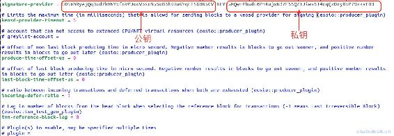

注意该秘钥对正是超级账户 eosio 的秘钥对。接下来就会用到 eosio 账户。

cleos create account eosio eosio.bios EOS6MRyAjQq8ud7hVNYcfnVPJqcVpscN5So8BhtHuGYqET5GDW5CV

## 七、部署系统合约

现在我们有一个拥有帐户 eosio 密钥的钱包`defualt`，那么接下来用 eosio 账户部署默认的系统合约，确保钱包`defualt`处于解锁状态。

eosio 账户是默认就有的，在系统启动的时候就自动被创建的超级用户。

### 1\. eosio.bios 合约

出于开发目的，`eosio.bios`可以使用系统提供的合约，通过此合约可以通过确认用户持有的 token 直接控制其他帐户的资源分配，包括管理链上的堆栈和非堆栈资源，带宽、CPU 以及内存资源。该`eosio.bios`合约可以在`contracts/eosio.bios`中找到源代码。

先进入到 eos 根目录，再使用命令`cleos set contract eosio build/contracts/eosio.bios -p eosio@active`部署 BIOS 合约。

```js
lixu@ubuntu:~/Desktop/sourceeos/eos$ cleos create account eosio eosio.bios EOS6MRyAjQq8ud7hVNYcfnVPJqcVpscN5So8BhtHuGYqET5GDW5CV
executed transaction: af3bc248ca73d14c644fca863f4f82135bb72582b7f2be0dbec73a41c4f6438a  200 bytes  422 us
#         eosio <= eosio::newaccount            "0000000000ea30550000a6ee00ea305501000000010002c0ded2bc1f1305fb0faac5e6c03ee3a1924234985427b6167ca56...
2018-10-12T09:15:03.461 thread-0   main.cpp:458                  print_result   warning: transaction executed locally, but may not be confirmed by the network yet

lixu@ubuntu:~/Desktop/sourceeos/eos$ cleos set contract eosio.bios build/contracts/eosio.bios
Reading WASM from build/contracts/eosio.bios/eosio.bios.wasm...
Publishing contract...
executed transaction: cf23d3be8d6195d5e12a2ada7411a6a2cd825fb941b89bd2c1c359d31fa0d751  3728 bytes  887 us
#         eosio <= eosio::setcode               "0000a6ee00ea30550000e62e0061736d0100000001621260037f7e7f0060057f7e7e7e7e0060047f7e7e7e0060027f7f006...
#         eosio <= eosio::setabi                "0000a6ee00ea3055b10d0e656f73696f3a3a6162692f312e30050c6163636f756e745f6e616d65046e616d650f7065726d6...
2018-10-12T09:15:25.278 thread-0   main.cpp:458                  print_result   warning: transaction executed locally, but may not be confirmed by the network yet
```

命令中的参数说明：

*   `eosio`：部署合约的账户
*   `build/contracts/eosio.bios`：合约路径
*   `-p eosio@active`：作用是告诉`cleos`使用`eosio`帐户部署此合约，将使用我们之前导入的帐户`eosio`的 active 权限的私钥对该操作进行签名。

### 2\. eosio.system 合约

eosio.system 是 EOS 系统合约中最重要的部分，实现了 EOS 项目的所有基本功能：如：创建新账户、部署智能合约、交易 RAM、抵押获取资源（net、cpu）、投票、领取节点奖励等；

```js
cleos create account eosio eosio.system EOS6MRyAjQq8ud7hVNYcfnVPJqcVpscN5So8BhtHuGYqET5GDW5CV

cleos set contract eosio.system build/contracts/eosio.system 
```

### 3\. eosio.msig 合约

实现的是多签系统合约，实现了一个多签功能，由于 EOS 要求系统的每一次更新都需要出块节点完成一次多签，当签名数达到 2/3+1 时，更新才能生效。所以出块节点可以调用这个合约实现多签功能。

```js
cleos create account eosio eosio.msig EOS6MRyAjQq8ud7hVNYcfnVPJqcVpscN5So8BhtHuGYqET5GDW5CV

cleos set contract eosio.msig build/contracts/eosio.msig 
```

### 4\. eosio.token 合约

用来发布代币的合约。

```js
cleos create account eosio eosio.token EOS6MRyAjQq8ud7hVNYcfnVPJqcVpscN5So8BhtHuGYqET5GDW5CV

cleos set contract eosio.token  build/contracts/eosio.token 
```

### 5\. exchange 合约

合约提供的功能来创建代币。

```js
cleos create account eosio exchange EOS6MRyAjQq8ud7hVNYcfnVPJqcVpscN5So8BhtHuGYqET5GDW5CV

cleos set contract exchange build/contracts/exchange
```

## 八、EOS v1.1 与 v1.2 版本的差异

在`~/eosio-wallet/config.ini`中可以修改 keosd 应用程序的端口，可以通过 keosd 命令单独启动。

在`~/.local/share/eosio/nodeos/config/config.ini`中可以修改 nodeos 应用程序的端口，可以通过 nodeos 命令启动，一般需要添加插件启动，如：

```js
nodeos -e -p eosio --plugin eosio::chain_api_plugin --plugin eosio::history_api_plugin --plugin eosio::wallet_api_plugin
```

### v1.1 版本

支持 wallet RPC API，在 nodeos 中添加 eosio::wallet_api_plugin 插件以启动 keosd，那么 keosd 的端口与 nodeos 一致，同时也可以再通过命令 keosd 单独启动 keosd 应用程序，此时可以通过两种途径访问 keosd，一是使用 nodeos 的插件方式访问，得用 nodeos 的端口访问 keosd，二是使用 keosd 的端口访问。

通过 RPC 访问钱包数据的时候目录在`~/.local/share/eosio/nodeos/data`。通过`cleos`命令访问钱包数据的时候目录在`~/eosio-wallet`。

### v1.2 版本

nodeos 已经删除了钱包 API，应该直接在 keosd 中使用 API。它的 API 定义与之前一样，可以在 v1.2 之前的版本中查看钱包 API，所以在 nodeos 中不能再添加钱包插件以启动 keosd 了，需要通过命令 keosd 单独启动 keosd 应用程序，注意它的端口不能与 nodeos 一样。

通过 RPC 和`cleos`命令访问钱包数据的目录都在`~/eosio-wallet`。

**版权声明：博客中的文章版权归博主所有，未经授权禁止转载，转载请联系作者（微信：lixu1770105）取得同意并注明出处。**