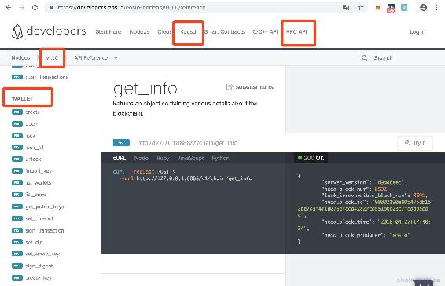
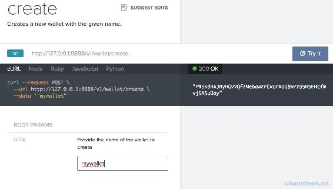
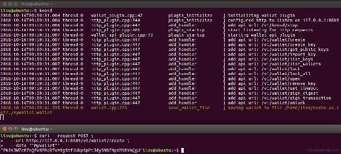

# 第四章 【EOS 钱包开发 四】钱包模块：新建钱包、解锁钱包、导入账号

> 本章的重点是使用 RPC 接口访问 EOS 区块链实现钱包的相关功能。

## 一、使用 RPC 访问 EOS 区块链

我们使用官方提供 RPC 接口轻松访问 EOS 区块链，首先打开[开发者中心网站](https://developers.eos.io/eosio-nodeos/v1.0.0/reference)。

在 V1.1 版本中支持 wallet RPC API，而在 v1.2 版本中 nodeos 已经删除了钱包 API，应该直接在 keosd 中使用 API，它的 API 定义与之前一样。我们可以在 v1.1 的版本中查看钱包 API，在 nodeos 中不能再添加钱包插件以启动 keosd 了，需要通过命令 keosd 单独启动 keosd 应用程序，注意它的端口不能与 nodeos 一样。另外最新的 V1.3 版本中将 wallet RPC API 单独放在了网站的 keosd 导航模块中。



我们使用 wallet 的第一个 API 创建钱包，文档如下



使用 curl 工具发起 post 请求访问 EOS 的命令如下

```js
curl --request POST \
  --url http://127.0.0.1:8889/v1/wallet/create \
  --data '"mywallet"'
```

运行该命令的前提：

1.  安装 curl 工具，这个太简单这里不作讲解了。
2.  确保命令中的端口与 keosd 配置文件中的端口一致，我这里是 8889（若未配置，请到 EOS 开发环境配置章节进行配置）。
3.  启动 keosd 服务。若报错`Unable to connect to keosd, if keosd is running please kill the process and try again.`，则运行命令`pkill keosd`停止 kesod。

成功运行后的效果如下所示，将会返回新钱包的密码，钱包 15 分钟不用将会自动锁定，注意一定要保存最后一行的密码，需要使用它解锁这个钱包。



## 二、项目源码

该部分源码包含钱包模块的如下功能：

*   创建钱包
*   打开钱包
*   钱包列表
    *   解锁/锁定
    *   导入私钥/获取公私钥对

### 1\. web.js

在 controllers 文件夹下新建 web.js 文件，用于实现后端返回给前端所有的页面，这里返回钱包模块的页面。

```js
module.exports = {
    getWalletHtml: async(ctx) => {
        await ctx.render("wallet.html")
    },
}
```

### 2\. wallet.js

在 controllers 文件夹下新建 wallet.js 文件，后端实现钱包模块的所有功能。

```js
let httpRequest = require("../utils/httpRequest")
let config = require("../config/config")

module.exports = {
    walletCreate: async(ctx) =>{
        console.log(JSON.stringify(ctx.request.body))
        let {wallet} = ctx.request.body

        let res = await httpRequest.postRequest(config.walletCreate, wallet)
        if (res.code == 0) {
            res.data = {"password":res.data, "wallet":wallet}
        }
        ctx.body = res
    },

    walletOpen: async(ctx) =>{
        console.log(JSON.stringify(ctx.request.body))
        let {wallet} = ctx.request.body

        let res = await httpRequest.postRequest(config.walletOpen, wallet)
        ctx.body = res
    },

    walletList: async(ctx) => {
        let res = await httpRequest.postRequest(config.walletList, null)
        ctx.body = res
    },

    walletUnlock:async(ctx) => {
        console.log(JSON.stringify(ctx.request.body))
        let {wallet, password} = ctx.request.body

        let res = await httpRequest.postRequest(config.walletUnlock, [wallet, password])
        ctx.body = res
    },

    walletLock: async(ctx) => {
        console.log(JSON.stringify(ctx.request.body))
        let {wallet} = ctx.request.body

        let res = await httpRequest.postRequest(config.walletLock, wallet)
        ctx.body = res
    },

    walletImportPrivatekey:async(ctx) => {
        console.log(JSON.stringify(ctx.request.body))
        let {wallet, privatekey} = ctx.request.body

        let res = await httpRequest.postRequest(config.walletImportPrivatekey, [wallet, privatekey])
        ctx.body = res
    },

    walletGetKeys:async(ctx) => {
        console.log(JSON.stringify(ctx.request.body))
        let {wallet, password} = ctx.request.body

        let res = await httpRequest.postRequest(config.walletGetKeys, [wallet, password])
        ctx.body = res
    },

    walletCreateKey: async(ctx) =>{
        let {wallet, type} = ctx.request.body
        let res = await httpRequest.postRequest(config.walletCreateKey, [wallet, type])
        ctx.body = res
    },

    walletPubkeyGetPrivatekey: async(ctx) => {
        let {wallet, password, publickey} = ctx.request.body
        let res = await httpRequest.postRequest(config.walletGetKeys, [wallet, password])

        let privatekey = "无权查看"
        for (const index in res.data) {
            let keys = res.data[index]
            if (keys[0] == publickey) {
                privatekey = keys[1]
                break
            }
        }

        res.data = privatekey
        ctx.body = res
    }
}
```

### 3\. router.js

将钱包模块所有功能的接口绑定到路由。

```js
let router = require("koa-router")()

let webController = require("../controllers/web")
let walletController = require("../controllers/wallet")

//钱包
router.post("/wallet/create", walletController.walletCreate)
router.post("/wallet/open", walletController.walletOpen)
router.get("/wallet/list", walletController.walletList)
router.post("/wallet/unlock", walletController.walletUnlock)
router.post("/wallet/lock", walletController.walletLock)
router.post("/wallet/importkey", walletController.walletImportPrivatekey)
router.post("/wallet/keys", walletController.walletGetKeys)
router.post("/wallet/createkey", walletController.walletCreateKey)
router.post("/wallet/privatekey", walletController.walletPubkeyGetPrivatekey)

//页面
router.get("/wallet.html", webController.getWalletHtml)

module.exports = router
```

### 4\. wallet.html

编辑 views 文件夹下的 wallet.html 文件，实现前端钱包模块的页面。

```js
<html>

<head>
    <title>钱包</title>
    <script src="js/lib/jquery-3.3.1.min.js"></script>
    <script src="/js/lib/jquery.url.js"></script>
    <script src="js/wallet.js"></script>
    <link rel="stylesheet" href="css/eoswallet.css">
</head>

<body>
    <%include block/nav.html%>

    <div id="main">
        <h1>钱包列表</h1>
        <form id="wallet-create-form">
            <button type="submit">新建钱包</button>
            <input type="text" name="wallet" placeholder="请输入钱包名称">
        </form>

        <form id="wallet-open-form">
            <button type="submit">打开钱包</button>
            <input type="text" name="wallet" placeholder="请输入钱包名称">
        </form>

        <table id="wallet-list-table">
        </table>
    </div>
</body>

</html>
```

### 5\. wallet.js

编辑 static/js 文件夹下的 wallet.js 文件，前端处理钱包模块的网络请求与页面的渲染。

```js
//导入私钥
function importPrivatekey(wallet) {
    var privatekey = prompt("请输入您需要导入的私钥");
    if(privatekey) {
        let params = {"wallet":wallet, "privatekey":privatekey}
        console.log(params)
        $.post("/wallet/importkey", params, function (res, status) {
            console.log(status, JSON.stringify(res))
            if (res.code == 0) {

            }
        })
    }
}

//获取钱包的公私钥列表
function getPublickeyList(name) {
    var password = prompt(`请输入"${name}"钱包的密码`);
    if(password) {
        let params = {"wallet":name, "password":password}
        console.log(params)
        $.post("/wallet/keys", params, function (res, status) {
            console.log(status, JSON.stringify(res))
            alert(JSON.stringify(res.data))
        })
    }
}

//解锁钱包
function unlockWallet(name) {
    var password = prompt(`请输入"${name}"钱包的密码`);
    if(password) {
        let params = {"wallet":name, "password":password}
        console.log(params)
        $.post("/wallet/unlock", params, function (res, status) {
            console.log(status, JSON.stringify(res))
            alert(JSON.stringify(res.data))
            if (res.code == 0) {
                unlockWalletComplete(name)
                localStorage.setItem(name, password)
            }
        })
    }
}

//锁定钱包
function lockWallet(name) {
    let params = {"wallet":name}
    $.post("/wallet/lock", params, function (res, status) {
        console.log(status, JSON.stringify(res))
        alert(JSON.stringify(res.data))
        if (res.code == 0) {
            lockWalletComplete(name)
        }
    })
}

function getAccountList(name) {
    localStorage.setItem("currentwallet", name)
    window.location.href = "/account.html"
}

function unlockWalletComplete(name) {
    console.log(name,name.length)
    $(`#unlock${name}`).text("已解锁")
    $(`#lock${name}`).text("未锁定")
    $(`#unlock${name}`).attr({"disabled":"disabled"})
    $(`#lock${name}`).attr({"disabled":false})
    $(`#importkey${name}`).attr({"disabled":false})
    $(`#getkeys${name}`).attr({"disabled":false})
    $(`#getaccounts${name}`).attr({"disabled":false})
}

function lockWalletComplete(name) {
    $(`#unlock${name}`).text("未解锁")
    $(`#lock${name}`).text("已锁定")
    $(`#unlock${name}`).attr({"disabled":false})
    $(`#lock${name}`).attr({"disabled":"disabled"})
    $(`#importkey${name}`).attr({"disabled":"disabled"})
    $(`#getkeys${name}`).attr({"disabled":"disabled"})
    $(`#getaccounts${name}`).attr({"disabled":"disabled"})
}

$(document).ready(function () {

    //获取钱包列表
    $.get("/wallet/list", function (res, status) {
        console.log(status, JSON.stringify(res))

        if (res.code == 0) {
            let walletTable = $("#wallet-list-table")
            res.data.forEach(wallet => {

                let walletName = wallet
                let isUnlock = false
                if(wallet.charAt(wallet.length-1)=="*"){
                    isUnlock = true
                    walletName = wallet.slice(0,-2)
                }
                let walletTr = `<tr>
                    <td>${walletName}</td>
                    <td><button id="unlock${walletName}" onclick="unlockWallet('${walletName}')">未解锁</button></td>
                    <td><button id="lock${walletName}" disabled="disabled" onclick="lockWallet('${walletName}')">已锁定</button></td>
                    <td><button id="importkey${walletName}" disabled="disabled" onclick="importPrivatekey('${walletName}')">导入私钥</button></td>
                    <td><button id="getkeys${walletName}" disabled="disabled" onclick="getPublickeyList('${walletName}')">获取公私钥对</button></td>
                    <td><button id="getaccounts${walletName}" disabled="disabled" onclick="getAccountList('${walletName}')">账号列表</button></td>
                </tr>`
                walletTable.append(walletTr)

                if(isUnlock){
                    unlockWalletComplete(walletName)
                }
            });
        }
    })

    //创建钱包
    $("#wallet-create-form").validate({
        rules: {
            wallet: {
                required: true,
            },
        },
        messages: {
            wallet: {
                required: "请输入新建的钱包名称",
            },
        },
        submitHandler: function (form) {
            $(form).ajaxSubmit({
                url: "/wallet/create",
                type: "post",
                dataType: "json",
                success: function (res, status) {
                    console.log(status + JSON.stringify(res))
                    alert(JSON.stringify(res.data))
                    if (res.code == 0) {
                        window.location.reload()
                        localStorage.setItem(res.data.wallet, res.data.password)
                    }
                },
                error: function (res, status) {
                    console.log(status + JSON.stringify(res))
                }
            });
        }
    })

    //打开钱包
    $("#wallet-open-form").validate({
        rules: {
            wallet: {
                required: true,
            },
        },
        messages: {
            wallet: {
                required: "请输入要打开的钱包名称",
            },
        },
        submitHandler: function (form) {
            $(form).ajaxSubmit({
                url: "/wallet/open",
                type: "post",
                dataType: "json",
                success: function (res, status) {
                    console.log(status + JSON.stringify(res))
                    if (res.code == 0) {
                        window.location.reload()
                    } else {
                        alert(JSON.stringify(res.data))
                    }
                },
                error: function (res, status) {
                    console.log(status + JSON.stringify(res))
                }
            });
        }
    })
})
```

## 三、项目运行效果

在 EOSV1.2 之后的版本，钱包数据所在路径是`~/eosio-wallet`，创建的钱包都能在该文件中查看。

*   当你第一次使用该钱包应用程序时，前端显示的钱包列表将是空的，需要自己创建钱包。另外，重启 keosd 服务后，还需重新打开之前创建的钱包才能显示。创建钱包与打开钱包的效果演示如下：

     09.21.50.gif)

*   新创建的钱包没有公私钥对，自己可以导入。对钱包的操作效果演示如下：

     09.34.21.gif)

**[项目源码 Github 地址](https://github.com/lixuCode/EOSWallet)**

**版权声明：博客中的文章版权归博主所有，未经授权禁止转载，转载请联系作者（微信：lixu1770105）取得同意并注明出处。**