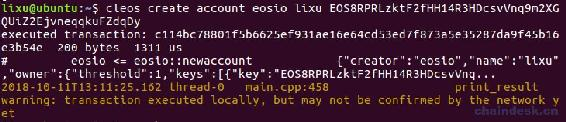
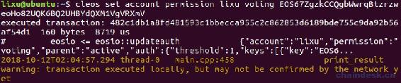
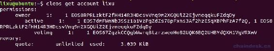
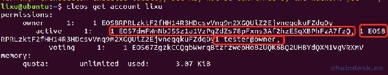
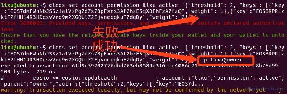
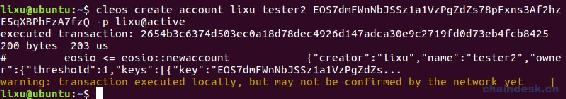
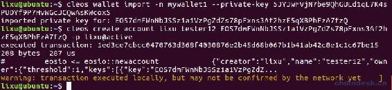

# 第五章 【EOS 钱包开发 五】使用 cleos 工具管理账号权限

在上一篇文章中，我们创建了一个新钱包并导入了一对公私钥，但是该钱包中并没有账号，在 EOS 区块链中创建账号是很扯蛋的事，必须使用已有的 EOS 账号才能创建新的 EOS 账号，使创建账号的时候便于扣费，因为创建的账号数据会占用区块链生产节点的内存资源，所以每创建一个 EOS 新账号都需要其他 EOS 账号消耗一定量的 EOS 来帮忙创建。那么我们找谁来创建呢？谁又有 EOS 账号呢？

*   EOS 主网中，最初始的 EOS 账号由 EOS 主网在映射阶段创建完成。

*   在本地网络中，最初始的 EOS 账号在系统启动的时候就自动被创建了一个超级用户——eosio。

我们是在本地网络中进行开发，所以我们将使用 eosio 超级账号去创建新账号。

## 一、创建账号

下面我们将要创建账号`lixu`。

我们钱包中是没有 eosio 账号的，但是可以通过命令行工具 cleos 去创建账号。在环境搭建的一篇文章的我们在 default 钱包中已经能够使用 eosio 账号了，创建的新账号由钱包应用程序中新建的 mywallet1 钱包中的私钥对控制，公钥为`EOS8RPRLzktF2fHH14R3HDcsvVnq9m2XGQUiZ2EjvneqqkuFZdqDy`，私钥是`5HrqHYGMPn36zk3mqNU1tmuQrD2SQHxCGdCMjBFBkJ815tjxmS2`。

**第一步：**我们须解锁 eosio 账号所在的钱包。

```js
lixu@ubuntu:~$ cleos wallet unlock --password PW5J5SSUrU3sGBonpxjxbn9QXGPdpAsCkWowmjCcLyBPUu5Y5uvvv

Unlocked: default
lixu@ubuntu:~$ cleos wallet list
Wallets:
[
  "default *"
]
```

**第二步：**查看创建账号命令的说明`cleos create account`。

```js
lixu@ubuntu:~$ cleos create account

ERROR: RequiredError: creator
Create an account, buy ram, stake for bandwidth for the account
Usage: cleos create account [OPTIONS] creator name OwnerKey [ActiveKey]

Positionals:
  creator TEXT                The name of the account creating the new account (required)
  name TEXT                   The name of the new account (required)
  OwnerKey TEXT               The owner public key for the new account (required)
  ActiveKey TEXT              The active public key for the new account

Options:
  -h,--help                   Print this help message and exit
  -x,--expiration             set the time in seconds before a transaction expires, defaults to 30s
  -f,--force-unique           force the transaction to be unique. this will consume extra bandwidth and remove any protections against accidently issuing the same transaction multiple times
  -s,--skip-sign              Specify if unlocked wallet keys should be used to sign transaction
  -j,--json                   print result as json
  -d,--dont-broadcast         don't broadcast transaction to the network (just print to stdout)
  --return-packed             used in conjunction with --dont-broadcast to get the packed transaction
  -r,--ref-block TEXT         set the reference block num or block id used for TAPOS (Transaction as Proof-of-Stake)
  -p,--permission TEXT ...    An account and permission level to authorize, as in 'account@permission'
  --max-cpu-usage-ms UINT     set an upper limit on the milliseconds of cpu usage budget, for the execution of the transaction (defaults to 0 which means no limit)
  --max-net-usage UINT        set an upper limit on the net usage budget, in bytes, for the transaction (defaults to 0 which means no limit)
```

根据输出可知：

*   创建账号需要购买 ram、带宽，在本地网络中可以不用购买，无限制的使用资源，在稍后我们验证这个说法。

*   创建账号的完整命令是`cleos create account [OPTIONS] creator name OwnerKey [ActiveKey]`。

*   在`Positionals`结构中包含四个字断：

    *   creator TEXT（必填）：创建者账号的名称。
    *   name TEXT（必填） ：新账号的名称。
    *   OwnerKey TEXT（必填）：新账号的 owner 权限的公钥。
    *   ActiveKey TEXT（可选）：新账号的 active 权限的公钥，默认与 owner 权限的公钥一致。
*   在`Options`结构中有很多可选参数，介绍一下比较常用的几个：

    *   `-d`：是不广播到网络。
    *   `-j`：是返回为 json 格式的数据。
    *   `-s`：是交易数据不经过签名。
    *   `-p`：是指定签名的账号以及权限，默认是 active 权限。
    *   `-h`：是帮助命令。

**第三步：**我们创建的第一个账号的 owner 权限和 active 权限都使用前面的这一对公私钥控制即可，新账号名称为`lixu`，所以创建账号的完整命令如下：

```js
cleos create account eosio lixu EOS8RPRLzktF2fHH14R3HDcsvVnq9m2XGQUiZ2EjvneqqkuFZdqDy
```

下面是效果图。



## 二、新增权限

下面我们将要新增账号`lixu`的`voting`权限。

现在账号`liux`的有自带的两个原生权限：owner 权限与 active 权限，owner 拥有很多功能给的操作权限，如：转账、投票、购买 ram 等等，我们可以将其中一个或多个功能，比如将投票权任命给一个自定义权限 voting。那么无须 owner、active 权限所对应的私钥对投票操作进行签名，单单通过 voting 权限所对应的私钥对投票操作进行签名便可完成投票操作。

**第一步：**查看账号`lixu`的权限分配，使用命令`cleos get account lixu`。


可知在本地网络中可以无限制的使用资源，我们现在只关心“permissions”的内容，在后面我们会切换到真实的测试网络中开发，然后重点介绍后面各项的含义与作用。

**第二步：**查看新增权限命令的说明`cleos set account permission`。

```js
lixu@ubuntu:~$ cleos set account permission

ERROR: RequiredError: account
set parameters dealing with account permissions
Usage: cleos set account permission [OPTIONS] account permission authority [parent]

Positionals:
  account TEXT                The account to set/delete a permission authority for (required)
  permission TEXT             The permission name to set/delete an authority for (required)
  authority TEXT              [delete] NULL, [create/update] public key, JSON string, or filename defining the authority (required)
  parent TEXT                 [create] The permission name of this parents permission (Defaults to: "Active")

Options:
  -h,--help                   Print this help message and exit
  -x,--expiration             set the time in seconds before a transaction expires, defaults to 30s
  -f,--force-unique           force the transaction to be unique. this will consume extra bandwidth and remove any protections against accidently issuing the same transaction multiple times
  -s,--skip-sign              Specify if unlocked wallet keys should be used to sign transaction
  -j,--json                   print result as json
  -d,--dont-broadcast         don't broadcast transaction to the network (just print to stdout)
  --return-packed             used in conjunction with --dont-broadcast to get the packed transaction
  -r,--ref-block TEXT         set the reference block num or block id used for TAPOS (Transaction as Proof-of-Stake)
  -p,--permission TEXT ...    An account and permission level to authorize, as in 'account@permission' (defaults to 'account@active')
  --max-cpu-usage-ms UINT     set an upper limit on the milliseconds of cpu usage budget, for the execution of the transaction (defaults to 0 which means no limit)
  --max-net-usage UINT        set an upper limit on the net usage budget, in bytes, for the transaction (defaults to 0 which means no limit)
```

根据输出可知：

*   创建账号的完整命令是`cleos set account permission [OPTIONS] account permission authority [parent]`。
*   在`Positionals`结构中包含四个字断：
    *   account TEXT（必填）：设置/删除权限的帐户。
    *   permission TEXT（必填） ：设置/删除权限的权限名称。
    *   authority TEXT（必填）：若删除则是 NULL、创建/更新则是公钥、JSON 字符串或者文件名。
    *   parent TEXT（可选）：该权限的父权限的权限名，默认为 active。
*   在`Options`结构中的可选参数与之前介绍的一样，

**第三步：**新建一对公私钥控制 voting 权限

```js
lixu@ubuntu:~$ cleos create key --to-console

Private key: 5K5NqYsyjvUEyYh9DG8ExP1Wt47Hm6D7KzBgFVCCVmnbt9tEcdj
Public key: EOS67ZgzkCCQgbWwrqBtzrzweoHo82UQK6BQ2UHBYdQXM1VgVRXmV
```

**第四步：**那么给账号`lixu`新增`voting`权限由公钥`EOS67ZgzkCCQgbWwrqBtzrzweoHo82UQK6BQ2UHBYdQXM1VgVRXmV`控制的完整命令如下：

```js
cleos set account permission lixu voting EOS67ZgzkCCQgbWwrqBtzrzweoHo82UQK6BQ2UHBYdQXM1VgVRXmV
```

下面是效果图。



**第五步：**新增权限后再次查看账号`lixu`的权限分配。


到此我们已经完成了给一个账号新建权限并指定控制的公钥的功能。

## 三、新增权限控制的主体

### 1\. 如何新增权限控制的主体

新增权限控制的主体有三种方式：公私钥对、账号、延迟，这里我们只介绍常见的前面两种。

下面我们新增账号`lixu`的`active`权限控制的主体。

初始时每个权限只有一个主体（一对公私钥），我们可以修改权限由多个主体控制，这样做的目的在于让多个主体共同控制一个权限的功能，即多签，只有当主体（一对公私钥）的权重大于等于阀值才能拥有该权限进行相应操作。

修改权限控制的主体需要传递的是 json 字符串或者 json 文件，那么 json 字符串的数据结构是怎么样的呢？如下：

```js
{
  "threshold":      <INTEGER [1-2³²): the threshold that must be met to satisfy this authority>,
  "keys": [         <keys must be alpha-numerically sorted by their string representations and unique>
    ...
    {
      "key":        <STRING: EOS.IO compatible Public Key>,
      "weight":     <INTEGER [1-2¹⁶): a signature from this key contributes this to satisfying the threshold>
    }
    ...
  ],
  "accounts": [     <accounts must be alpha-numerically sorted by their permission (actor, then permission) and unique>
    ...
    {
      "permission": {
        "actor":      <STRING: account name of the delegated signer>,
        "permission": <STRING: permission level on the account that must be satisfied>,
      },
      "weight":     <INTEGER [1-2¹⁶): satisfying the delegation contributes this to satisfying the threshold>
    }
    ...
  ],
  "waits": [        <waits must be sorted by wait_sec, largest first, and be unique>
    ...
    {
      "wait_sec":   <INTEGER [1-2³²): seconds of delay which qualifies as passing this wait>
      "weight":     <INTEGER [1-2¹⁶): satisfying the delay contributes this to satisfying the threshold>
    }
    ...
  ]
}
```

每个字断的解释如下：

```js
{
  "threshold":是阈值，范围是整数[1-2^ 32 ]：
  "keys": [必须由字符串中的字母和数字排序
    ...
    {
      "key":        公钥,
      "weight":   权重，范围是 1-2¹⁶
    }
    ...
  ],
  "accounts": [帐号必须由他们的权限的独特的字母和数字排序
    ...
    {
      "permission": {
        "actor":委派签名者的帐户名,
        "permission": 权限,
      },
      "weight":所占的权重，范围是 1-2¹⁶
    }
    ...
  ],
  "waits": [必须由 wait_sec 排序，第一个最大
    ...
    {
      "wait_sec":延迟的秒数
      "weight":所占的权重，范围是 1-2¹⁶
    }
    ...
  ]
}
```

我们可以选择性的设置权限的控制权，但是必须要按照如下规则进行修改：

*   严格按照上面的 json 数据结构设置
*   修改的公钥、账号必须按照从小到大进行排序，如：EOS67Z…需在 EOS7dm 签名。
*   所有控制体的权重的和必须大于等于阀值。

### 2\. 新增权限控制的主体：公私钥对

**第一步：**新建一对公私钥作为 active 权限的另一个主体。

```js
lixu@ubuntu:~$ cleos create key --to-console
Private key: 5JYJwFVjN7be9QhGULd1qL7K4sPUDYf9P7HvWGcJCQwAsKWcoxS
Public key: EOS7dmFWnNbJSSz1a1VzPgZdZs78pFxns3Af2hzE5qXBPhFzA7fzQ
```

**第二步：新增权限控制的主体**

我们只选择了 threshold、keys 字断，并且需要把之前的控制主体表示出来，否则会被更新，阀值和主体的权重都为默认的 1。那么新增权限控制的主体的正确姿势是

```js
cleos set account permission lixu active '{"threshold": 1, "keys": [{"key":"EOS7dmFWnNbJSSz1a1VzPgZdZs78pFxns3Af2hzE5qXBPhFzA7fzQ","weight": 1},{"key":"EOS8RPRLzktF2fHH14R3HDcsvVnq9m2XGQUiZ2EjvneqqkuFZdqDy","weight": 1}]}' 
```

若这样设置

```js
lixu@ubuntu:~$ cleos set account permission lixu active '{"threshold": 1, "keys": [{"key":"EOS8RPRLzktF2fHH14R3HDcsvVnq9m2XGQUiZ2EjvneqqkuFZdqDy","weight": 1},{"key":"EOS7dmFWnNbJSSz1a1VzPgZdZs78pFxns3Af2hzE5qXBPhFzA7fzQ","weight": 1}]}' 
```

上面的命令会报错如下

```js
Error Details:
Authority failed validation! ensure that keys, accounts, and waits are sorted and that the threshold is valid and satisfiable!
```

注意：权限的主体必须按照公钥进行排序。

**第三步：**新增权限控制的主体后再次查看账号`lixu`的权限分配。



现在两个主体都可以操作 active 权限的功能，因为它们的权重等于阀值。

### 3\. 新增权限控制的主体：账号

使用 tester 的 owner 权限作为账号`lixu`的 active 权限的一个主体，分配的权重仍为 1，完整的命令如下

```js
cleos set account permission lixu active '{"threshold": 1, "keys": [{"key":"EOS7dmFWnNbJSSz1a1VzPgZdZs78pFxns3Af2hzE5qXBPhFzA7fzQ","weight": 1},{"key":"EOS8RPRLzktF2fHH14R3HDcsvVnq9m2XGQUiZ2EjvneqqkuFZdqDy","weight": 1}], "accounts": [{"permission":{"actor":"tester", "permission":"owner"}, "weight":1}]}'
```

再次查看账号`lixu`的权限分配如下，有三个主体，注意最后一个账号主体的权重与上一个公钥主体的公钥之间没有“，”分割。



现在三个主体都可以操作 active 权限的功能，因为它们的权重等于阀值。

## 四、修改阀值

接下来我们通过修改账号`lixu`的`active`权限的阀值为 2，实现多签的功能。

**第一步：**测试账号`lixu`的`active`权限的`EOS8RPRLzktF2fHH14R3HDcsvVnq9m2XGQUiZ2EjvneqqkuFZdqDy`主体是否拥有它的（active）功能。

```js
lixu@ubuntu:~$ cleos create account lixu tester EOS7dmFWnNbJSSz1a1VzPgZdZs78pFxns3Af2hzE5qXBPhFzA7fzQ -p lixu@active

executed transaction: d176524d7ae93a39b2c5bb9bcb23a820c780ee51c780e0eca13bce335775bc34  200 bytes  199 us
#         eosio <= eosio::newaccount            {"creator":"lixu","name":"tester","owner":{"threshold":1,"keys":[{"key":"EOS7dmFWnNbJSSz1a1VzPgZdZs7...
```

证明该主体还能使用 active 权限的功能（创建账号）。因为它的私钥导入到了钱包，使用的是 acitve 权限签名。

**第二步：**修改账号`lixu`的`active`权限的阀值为 2。

```js
lixu@ubuntu:~$ cleos set account permission lixu active '{"threshold": 2, "keys": [{"key":"EOS7dmFWnNbJSSz1a1VzPgZdZs78pFxns3Af2hzE5qXBPhFzA7fzQ","weight": 1},{"key":"EOS8RPRLzktF2fHH14R3HDcsvVnq9m2XGQUiZ2EjvneqqkuFZdqDy","weight": 1}]}' 

executed transaction: 95131918b3e306e7aac8f7c3d85fecab1ecc1db2dc0393d780b8bfd1c690146e  200 bytes  182 us
#         eosio <= eosio::updateauth            {"account":"lixu","permission":"active","parent":"owner","auth":{"threshold":2,"keys":[{"key":"EOS7d...
warning: transaction executed locally, but may not be confirmed by the network yet    ] 
```

**第三步：**现在其中的任何主体都不能单独使用 active 权限的功能，如下操作将会报错：3090003：提供的密钥、权限和延迟不满足该权限的阀值，请确保钱包内有相关的私钥。

```js
lixu@ubuntu:~$ cleos create account lixu tester2 EOS7dmFWnNbJSSz1a1VzPgZdZs78pFxns3Af2hzE5qXBPhFzA7fzQ -p lixu@active

Error 3090003: Provided keys, permissions, and delays do not satisfy declared authorizations
Ensure that you have the related private keys inside your wallet and your wallet is unlocked.
```

因此，现在必须同时拥有 active 的两个主体才能使用 active 权限的功能，因为两个主体的权重分别为 1，加起来才等于 acrive 权限的阀值 2。现在有哪些办法可以使用 active 权限呢？

*   使用`-p lixu@owner`签名。
*   修改改主体的权重大于等于 active 权限的阀值。
*   将另外个私钥导入到该钱包。

## 五、修改权重

下面我们修改`EOS8RPRLzktF2fHH14R3HDcsvVnq9m2XGQUiZ2EjvneqqkuFZdqDy`主体的权重为 2。

现在该主体的权重为 1 不能使用 active 的功能，所以将它的权重改为与 active 的阀值一样，以使它能使用该权限。但是想要修改 active 的权限，需要 active 签名，或者它的父权限 owner 签名，那么只好使用 owner 签名了，否则修改失败。

完整的命令如下：

```js
cleos set account permission lixu active '{"threshold": 2, "keys": [{"key":"EOS7dmFWnNbJSSz1a1VzPgZdZs78pFxns3Af2hzE5qXBPhFzA7fzQ","weight": 1},{"key":"EOS8RPRLzktF2fHH14R3HDcsvVnq9m2XGQUiZ2EjvneqqkuFZdqDy","weight": 2}]}' -p lixu@owner
```

效果如下：



现在`EOS8RPR...`该主体便能使用 active 权限了，不用 owner 签名也能再次修改 active 的权限配置。



此时 active 的阀值为 2，另外一个主体`EOS7dmF...`权重还是 1，不能单独使用 active，必须与主体`EOS8RPR...`共同签名方可使用。

## 六、多重签名

前面的步骤都是单签名完成的操作，如何实现多签名呢？就是使用多个私钥一起对交易进行签名。那么下面我们重新配置一下该账号的 active 权限。

```js
cleos set account permission lixu active '{"threshold": 3, "keys": [{"key":"EOS67ZgzkCCQgbWwrqBtzrzweoHo82UQK6BQ2UHBYdQXM1VgVRXmV","weight": 1},{"key":"EOS8RPRLzktF2fHH14R3HDcsvVnq9m2XGQUiZ2EjvneqqkuFZdqDy","weight": 2}], "accounts": [{"permission":{"actor":"tester", "permission":"owner"}, "weight":1}]}'
```

现在 active 的三个主体的权重都小于阀值，不能单独使用 active 权限。上面介绍了有三种办法可以使用 active 权限，第一、二种已经使用过了，并且不是没有使用到多重签名，接下来我们使用最后种方式——将另外个私钥导入到该钱包来实现多重签名。

需要导入 tester 的 owner 权限的私钥到 mywallet1 钱包。现在 mywallet1 钱包就拥有权重为 2 的主体`EOS8RPR...`，与权重为 1 的主体 test 的 owner 权限，主体权重就一共为 3 等于了 active 阀值，然后就可以使用多重签名操作 active 权限了。



## 七、总结

每个权限都会有一个阀值，初始时为 1。权限下的每对公私钥都会有一个权重，初始时每个权限只有一对公私钥且权重为 1。后续账户可以修改权限的阀值，可以对每个主体（即每对 EOS 公私钥或账号）分配不同的权重，还可以修改权限由多个主体管理。只有当公私钥的权重大于等于阀值才能拥有该权限进行相应操作。

**版权声明：博客中的文章版权归博主所有，未经授权禁止转载，转载请联系作者（微信：lixu1770105）取得同意并注明出处。**