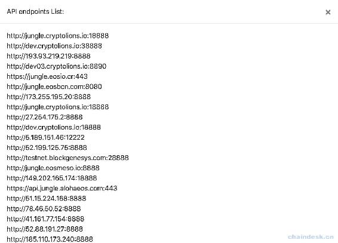
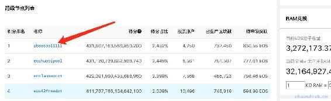
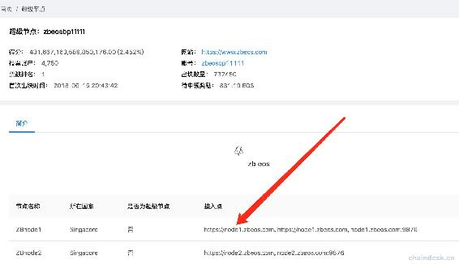
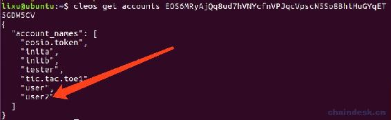
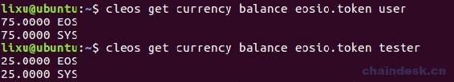
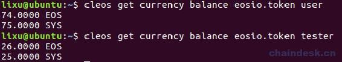

# 第六章 【EOS 钱包开发 六】深入浅出 EOSJS：连接到主网、测试网、交易

> EOSJS 是 EOSIO 区块链的通用库，这里使用 eosjs 的目的是使用 eosjs 库中封装的交易的接口，使用及其简单，可在此处查看[eosjs 开发手册](https://github.com/EOSIO/eosjs/tree/v16.0.0)。

## 一、EOSJS 简单用法

**安装 EOSJS**

```js
npm install eosjs
```

获取当前区块链的信息和查询指定区块的信息。

```js
Eos = require('eosjs')

eos = Eos()

eos.getInfo((error, result) => {
     console.log("info:", error, result)
})

eos.getBlock(10, (error, result) => {
    console.log("block:", error, result)
})
```

首先启动本地节点网络。

```js
nodeos -e -p eosio --plugin eosio::chain_api_plugin --plugin eosio::history_api_plugin --plugin eosio::wallet_api_plugin
```

通过命令行`node index.js`运行以上脚本，输出如下

```js
lixu@ubuntu:~/Desktop/demo/eosjsdemo$ node index.js
info: null { server_version: 'a228b1dc',
  chain_id: 'cf057bbfb72640471fd910bcb67639c22df9f92470936cddc1ade0e2f2e7dc4f',
  head_block_num: 9259,
  last_irreversible_block_num: 9258,
  last_irreversible_block_id: '0000242a8128c109fb4f04c8b11b78e202e01745cf7949a6ec33e8bd9481a0d7',
  head_block_id: '0000242b9ee3ea0a6b5dfeefdd5603937778c90c3eb022dd16d3ad61a0346d13',
  head_block_time: '2018-09-15T03:32:19.000',
  head_block_producer: 'eosio',
  virtual_block_cpu_limit: 200000000,
  virtual_block_net_limit: 1048576000,
  block_cpu_limit: 199900,
  block_net_limit: 1048576 }

block: null { timestamp: '2018-09-14T07:36:19.000',
  producer: 'eosio',
  confirmed: 0,
  previous: '00000009d0016b6afe0bfee7fd168ca29dcc17fc990d54a8d81b3641136dc49c',
  transaction_mroot: '0000000000000000000000000000000000000000000000000000000000000000',
  action_mroot: 'c8e04cf40af8a6d62e4c7741dae972fe2ac5756fa4ce039959d4769f352c52ef',
  schedule_version: 0,
  new_producers: null,
  header_extensions: [],
  producer_signature: 'SIG_K1_KcXNRs7CTs4de3SdNvuJ4Z7zC2dwqxvpTTZpRfB6Mcndd7QKnkUkgXAyuNNhs6PvRi8NDim5xe7SUhEoP8YzRNJBKEmSrS',
  transactions: [],
  block_extensions: [],
  id: '0000000a8ab5ea5abd8f55b1a29f8a7b5ac1a9ad722ffeb4dfca4f32110f4df2',
  block_num: 10,
  ref_block_prefix: 2975174589 }
lixu@ubuntu:~/Desktop/demo/eosjsdemo$
```

若 chain_id:为'cf057bbfb72640471fd910bcb67639c22df9f92470936cddc1ade0e2f2e7dc4f'，则证明连接到了本地网络。

## 二、连接到测试网络

需要如下配置 eos 对象连接到指定的网络。修改以上代码`eos = Eos()`为如下代码。

```js
config = {
    // chainId: "", 
    keyProvider: ["5KQwrPbwdL6PhXujxW37FSSQZ1JiwsST4cqQzDeyXtP79zkvFD3"], 
    httpEndpoint: 'http://jungle.cryptolions.io:18888',
}
eos = Eos(config)
```

*   `chainId`：通过`eos.getInfo`方法获取到的`chain_id`值填写在该字段中，用于连接到不同的网络中的必填字段。
*   `keyProvider`：用于签名事务的私钥，当前测试案例可随意填写，后续我们再介绍如果填写该字段的值。
*   `httpEndpoint`：提供 nodeos 服务的地址。

输出如下

```js
lixu@ubuntu:~/Desktop/demo/eosjsdemo$ node index.js
info: null { server_version: '08819aae',
  chain_id: '038f4b0fc8ff18a4f0842a8f0564611f6e96e8535901dd45e43ac8691a1c4dca',
  head_block_num: 14459108,
  last_irreversible_block_num: 14458782,
  last_irreversible_block_id: '00dc9f9e460a7cf24ec93634323c21955d75475ac7525a878f84ea565ef37c7c',
  head_block_id: '00dca0e4a8eb6a7d858acc85f8f462218462e8c5429f0ad9cdc897f2090c6ad9',
  head_block_time: '2018-09-15T03:37:12.500',
  head_block_producer: 'galapaguin22',
  virtual_block_cpu_limit: 200000000,
  virtual_block_net_limit: 1048576000,
  block_cpu_limit: 199900,
  block_net_limit: 1048576,
  server_version_string: 'v1.2.5-dirty' }

block: null { timestamp: '2018-06-09T00:55:45.500',
  producer: 'eosio',
  confirmed: 0,
  previous: '000000091be3d40e633cef45a18d0b74b87d535d0a57c2fa842d0d461bc08cae',
  transaction_mroot: '0000000000000000000000000000000000000000000000000000000000000000',
  action_mroot: '9d3683cd4eabf72aef6bed9fdf6bb3e50c4a01f39e9ca6848b71898e80151f0c',
  schedule_version: 0,
  new_producers: null,
  header_extensions: [],
  producer_signature: 'SIG_K1_JypxpucZxAjAC6chEzgF2j7JjhYMrh8ZXvVWqTaXZPZR2eefjzuMbNH4NPY6h8G9C77fhYTCekXJG4UZgHphuaGTJrVdcn',
  transactions: [],
  block_extensions: [],
  id: '0000000afd747564aceea23209cbc4dc1cff14e661c4cf5e14188fd080ea8067',
  block_num: 10,
  ref_block_prefix: 849538732 }
lixu@ubuntu:~/Desktop/demo/eosjsdemo$ 
```

若 chain_id:为'038f4b0fc8ff18a4f0842a8f0564611f6e96e8535901dd45e43ac8691a1c4dca'，则证明连接到了测试网络。

## 三、获取 jungle 测试网节点地址

大家可能会有疑问，上面配置中`httpEndpoint`字段的地址如何获取。

1.  打开 jungle 网站

    地址是 http://jungle.cryptolions.io/

2.  点击`API endpoints`按钮

    

3.  随意选择一个地址

    在`API Endpoints`列表中展示了多个连接地址，随意选复制一个即可。上面代码示例中则是选择了第一个地址`http://jungle.cryptolions.io:18888`。

    

## 四、连接到主网

只需修改配置信息中的`httpEndpoint`字段，如下。

```js
config = {
    // chainId: "", 
    keyProvider: ["5KQwrPbwdL6PhXujxW37FSSQZ1JiwsST4cqQzDeyXtP79zkvFD3"], 
    httpEndpoint: 'https://node1.zbeos.com',
}
eos = Eos(config)
```

输出如下

```js
lixu@ubuntu:~/Desktop/demo/eosjsdemo$ node index.js
info: null { server_version: '78708df4',
  chain_id: 'aca376f206b8fc25a6ed44dbdc66547c36c6c33e3a119ffbeaef943642f0e906',
  head_block_num: 16481648,
  ......
block: null { timestamp: '2018-06-09T11:56:34.000',
  producer: 'eosio',
  ......
```

若 chain_id:为'aca376f206b8fc25a6ed44dbdc66547c36c6c33e3a119ffbeaef943642f0e906'，则证明连接到了主网。

## 五、获取主网节点地址

1.  打开 eospark 网站

    地址是 https://eospark.com。在该网站可查询所有超级节点接入点网址。

2.  选择超级节点

    随意选择一个超级节点即可。

    

3.  选择接入点地址

    随意选择一个接入点地址即可。上面代码示例中则是选择了第一个地址`https://node1.zbeos.com`。

    

## 六、EOSJS 配置

以下的教程在不特别说明的情况下，都是在本地网络上进行的开发。

在前面介绍了简单的配置 eos，在开发中我们一般需要如下完整的配置。

```js
let Eos = require('eosjs')
let binaryen = require('binaryen')

config = {
    chainId: "cf057bbfb72640471fd910bcb67639c22df9f92470936cddc1ade0e2f2e7dc4f",
    keyProvider: ["5KYU9Xsv3SXY674eXfDiGD5SrQXU6JZeULZsXAtcY1x3huAzrHt"], 
    httpEndpoint: 'http://127.0.0.1:8888',
    binaryen: binaryen,
    expireInSeconds: 60,
    broadcast: true,
    verbose: false, 
    sign: true
}

eos = Eos(config)
```

*   **chainId**：16 进制数据。要连接的**区块**链的唯一 ID，这是有效交易签名所必需的字段。chainId 通过 `get_info`API 调用提供。签署的所有交易仅对具有此 chainId 的区块链有效。出于安全原因验证 chainId。

*   **keyProvider**：array|string 数据。提供用于签名事务的私钥。如果提供了多个私钥，不能确定使用哪个私钥，可以使用调用`get_required_keys`API 获取要使用签名的密钥。

*   **keyPrefix**：string 数据。更改公钥前缀。

*   **httpEndpoint**：string 数据。提供 nodeos 服务的地址，如本地节点地址：[`127.0.0.1:8888`](http://127.0.0.1:8888)。

*   **expireInSeconds**：number 数据。事务到期前的秒数，时间基于 nodeosd 的时间。

*   **broadcast**：boolean 值，默认是 true。使用 true 将交易发布到区块链，使用 false 将获取签名的事务。

*   **verbose**：boolean 值，默认是 false。详细日志记录。

*   **debug**：boolean 值，默认是 false。低级调试日志记录。

*   **sign**：boolean 值，默认是 true。使用私钥签名交易。保留未签名的交易避免了提供私钥的需要。

*   **authorization**：array<auth>|auth 数据。替换默认的 eosjs 的授权，通常在 multisig 配置中标识签名帐户和权限。授权可以是格式化为`account@permission`的字符串，如下</auth>

    ```js
    {authorization: 'user@active'}
    ```

    注意：`authorization`适用于个人操作，不属于`Eos(config)`。

**可选项**：

可以在 EOSJS 方法的参数之后提供可选项，如下操作。

```js
options = {
  authorization: 'user@active',
  broadcast: true,
  sign: true
}
eos.transfer('user', 'test', '1.0000 SYS', '', options)
```

## 七、创建账号

`transaction`函数接受标准区块链事务。

下面使用了`newaccount`去创建账号，新帐户需要抵押一定的代币用于 RAM 和带宽资源。使用已经存在的`user`账号去创建新账号`user2`。

**代码需求**：

*   `keyProvider`字段中需要填写`user`的`active`权限的私钥
*   必须解锁`user`账号的`active`权限的私钥所在的钱包
*   新账号`user2`的`owner`权限与`active`权限的公钥都是使用的局部变量`pubkey`里的值

```js
let Eos = require('eosjs')
let binaryen = require('binaryen')

config = {
    chainId: "cf057bbfb72640471fd910bcb67639c22df9f92470936cddc1ade0e2f2e7dc4f", 
    keyProvider: ["5KQwrPbwdL6PhXujxW37FSSQZ1JiwsST4cqQzDeyXtP79zkvFD3"],
    httpEndpoint: 'http://127.0.0.1:8888',
    binaryen: binaryen,
    expireInSeconds: 60,
    broadcast: true,
    verbose: false, 
    sign: true
}

eos = Eos(config)

async function transaction() {
    pubkey = 'EOS6MRyAjQq8ud7hVNYcfnVPJqcVpscN5So8BhtHuGYqET5GDW5CV'

    let createor = "user"
    let acocunt = "user2"

    let data = await eos.transaction(tr => {
        tr.newaccount({
            creator: createor,
            name: acocunt,
            owner: pubkey,
            active: pubkey
        })

        tr.buyrambytes({
            payer: createor,
            receiver: acocunt,
            bytes: 8192
        })

        tr.delegatebw({
            from: createor,
            receiver: acocunt,
            stake_net_quantity: '10.0000 EOS',
            stake_cpu_quantity: '10.0000 EOS',
            transfer: 0
        })
    })

    console.log(JSON.stringify(data))
}

transaction()
```

运行后返回的数据为 json 字符串，经过格式化后数据较多，下面只展示了前面一部分

```js
{
    "broadcast": true,
    "transaction": {
        "compression": "none",
        "transaction": {
            "expiration": "2018-09-15T06:55:34",
            "ref_block_num": 10949,
            "ref_block_prefix": 1636345996,
            "max_net_usage_words": 0,
            "max_cpu_usage_ms": 0,
            "delay_sec": 0,
            "context_free_actions": [],
            "actions": [
                {
                    "account": "eosio",
                    "name": "newaccount",
                    "authorization": [
                        {
                            "actor": "user",
                            "permission": "active"
                        }
                    ],
......
```

运行后即可查询到公钥`EOS6MRyAjQq8ud7hVNYcfnVPJqcVpscN5So8BhtHuGYqET5GDW5CV`所关联的账号有`user2`，如下所示



## 八、代币转账

下面代码是实现 user 向 tserer 转账，转的代币是 EOS，数额为 1。

**代码需求**：

*   `keyProvider`字段中需要填写`user`的私钥
*   必须解锁`user`账号的私钥所在的钱包
*   user 必须拥有 EOS 代币，且余额不小于 1

```js
Eos = require('eosjs')
let binaryen = require('binaryen')

config = {
    chainId: "cf057bbfb72640471fd910bcb67639c22df9f92470936cddc1ade0e2f2e7dc4f", 
    keyProvider: ["5KQwrPbwdL6PhXujxW37FSSQZ1JiwsST4cqQzDeyXtP79zkvFD3"], 
    httpEndpoint: 'http://127.0.0.1:8888',
    binaryen: binaryen,
    expireInSeconds: 60,
    broadcast: true,
    verbose: false,
    sign: true
}

eos = Eos(config)

async function sendTransaction() {
    options = {
        authorization: 'user@active',
        broadcast: true,
        sign: true
      }
    let data = await eos.transaction(eos => {
        eos.transfer('user', 'tester', '1.0000 EOS', 'lixu', options)
    })
    console.log("data:",data)
}
sendTransaction()
```

在运行转账代码之前，先查询一下 user 与 tester 的代币余额，如下



运行后返回的数据为 json 字符串，经过格式化后数据较多，下面只展示了前面一部分

```js
{
    "broadcast": true,
    "transaction": {
        "compression": "none",
        "transaction": {
            "expiration": "2018-09-15T07:28:07",
            "ref_block_num": 14856,
            "ref_block_prefix": 3593559935,
            "max_net_usage_words": 0,
            "max_cpu_usage_ms": 0,
            "delay_sec": 0,
            "context_free_actions": [

            ],
            "actions": [
                {
                    "account": "eosio.token",
                    "name": "transfer",
                    "authorization": [
                        {
                            "actor": "user",
                            "permission": "active"
                        }
                    ],
......
```

运行后 user 账号的 EOS 代币余额会减少 1 个，由 74 变成了 75；同时 tester 账号的 EOS 代币余额会增加 1 个由 25 变成了 26，如下所示。



## 九、总结

连接指定网络主要是设置`httpEndpoint`字段的地址，地址可以通过网站获取。连接到网络后注意设置`chainId`字段。

根据`chainId`可以确定连接的网络类型：

*   本地网络：cf057bbfb72640471fd910bcb67639c22df9f92470936cddc1ade0e2f2e7dc4f
*   测试网络：038f4b0fc8ff18a4f0842a8f0564611f6e96e8535901dd45e43ac8691a1c4dca
*   主网：aca376f206b8fc25a6ed44dbdc66547c36c6c33e3a119ffbeaef943642f0e906

对象 eos 操作时所带有的私钥由 keyProvider 配置，很关键，若填错则无权限操作。

**版权声明：博客中的文章版权归博主所有，未经授权禁止转载，转载请联系作者（微信：lixu1770105）取得同意并注明出处。**