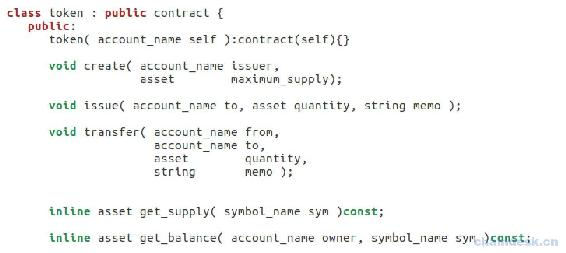
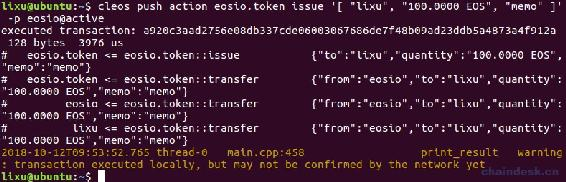

# 第八章 【EOS 钱包开发 八】EOS 代币转账交易

## 一、使用 Cleos 在本地网络发布代币

发布代币后转账给钱包应用里的账号，接下来我们才能使用应用程序去进行转账交易。发布代币的过程这里使用 Cleos 命令行工具，咱们拓展钱包应用程序的时候也可以添加发布代币这样一个功能，这里就不做这个次要的功能了。

### 1\. 部署 eosio.token 合约

这一步骤咱们在环境搭建章节已经完成，注意必须创建 eosio.token 这个账号，并使用 eosio.token 账号部署 eosio.token 合约。

### 2\. 创建 Token 代币

在`contracts/eosio.token/eosio.token.hpp`文件中可以查看到 Token 合约接口，如下



需要调用`create()`方法去创建 Token 合约。发行人可以对该 Token 合约执行一些特有的操作，例如冻结，召回和列入所有者白名单。

创建代币的 cleos 命令是`cleos push action`

```js
lixu@ubuntu:~/Desktop/sourceeos/eos$ cleos push action
ERROR: RequiredError: account
Push a transaction with a single action
Usage: cleos push action [OPTIONS] account action data

Positionals:
  account TEXT                The account providing the contract to execute (required)
  action TEXT                 A JSON string or filename defining the action to execute on the contract (required)
  data TEXT                   The arguments to the contract (required)

Options:
......
```

其中的参数：

*   account TEXT（必传）：执行合约的帐户名。
*   action TEXT （必传）：JSON 字符串或文件名，执行的是合约里的 action，即方法名。
*   data TEXT（必传）：执行的是合约方法的参数。

因此，创建 EOS Token 代币的完整命令如下：

```js
cleos push action eosio.token create '[ "eosio", "1000000000.0000 EOS"]' -p eosio.token@active
```

或者调用 create 方法时指定参数

```js
cleos push action eosio.token create '{"issuer":"eosio", "maximum_supply":"1000000000.0000 EOS"}' -p eosio.token@active

executed transaction: b1a1f0a1471415170438ea609ed6586ec7d3965e9bcd4f92cb502364f877fa59  120 bytes  494 us
#   eosio.token <= eosio.token::create          {"issuer":"eosio","maximum_supply":"1000000000.0000 EOS"}
```

此命令是通过`eosio.token`账户创建了一个新的 Token，发布者是`eosio`，Token 名为`EOS`，其精度为 4 位小数，发布的总量是 1000000000.0000 EOS。

### 3\. 查询代币信息

根据命令`cleos get currency stats`可以查看查询代币命令的参数

```js
lixu@ubuntu:~$ cleos get currency stats

ERROR: RequiredError: contract
Retrieve the stats of for a given currency
Usage: cleos get currency stats contract [symbol]

Positionals:
  contract TEXT               代币合约名称 ，此项必填
  symbol TEXT                 代币符号，例如 EOS ，此项必填
```

因此，可知查询账户余额的命令为 `cleos get currency stats 合约名称 代币符号`

```js
lixu@ubuntu:~$ cleos get currency stats eosio.token EOS
{
  "EOS": {
    "supply": "0.0000 EOS",
    "max_supply": "1000000000.0000 EOS",
    "issuer": "eosio"
  }
} 
```

### 4\. 发行者转代币给其它账户

现在我们已经创建了 EOS 代币，发行者可以调用`issue`方法向之前创建的帐户`lixu`发放 Token。

```js
cleos push action eosio.token issue '[ "user", "100.0000 EOS", "memo" ]' -p eosio@active
```



可以看到会通知资金的发送方和接收方，以便它们可以自动处理存款和取款。

### 5\. 查询账户余额

根据命令`cleos get currency balance`可以查询账户余额。

```js
$ cleos get currency balance

ERROR: RequiredError: contract
Retrieve the balance of an account for a given currency
Usage: cleos get currency balance contract account [symbol]

Positionals:
  contract TEXT               代币合约名称
  account TEXT                查询余额的账户
  symbol TEXT                 货币符号，例如 EOS ，此项非必须
```

因此，查询账户余额完整的命令为`cleos get currency balance 合约名称 账户名称`

```js
lixu@ubuntu:~$ cleos get currency balance eosio.token lixu
100.0000 EOS

lixu@ubuntu:~$ cleos get currency balance eosio.token lixu EOS
100.0000 EOS
```

## 二、项目源码

对发布的代币如何进行转账交易，请查看“深入浅出 EOSJS：连接到主网、测试网、交易”章节。

### 1\. web.js

编辑 controllers 文件夹下的 web.js 文件，用于实现后端返回给前端转账交易的页面。

```js
module.exports = {
    ......

    getTransactionHtml:async(ctx) =>　{
        await ctx.render("transaction.html")
    },
}
```

### 2\. transaction.js

在 controllers 文件夹下新建 transaction.js 文件，后端实现转账交易的功能。

```js
let {success, fail} = require("../utils/myUtils")
let myUtils = require("../utils/myUtils")
let walletModel = require("../models/wallet")

module.exports = {
    transactionSend: async (ctx) => {
        console.log(ctx.request.body)
        let { from, to, amount, symbol, memo, wallet, password } = ctx.request.body

        //1.获取钱包里面所有的私钥
        let privatekeyList = await walletModel.getWalletPrivatekeyList(wallet, password)

        //2.配置 EOSJS
        eos = myUtils.getEOSJS(privatekeyList)

        //3.发起转账交易
        options = {
            authorization: `${from}@active`,
            broadcast: true,
            sign: true
        }
        let data = await eos.transaction(eos => {
            let stantardAmount = parseFloat(amount).toFixed(4)
            eos.transfer(from, to, `${stantardAmount} ${symbol}`, memo, options)
        })
        console.log("data:", data)

        //4.返回给前端执行的状态
        let resData
        if (data) {
            resData = success("转账成功")
        } else {
            resData = fail("转账失败")
        }
        ctx.body = resData
    },
}
```

### 3\. wallet.js

在 mdoels 文件夹下新建 wallet.js 文件，实现根据钱包名和密码获取所有秘钥的功能。

```js
let httpRequest = require("../utils/httpRequest")
let config = require("../config/config")

module.exports = {
    getWalletPrivatekeyList: async (wallet, password) => {
        let privatekeyList = []
        let res = await httpRequest.postRequest(config.walletGetKeys, [wallet, password])
        if (res.code == 0 && res.data.length > 0) {
            for (const index in res.data) {
                let keys = res.data[index]
                privatekeyList.push(keys[1])
            }
        }
        return privatekeyList
    }
}
```

### 3\. router.js

将转账交易功能的接口绑定到路由。

```js
......

let transactionController = require("../controllers/transaction")

//转账交易
router.post("/transaction/send", transactionController.transactionSend)

//页面
router.get("/transaction.html", webController.getTransactionHtml)
```

### 4\. transaction.html

在 views 文件夹下新建 transaction.html 文件，实现前端转账交易的页面。

```js
<html>

<head>
    <title>转账</title>
    <script src="js/lib/jquery-3.3.1.min.js"></script>
    <script src="/js/lib/jquery.url.js"></script>
    <script src="js/transaction.js"></script>
    <link rel="stylesheet" href="css/eoswallet.css">
</head>

<body>
    <%include block/nav.html%>

    <div id="main">
        <h1></h1>
        <div class="row top">
            <form id="transaction-send-form" 　>
                <select name="from" id="transaction-send-account-select">
                </select>
                <label>from 账号名称</label>
                <br><br>

                <input type="text" name="to" placeholder="请输入对方账号名称">
                <label>to 账号名称</label>
                <br><br>

                <input type="text" name="amount" placeholder="请输入转账数量">
                <select name="symbol" id="transaction-send-token-select">
                </select>
                <label>金额</label>
                <br><br>

                <input type="text" name="memo" placeholder="请输入转账备注">
                <label>memo 备注</label>
                <br><br>
                <input type="text" name="wallet" hidden="hidden">
                <input type="text" name="password" hidden="hidden">
                <button type="submit">发送交易</button>
            </form>
        </div>

        <div class="row top">
            <table>
                <tr>
                    <th>代币</th>
                    <th>金额</th>
                </tr>
            </table>
            <table id="transation-balance-table">
            </table>
        </div>
    </div>
</body>

</html>
```

### 5\. transaction.js

在 static/js 文件夹下新建 transaction.js 文件，前端处理钱包模块的网络请求与页面的渲染。

```js
//账号金额
function updateAccountBalance(account) {
    let params = {"code":"eosio.token","account":account}
    $.post("/account/balance", params, function (res, status) {
        console.log(status + JSON.stringify(res))
        if (res.code == 0) {
            let balanceTable = $("#transation-balance-table")
            balanceTable.empty()
            if (res.data && res.data.length > 0) {
                res.data.forEach(balanceData => {
                    let balanceTr = `<tr>
                        <td>${balanceData.symbol}</td>
                        <td>${balanceData.amount}</td>
                    </tr>`
                    balanceTable.append(balanceTr)
                });
                tokenSelectList(res.data)
            } else {
                let balanceTr = `<tr>
                        <td>无存款</td>
                    </tr>`
                balanceTable.append(balanceTr)
                tokenSelectList([])
            } 
        }
    })
}

//选择 Token 列表
function tokenSelectList(tokenList) {
    let TokenSelectList = $("#transaction-send-token-select")
    TokenSelectList.empty()

    for(let i = 0; i < tokenList.length; i++) {
        let token = tokenList[i]
        let option = `<option value="${token.symbol}">${token.symbol}</option>`
        TokenSelectList.append(option)
    }
}

$(document).ready(function () {
    let currentwallet = localStorage.getItem("currentwallet")
    $("h1").text(currentwallet+" 钱包")
    if (!currentwallet) {
        return
    }
    let currentAccount = localStorage.getItem("currentAccount")
    let walletPassword = localStorage.getItem(currentwallet)

    $("input[name=wallet][hidden=hidden]").val(currentwallet)
    $("input[name=password][hidden=hidden]").val(walletPassword)

    //选择账号列表
    let accountList = sessionStorage.getItem(`wallet-${currentwallet}-accounts`)
    accountList = JSON.parse(accountList)
    console.log("accountList",accountList)
    let accountSelectList = $("#transaction-send-account-select")
    for(let i = 0; accountList && i < accountList.length; i++) {
        let account = accountList[i]
        let accountOption
        if (account == currentAccount) {
            accountOption = `<option selected="selected" value="${account}">${account}</option>`
        } else {
            accountOption = `<option value="${account}">${account}</option>`
        }
        accountSelectList.append(accountOption)
    }

    //账号金额
    updateAccountBalance(currentAccount)

    //选择不同的账号
    accountSelectList.change(function() {
        console.log(this.value)
        localStorage.setItem("currentAccount", this.value)
        updateAccountBalance(this.value)
    })

    //发送交易
    $("#transaction-send-form").validate({
        rules: {
            from: {required: true,},
            to: {required: true,},
            amount: {required: true,},
        },
        messages: {
            frmo: {required: "请选择转出的账号",},
            to: {required: "请输入对方账号名称",},
            amount: {required: "请输入转账的数量",},
        },
        submitHandler: function (form) {
            $(form).ajaxSubmit({
                url: "/transaction/send",
                type: "post",
                dataType: "json",
                success: function (res, status) {
                    console.log(status + JSON.stringify(res))
                    alert(JSON.stringify(res.data))
                    if (res.code == 0) {
                    }
                },
                error: function (res, status) {
                    console.log(status + JSON.stringify(res))
                    alert(res.data)
                }
            });
        }
    })
})
```

## 三、项目运行效果

前面通过 cleos 给账号`lixu`发行了 100 个 EOS，现在通过他去转账。

 18.11.58.gif)

**[项目源码 Github 地址](https://github.com/lixuCode/EOSWallet)**

**版权声明：博客中的文章版权归博主所有，未经授权禁止转载，转载请联系作者（微信：lixu1770105）取得同意并注明出处。**