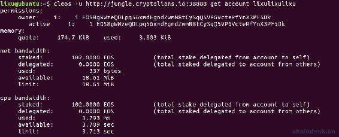

# 第九章 【EOS 钱包开发 九】基于测试网络进行开发

## 课程目标

1.  如何正确连接到测试网络
2.  使用 jungle 创建我的第一个账号
3.  在 jungle 索取 EOS 测试币
4.  在项目中创建账号

## 前言

咱们的课程到目前已经完成基于本地网络的 EOS 钱包开发，有三个模块：钱包模块、账号模块、转账模块，另外也能使用 eosjs、cleos 等。但是基于测试网络会有一些坑和区别，下面我们一起来学习。

## 一、如何正确连接到测试网络

### 1\. 常见错误

学习快的同学可能自己已经提前尝试连接到测试网络，但是会报错

```js
{"code":0,"name":"exception","what":"unspecified","details":[{"message":"Unknown Endpoint","file":"http_plugin.cpp","line_number":298,"method":"handle_http_request"}]} 
```

我们打开[jungle](http://jungle.cryptolions.io/)网站，查看 jungle 测试网节点地址，教程在“深入浅出 EOSJS：连接到主网、测试网、交易”章节中作了详细说明。我们还是选用第一个测试地址“[`jungle.cryptolions.io:38888”。`](http://jungle.cryptolions.io:38888”。)

我们测试下为啥会报这样的错误

*   nodeos 节点服务是没有问题的，我们能正常获取用户信息等。

```js
cleos -u http://jungle.cryptolions.io:38888 get account lixulixulixu 
```



*   那么就肯定是 keosd 服务不支持了，我们来访问下 wallet 的 API，如下

```js
cleos --wallet-url http://jungle.cryptolions.io:38888 --print-request wallet list 
```


### 2.错误分析

由此可见，jungle.cryptolions.io:38888 测试节点上并没配置 wallet 的 API 插件，所以连接到测试网络中不支持 wallet，但是支持 wallet 外的其它 RPC 连接。因为它作为一个公共的服务节点，是不可能帮助大家管理私钥的，那样会非常不安全，大家都会共用相同的钱包和私钥，除非它再为大家做一个用户系统，这就太没有必要了。

因此，我们连接到测试网络的时候，需要自己搭建 keosd 服务用于管理钱包和私钥。将 wallet 服务连接到本地服务，而 nodeos 服务连接到测试网络。这样仅仅是依赖我们的本地钱包应用程序 keosd 来处理我们的私钥，而账号、交易等是连接到的测试网络，因此该钱包项目上线后会需要我们服务器提供 keosd 服务。

### 3\. 错误处理

修改 config/config.js 文件中 httpEndpoint 和 chainId 如下

```js
//测试网络
eosconfig:{
    httpEndpoint:"http://jungle.cryptolions.io:18888",
    chainId: "038f4b0fc8ff18a4f0842a8f0564611f6e96e8535901dd45e43ac8691a1c4dca", 
    ......
}, 
```

而 walletAddress 地址不能修改，还是连接到的本地 IP“[`127.0.0.1:8889”。`](http://127.0.0.1:8889”。)

现在只需启动 keosd 服务即可，nodeos 可以停掉，然后启动 NodeJS 后台服务我们，查看前面创建的钱包“mywallet1”，如下图


可见该钱包中虽然还是拥有之前一样的私钥，但是所管理的账号为 null。大家应该该记得前面的截图，在本地网络中该钱包的账号有哪些，如下


## 二、使用 jungle 创建我的第一个账号

我们已经知道在 EOS 区块链中创建账号是需要使用已有账号去创建，并需要购买和消耗一定网络资源。那么我们在测试网络中由谁帮我们创建第一个账号呢？下面我们通过 jungle 网站为我们创建第一个账号。

**第一步：**

我们打开[jungle](http://jungle.cryptolions.io/)网站，在导航栏上有一个创建账号按钮是“Create Account”，点击它会出现如下的弹框


注意账号名称在测试网络和主网中必须是 12 位，自己去创建一对公私钥作为 owner 与 acitve 权限的管理者。输入后点击按钮“Create”。

**第二步：**

然后会弹出如下的交易信息，说明已经创建成功。


可以看见 eosio 为该账号购买了网络资源：RAM、NET、CPU。具体说明将在下一章介绍。

**第三步：**

输出命令查看新创建的账号“lixutest1111”的信息

```js
cleos -u http://jungle.cryptolions.io:18888 get account lixutest1111 
```

输出如下


说明已经创建成功，但是没有余额。

**第四步：**

将“lixutest1111”账号的私钥导入到“mywallet1”钱包中，将会查看到该账号。


**衍生**

很多人会使用 eosio 的私钥去控制账号，而每台电脑里 eosio 设置的私钥都是一样的，我们可以导入 eosio 的私钥到钱包，那样就可以有了它所控制的所有账号的控制权，还能找到有些账号有 EOS 测试币，哈哈。OK，那我们导入私钥“5KQwrPbwdL6PhXujxW37FSSQZ1JiwsST4cqQzDeyXtP79zkvFD3”到“mywallet2”钱包中吧，因为里面的账号太多了。下面是我导入后的结果，我截取了前面部分的账号。


## 三、索取 EOS 测试币

索取 EOS 测试币是我们后面交易和购买资源不可缺少的资源。当然，这也离不开 jungle 网站的支持。

**第一步：**

我们打开[jungle](http://jungle.cryptolions.io/)网站，在导航栏上有一个索取 EOS 的按钮是“Faucet”，点击它会出现如下的弹框


输入后点击按钮“Send Coins”。

**第二步：**

然后会弹出如下的交易信息，说明已经创建成功。


可以看见是 eosio 转出了 100EOS 到该账号，同时“lioninjungle”账号转来了 100 个 JUNGLE 代币。

**第三步：**

查看该账号的详情，将会查收到有 100EOS 和 100JUNGLE。


## 四、在项目中创建账号

在项目中创建账号的功能已经完成，之前是在本地网络，现在我们运行在测试网络中，看看会有什么区别。

**第一步：**

新建账号“lixutest1112”，使用“mywallet1”钱包中的任意一个公钥控制。


**第二步：**

可以看到“mywallet1”钱包中又多了一个账号“lixutest1112”，它的余额显示为 0，但是“lixutest1111”的余额由 100EOS 变为了下面的 79.4019EOS。


为何少了 20.5EOS 呢，我们查看创建账号的代码，如下：


可见我们在转账的时候给新账号买了 NET 和 CPU 和花费了 10EOS，另外买了 8192bytesRAM。所以一共扣掉了约 20.5EOS。

**第三步：**

查看账号“lixutest1112”的网络资源，确实拥有了 10 个 EOS 抵押 NET 和 10EOS 抵押 CPU，RAM 有 9.325Kib。


## 五、小结

经过本章内容我们已经成功将钱包项目连接到了真实的测试网络，用于管理钱包私钥的服务是本地搭建的。经过测试我们的功能都已成功，下一章的内容将介绍如何购买网络资源。

**[项目源码 Github 地址](https://github.com/lixuCode/EOSWallet)**

**版权声明：博客中的文章版权归博主所有，未经授权禁止转载，转载请联系作者（微信：lixu1770105）取得同意并注明出处。**